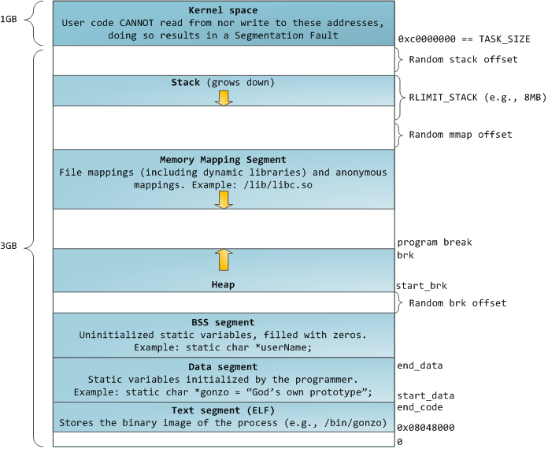
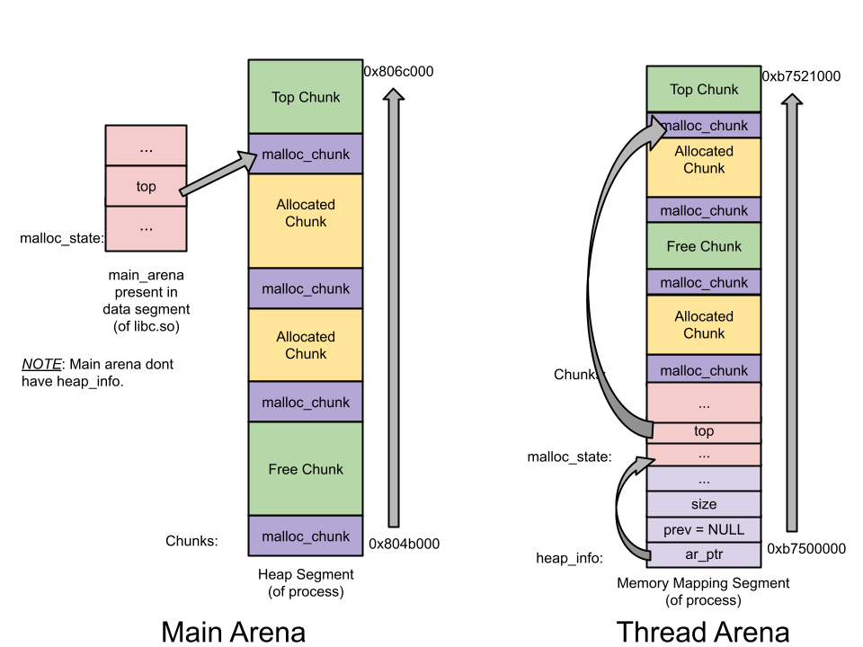

# Main

# What is Heap?

> 堆是每个程序被分配到的一块内存区域，和栈的区别主要在于其内存是动态分配的，也就是说，程序可以从 `heap` 段请求一块内存，亦或是释放一块内存。
>
> 另外的，堆内存是全局性的，即请求创建后，在程序的任意位置都能够访问到堆，并不限于在调用malloc的函数中访问。

# 动态分配的内存

Glibc 利用 ptmalloc2内存分配器来管理堆的内存。

我们借助  `stdlib.h`​ 可以使用 `malloc`​ 以及 `free` 指令来管理堆的内存

> ```c
> char *buffer = (char *)malloc(10);
>
> strcpy(buffer, "hello");
> printf("%s\n", buffer);
>
> free(buffer);
> ```
>
> 这里第一行分配了十个字节的空间给 buffer
>
>> 注意！
>>
>> 这里的类型转换是必须的，如若没有，malloc创建的内存块将会是void类型，即无法对应地将其地址赋值给buffer
>>
>
> 第三、四行是对其进行部分操作
>
> 在第六行对buffer指向的堆空间进行了释放
>
> 这里我们给出 free 以及 malloc 的注释:
>
>> ## **malloc指令**
>>
>> ### 原文
>>
>> ```
>> /*
>>   malloc(size_t n)
>>   Returns a pointer to a newly allocated chunk of at least n
>>   bytes, or null if no space is available. Additionally, on 
>>   failure, errno is set to ENOMEM on ANSI C systems.
>>
>>   If n is zero, malloc returns a minimum-sized chunk. (The
>>   minimum size is 16 bytes on most 32bit systems, and 24 or 32
>>   bytes on 64bit systems.)  On most systems, size_t is an unsigned
>>   type, so calls with negative arguments are interpreted as
>>   requests for huge amounts of space, which will often fail. The
>>   maximum supported value of n differs across systems, but is in
>>   all cases less than the maximum representable value of a
>>   size_t.
>> */
>> ```
>>
>> ### [malloc 注释翻译](../Resources/Glibc中相关指令/Translation%20翻译.md#20241219223331-rr7dq3c)
>>
>
>> ## **free指令**
>>
>> ### 原文
>>
>> ```
>> /*
>>   free(void* p)
>>   Releases the chunk of memory pointed to by p, that had been
>>   previously allocated using malloc or a related routine such as
>>   realloc. It has no effect if p is null. It can have arbitrary
>>   (i.e., bad!) effects if p has already been freed.
>>
>>   Unless disabled (using mallopt), freeing very large spaces will
>>   when possible, automatically trigger operations that give
>>   back unused memory to the system, thus reducing program
>>   footprint.
>> */
>> ```
>>
>> ### [free 注释翻译](../Resources/Glibc中相关指令/Translation%20翻译.md#20241219223859-7d93hfm)
>>

> 注意
>
>> 在一些异常情况下，会进行特殊的处理：
>>
>> - 满足`n=0`时，malloc函数会返回当前系统所允许的堆的最小的内存块
>> - 满足`n<0`​ 即n为负数时， 程序会申请极大的内存空间<sup>（原因： size_t 是一个 无符号数 ）</sup>，但通常来说都会申请失败，原因是系统无法调度出足够的内存给其堆块
>>
>
>> 如果传给`free`​的参数是一个空指针，`free`​不会做任何事，而如果传入的是已经`free`​过的指<span data-type="text" style="background-color: var(--b3-card-info-background); color: var(--b3-card-info-color);">针，那么后果将是</span>**不可估计的**<span data-type="text" style="background-color: var(--b3-card-info-background); color: var(--b3-card-info-color);">。</span>[Double Free漏洞](Double%20Free漏洞.md)
>>

这两个函数在更底层上来说，是使用了 `brk()`​和`mmap()`这两个系统调用来管理内存的。

# 两个系统调用

> Attention
>
> 在申请内存时，Linux内核只会先分配一段虚拟内存，真正使用时方才会映射到物理内存上去

## Brk()

​`brk()`​通过调整brk<sup>(又被称为 program break 和 break location)</sup>​来获取内存，一开始`heap`​段的起点`start_brk`​和`heap`​段的终点`brk`指向的时同一个位置 (这里需要分为两个情况)

- ASLR 关闭时，两者指向的是 data/bss段的末尾，也就是`end_data`的位置
- ASLR 开启时，两者指向的是 data/bss段的末尾地址额外加上一段随机的brk偏移



> 注意`brk()`​与`sbrk()`​的区别，后者是C语言的库函数，`malloc`​源码中的`MORECORE`​就是调用的`sbrk()`函数。

## Mmap()

该函数用于创建私有的匿名映射段，主要是为了分配一块新的内存，且这一块内存只有调用`mmap()`​函数的进程才可以使用，因而被称为私有的映射段。与之进行相反操作的是`munmap()`函数，其会删除一块内存区域上面的映射。

# 多线程 & Arena

ptmalloc2相较于其前身dlmalloc的一大改进就在于它的多线程调度。

## 实现

其实不难想到，每个线程都是要维护管理一些独立的数据结构，而朝向这些数据结构的访问时需要上锁的，不能随意改动。

在ptmalloc2中，每个线程都会拥有属于自己的freelist<sup>(存储空闲内存的一个链表，又被称为Bin)</sup>​以及属于自己的arena<sup>(一段连续的堆内存区域)</sup>​。特别地，在主线程下的`arena`​会被称为`main_arena`。

> 只有`main_arena`​可以访问`heap`​段 和 `mmap`的映射区域
>
> ​`non_main_arena`​只能够访问`mmap`​的映射区域，不能够访问`heap`段

> 线程较多时，互斥锁机制会导致其性能下降

### 对于main_arena

当我们程序中第一次申请内存时<sup>（在申请内存前，heap段还未创建）</sup>，无论我们申请的内存是多大，程序都会通过`brk()`​创建一个大小132KB的 heap段<sup>（也就是我们的main_arena）</sup>。在接下来的内存申请的过程中，`malloc`​函数都会从`main_arena`​中尝试取出一块内存进行分配，如果内存不够，`main_arena`​会通过`brk()`进行扩张；若是空闲内存过多，也可以进行缩小的操作。

### 对于non_main_arena

创建它时，我们是使用`mmap()`​创建的--1MB的内存空间会被映射到进程地址空间中，但实际只有132KB时可读写的。这132KB的内存空间就是该线程的heap结构<sup>（又会被叫做 non_main_arena）</sup>。

> 因为其是通过`mmap()`​创建的，所以其只能访问`mmap`所映射的区域。

> 特别地，当申请的内存空间大于128KB，且`arena`​中没有足够的空间时，无论是对于main_arena，还是non_main_arena都只能通过`mmap()`来分配内存。

‍

### arena的数量限制

当然，arena实际也不是与线程一对一存在的，其是有数量限制的。

```c
For 32 bit systems:
     Number of arena = 2 * number of cores.
For 64 bit systems:
     Number of arena = 8 * number of cores.
```

### Free

当我们对一小块内存进行`free`操作时，内存也不会直接归还给内核，而是将释放的内存交予ptmalloc2维护，ptmalloc2会将空闲的空间丢入 Bin中。若后续程序再次需要申请内存，ptmalloc2将会优先在bin中找出一块空闲的内存进行分配，如果找不到，方才会向内核发起请求，申请内存。

# 对多个堆的维护

在前面提到，`main_arena`​只有一个堆，并且可以灵活的放缩；`non_main_arena`​则只能够通过`mmap()`​获得一个堆，若是其中分配的堆内存不够了，只能再进行一次`mmap()`创建一个新的堆。

所以，我们在`non_main_arena`中，我们必须去考虑如何维护多个堆。

在这里，我们引入三个新的定义

- ​`heap_info`​ 是每个堆的头部 （`main_arena`​不拥有，仅`non_main_arena`拥有）
- ​`malloc_state`​是`arena`​的头部（`main_arena`的这个部分是存储全局变量的，不属于堆段）

  > 特别地， `malloc_state`是在 libc 当中的
  >
  > 也就是说，我们如果能够获得`malloc_state`结构体的地址，我们就可以通过其地址泄露出libc地址，从而获取足够的信息供我们对程序进行攻击
  >

- ​`malloc_chunk`​是每个`chunk`的头部

> # 简述
>
> 在程序刚开始执行的时候，每个线程都是不存在 Heap区域的。 当当前线程申请内存时，就需要一个结构来记录对应的信息，此时，Heap_info结构应运而生。
>
> 当该Heap的资源被耗尽后，就需要再次申请内存。
>
> 此外，一般申请的 Heap 在物理内存上 是不连续的， 因此我们需要记录不同Heap之间的链接结构。
>
> **该数据结构是特意为了 从<Memory Mapping Segment>处申请的内存而准备的，即 为非主线程所准备的。**
>
> 主线程可以通过 sbrk()函数 扩展 Program Break Location 获得 (直到申请至使用完全，触及 **<Memory Mapping Segment>** )，主线程仅拥有一个Heap，不存在 Heap_info 结构。
>
> # 完整定义
>
> ```c
> #define HEAP_MIN_SIZE (32 * 1024)
> #ifndef HEAP_MAX_SIZE
> # ifdef DEFAULT_MMAP_THRESHOLD_MAX
> #  define HEAP_MAX_SIZE (2 * DEFAULT_MMAP_THRESHOLD_MAX)
> # else
> #  define HEAP_MAX_SIZE (1024 * 1024) /* must be a power of two */
> # endif
> #endif
>
> /* HEAP_MIN_SIZE and HEAP_MAX_SIZE limit the size of mmap()ed heaps
>    that are dynamically created for multi-threaded programs.  The
>    maximum size must be a power of two, for fast determination of
>    which heap belongs to a chunk.  It should be much larger than the
>    mmap threshold, so that requests with a size just below that
>    threshold can be fulfilled without creating too many heaps.  */
>
> /***************************************************************************/
>
> /* A heap is a single contiguous memory region holding (coalesceable)
>    malloc_chunks.  It is allocated with mmap() and always starts at an
>    address aligned to HEAP_MAX_SIZE.  */
>
> typedef struct _heap_info
> {
>   mstate ar_ptr; /* Arena for this heap. */
>   struct _heap_info *prev; /* Previous heap. */
>   size_t size;   /* Current size in bytes. */
>   size_t mprotect_size; /* Size in bytes that has been mprotected
>                            PROT_READ|PROT_WRITE.  */
>   /* Make sure the following data is properly aligned, particularly
>      that sizeof (heap_info) + 2 * SIZE_SZ is a multiple of
>      MALLOC_ALIGNMENT. */
>   char pad[-6 * SIZE_SZ & MALLOC_ALIGN_MASK];
> } heap_info;
> ```
>
> 这个结构主要描述了堆的基本信息，包括了:
>
> - 堆所对应的 Arena 地址
> - 如果一个线程使用的堆占满，则必须再次申请。 因而一个线程可能具有多个堆结构。
>
>   prev 记录着上一个 Heap_info 的地址。 这里可以发现，堆的Heap_info 是通过一个单向链表所链接的。
> - Size 表示当前堆的大小
> - 最后一个部分是保证内存空间对齐。 (即 pad[...] )
>
>> Q:  为何 `pad` 的空间大小存在 "-6" ?
>>
>> A:  `pad`​是为了确保分配的空间是按照 `MALLOC_ALIGN_MASK +1`​(又被记为 `MALLOC_ALIGN_MASK_1`​ )对齐的。  在`pad`​之前，该结构体一共存在6个 `SIZE_SZ`​ 大小的成员，为了确保 `MALLOC_ALIGN_MASK_1`​ 字节的对其，我们可能会需要进行 `pad`​ ，因而我们不妨假设 该结构体的最终大小为`MALLOC_ALIGN_MASK_1 + X`​，其中`X`​为自然数。那么，需要`pad`​的空间即为`MALLOC_ALIGN_MASK_1 * X  -  6 * SIZE_SZ`​ -> `(MALLOC_ALIGN_MASK_1 * x  -  6 * SIZE_SZ) % MALLOC_ALIGN_MASK_1`​ -> `0  -  6 * SIZE_SZ % MALLOC_ALIGN_MASK_1`​ -> `-6 * SIZE_SZ % MALLOC_ALIGN_MASK_1`​ -> `-6 * SIZE_SZ & MALLOC_ALIGN_MASK`  因此, pad的空间如此表示
>>
>
> 到现在为止，这个结构看起来是相当重要的，但若是我们看完 Malloc 的实现后，会发现其出现的频率实际并不高。

> # 简述
>
> 这个结构用于管理堆块，用来记录每一个 Arena 当前申请的内存的具体状态，例如当前Arena是否存在空闲Chunk，存在什么大小的空闲Chunk等。
>
> 无论是 Main_arena 还是 Thread_arena，它们都只会有一个 Malloc_State 结构。
>
> 由于 Thread 的 Arena 可能拥有多个，因而 Malloc_State 会存在在最新申请的 Arena中。
>
> **注意： Main_Arena 中的 Malloc_State 并不是 Heap Segment 的一部分，而是一个全局变量，它存储在 Libc.so的数据段中**
>
> # 完整定义
>
> ```c
> struct malloc_state {
>     /* Serialize access.  */
>     __libc_lock_define(, mutex);
>
>     /* Flags (formerly in max_fast).  */
>     int flags;
>
>     /* Fastbins */
>     mfastbinptr fastbinsY[ NFASTBINS ];
>
>     /* Base of the topmost chunk -- not otherwise kept in a bin */
>     mchunkptr top;
>
>     /* The remainder from the most recent split of a small request */
>     mchunkptr last_remainder;
>
>     /* Normal bins packed as described above */
>     mchunkptr bins[ NBINS * 2 - 2 ];
>
>     /* Bitmap of bins, help to speed up the process of determinating if a given bin is definitely empty.*/
>     unsigned int binmap[ BINMAPSIZE ];
>
>     /* Linked list, points to the next arena */
>     struct malloc_state *next;
>
>     /* Linked list for free arenas.  Access to this field is serialized
>        by free_list_lock in arena.c.  */
>     struct malloc_state *next_free;
>
>     /* Number of threads attached to this arena.  0 if the arena is on
>        the free list.  Access to this field is serialized by
>        free_list_lock in arena.c.  */
>     INTERNAL_SIZE_T attached_threads;
>
>     /* Memory allocated from the system in this arena.  */
>     INTERNAL_SIZE_T system_mem;
>     INTERNAL_SIZE_T max_system_mem;
> };
> ```
>
> - __libc_lock_define(, mutex);
>
>   - 这个变量是用于控制程序串行访问同一个分配区的。当一个线程获取分配区后，其他线程想要访问该分配区，便必须等待该线程分配完成后方才可以使用。 (上🔒)
> - flags
>
>   - 它记录了分配区的一些标志，如 bit0 记录分配区是否存在 `fast_bin_chunk`，bit1标识着分配区是否能够返回一个连续的虚拟地址空间。
>
>     具体如下
>   - ```sh
>     /*
>        FASTCHUNKS_BIT held in max_fast indicates that there are probably
>        some fastbin chunks. It is set true on entering a chunk into any
>        fastbin, and cleared only in malloc_consolidate.
>        The truth value is inverted so that have_fastchunks will be true
>        upon startup (since statics are zero-filled), simplifying
>        initialization checks.
>      */
>
>     #define FASTCHUNKS_BIT (1U)
>
>     #define have_fastchunks(M) (((M)->flags & FASTCHUNKS_BIT) == 0)
>     #define clear_fastchunks(M) catomic_or(&(M)->flags, FASTCHUNKS_BIT)
>     #define set_fastchunks(M) catomic_and(&(M)->flags, ~FASTCHUNKS_BIT)
>
>     /*
>        NONCONTIGUOUS_BIT indicates that MORECORE does not return contiguous
>        regions.  Otherwise, contiguity is exploited in merging together,
>        when possible, results from consecutive MORECORE calls.
>        The initial value comes from MORECORE_CONTIGUOUS, but is
>        changed dynamically if mmap is ever used as an sbrk substitute.
>      */
>
>     #define NONCONTIGUOUS_BIT (2U)
>
>     #define contiguous(M) (((M)->flags & NONCONTIGUOUS_BIT) == 0)
>     #define noncontiguous(M) (((M)->flags & NONCONTIGUOUS_BIT) != 0)
>     #define set_noncontiguous(M) ((M)->flags |= NONCONTIGUOUS_BIT)
>     #define set_contiguous(M) ((M)->flags &= ~NONCONTIGUOUS_BIT)
>
>     /* ARENA_CORRUPTION_BIT is set if a memory corruption was detected on the
>        arena.  Such an arena is no longer used to allocate chunks.  Chunks
>        allocated in that arena before detecting corruption are not freed.  */
>
>     #define ARENA_CORRUPTION_BIT (4U)
>
>     #define arena_is_corrupt(A) (((A)->flags & ARENA_CORRUPTION_BIT))
>     #define set_arena_corrupt(A) ((A)->flags |= ARENA_CORRUPTION_BIT)
>     ```
> - fastbinsY[ NFASTBINS ]
>
>   - 用于存放每个 `fast bin`链表头部的指针
> - top
>
>   - 其指向分配区的 Top_Chunk
> - last_remainder
>
>   - 指向最新`Chunk`分割后剩下的部分
> - bins[ NBINS * 2 - 2 ]
>
>   - 用于存储 `Unsorted Bin`​、`Small Bins`​以及`Large Bins`的链表
> - binmap
>
>   - ptmalloc 使用 Bitmap 来标识哪些 bin 中是非空的
> - *next
>
>   - 指向Arena链表中的下一个节点
> - \*next\_free
>
>   - 用于管理 (未被线程占用的) Arena
>   - 其被 `free_list_lock` 保护，仅在 Arena 未被使用时方才出现在链表中
> - attached\_threads
>
>   - 记录当前有多少个线程正使用该 Arena (若为0，则说明该Arena未被任何线程使用，可以进入Free List链表中)
> - system\_mem
>
>   - 记录该Arena从系统申请的内存总量 (包括了未分配出去的部分)
> - max\_system\_mem
>
>   - 记录历史上从系统申请的最大内存值
>
>> ChatGPT Said:
>>
>> ## 总结一句话版本：
>>
>> 这个结构体代表了一个 **内存分配“arena”**  的内部状态。多个线程可以拥有各自的 arena，从而减小锁竞争。内部包含快速分配机制（fastbins）、正常分配机制（bins/top）、多线程支持（锁、线程计数）、以及从系统请求的内存记录等。
>>

其中，`INTERNAL_SIZE_T`​默认的和`size_t`相同

```c
#ifndef INTERNAL_SIZE_T
#define INTERNAL_SIZE_T size_t
#endif
```

## 对于`arena`中只有单个堆时的管理策略



## 对于`non_main_arena`有多个堆时的管理策略


> 注意
>
> 在有多个堆的情况下，旧的堆的`Top chunk`会被认为时一个普通的空闲块

# Chunk

通俗的来说，一块由分配器分配的内存块会被叫做一个`chunk`，其中包含了元数据和用户数据两部分。

‍

## 完整定义

> # [概述](堆相关的数据结构/Malloc_chunk/概述.md)
>
>> 在程序的执行过程中，我们称由 malloc 申请的内存为 `chunk` ，这块内存在 ptmalloc 内部用 malloc_chunk 结构体来表示。
>>
>> 当程序申请的 `chunk` 被 free 后，会被加入到相应的空闲管理列表中。
>>
>> 非常有意思的是，无论一个 `chunk` 的大小如何，处于分配状态还是释放状态，他们都使用一个统一的结构——虽然他们使用了同一个数据结构，但是根据是否被释放，它们的表现形式会有所不同。
>>
>> malloc_chunk是每个 chunk 的头部
>>
>> 其malloc_chunk的结构如下
>>
>> ```c
>> /*
>>   This struct declaration is misleading (but accurate and necessary).
>>   It declares a "view" into memory allowing access to necessary
>>   fields at known offsets from a given base. See explanation below.
>> */
>> struct malloc_chunk {
>>
>>   INTERNAL_SIZE_T      prev_size;  /* Size of previous chunk (if free).  */
>>   INTERNAL_SIZE_T      size;       /* Size in bytes, including overhead. */
>>
>>   struct malloc_chunk* fd;         /* double links -- used only if free. */
>>   struct malloc_chunk* bk;
>>
>>   /* Only used for large blocks: pointer to next larger size.  */
>>   struct malloc_chunk* fd_nextsize; /* double links -- used only if free. */
>>   struct malloc_chunk* bk_nextsize;
>> };
>> ```
>>
>>> 我们在此给出一些必要的宏的定义
>>>
>>> ```c
>>> /* INTERNAL_SIZE_T is the word-size used for internal bookkeeping of
>>>    chunk sizes.
>>>    The default version is the same as size_t.
>>>    While not strictly necessary, it is best to define this as an
>>>    unsigned type, even if size_t is a signed type. This may avoid some
>>>    artificial size limitations on some systems.
>>>    On a 64-bit machine, you may be able to reduce malloc overhead by
>>>    defining INTERNAL_SIZE_T to be a 32 bit `unsigned int' at the
>>>    expense of not being able to handle more than 2^32 of malloced
>>>    space. If this limitation is acceptable, you are encouraged to set
>>>    this unless you are on a platform requiring 16byte alignments. In
>>>    this case the alignment requirements turn out to negate any
>>>    potential advantages of decreasing size_t word size.
>>>    Implementors: Beware of the possible combinations of:
>>>      - INTERNAL_SIZE_T might be signed or unsigned, might be 32 or 64 bits,
>>>        and might be the same width as int or as long
>>>      - size_t might have different width and signedness as INTERNAL_SIZE_T
>>>      - int and long might be 32 or 64 bits, and might be the same width
>>>    To deal with this, most comparisons and difference computations
>>>    among INTERNAL_SIZE_Ts should cast them to unsigned long, being
>>>    aware of the fact that casting an unsigned int to a wider long does
>>>    not sign-extend. (This also makes checking for negative numbers
>>>    awkward.) Some of these casts result in harmless compiler warnings
>>>    on some systems.  */
>>> #ifndef INTERNAL_SIZE_T
>>> # define INTERNAL_SIZE_T size_t
>>> #endif
>>>
>>> /* The corresponding word size.  */
>>> #define SIZE_SZ (sizeof (INTERNAL_SIZE_T))
>>>
>>> /* The corresponding bit mask value.  */
>>> #define MALLOC_ALIGN_MASK (MALLOC_ALIGNMENT - 1)
>>>
>>> /* MALLOC_ALIGNMENT is the minimum alignment for malloc'ed chunks.  It
>>>    must be a power of two at least 2 * SIZE_SZ, even on machines for
>>>    which smaller alignments would suffice. It may be defined as larger
>>>    than this though. Note however that code and data structures are
>>>    optimized for the case of 8-byte alignment.  */
>>> #define MALLOC_ALIGNMENT (2 * SIZE_SZ < __alignof__ (long double) \
>>>               ? __alignof__ (long double) : 2 * SIZE_SZ)
>>> ```
>>>
>>
>>> 一般来说，`size_t`​会被定义为 `unsigned long`，在 64 位中是 64位无符号整数，在 32位中是 32位无符号整数。
>>>
>>
>> 下面我们来看 `chunk` 结构体，各个字段的具体的解释如下：
>>
>> - **prev_size**，如果该`chunk`​的物理相邻的前一地址 chunk ( 两个指针的地址差值为前一chunk的大小 ) 是空闲的话，那么该字段记录的是前一个 `chunk`​ 的大小 ( 包括 `chunk`​ 头 )。    否则，该字段可以用来存储物理相邻的前一个 chunk 的数据。这里的前一个 `chunk`​ 指的是较低地址的 `chunk`。
>> - **size**，该 `chunk`​ 的大小，大小必须是 `MALLOC_ALIGNMENT`​ 的整数倍。如果申请的内存大小不是 `MALLOC_ALIGNMENT`​ 的整数倍，会被转换为满足大小的最小的 `MALLOC_ALIGNMENT`​ 的倍数，这会通过 `request2size()` 宏来完成。
>>
>>   在32位系统中， `MALLOC_ALIGNMENT`​ 可能是 `4`​ 或者 `8`​ ；而在64位系统中， `MALLOC_ALIGNMENT`​ 只可能是 `8`​ 。该字段的低三个比特位对 `chunk` 的大小没有影响，他们从高到低分别表示
>>
>>   - NON_MAIN_ARENA    这一位记录当前 `chunk`​ 是否属于主线程，属于主线程标记为 `0`​ ，不属于主线程标记为 `1`.
>>   - IS_MAPPED    这一位记录前一个 `chunk` 是否是有mmap分配的.
>>   - PREV_INUSE    这一位记录前一个 `chunk`​ 块是否被分配。一般来说，堆中的第一个被分配的内存块的 size 字段的 P位 都会被设置为1，以便于防止访问前面的非法内存。当一个`chunk`​的 size 的 P位 为0时，我们能通过 `prev_size`​ 字段来获取上一个 `chunk`​ 的大小以及地址。这会方便程序进行 空闲的`chunk` 之间的合并。
>> - **fd、bk**，当 `chunk`​ 处于分配状态时，从 fd 字段开始就是用户的数据；当 `chunk` 处于空闲状态时，其字段会被添加到对应的空闲管理链表中，其字段含义如下
>>
>>   - **fd** 指向下一个 (非物理相邻) 空闲的 `chunk`
>>   - **bk** 指向上一个 (非物理相邻) 空闲的 `chunk`
>> - **fd_nextsize、bk_nextsize** 也是只有在 `chunk`​ 空闲时才会使用，不过其用于较大的 `chunk` 上 (Large Chunk)
>>
>>   - fd\_nextsize 指向前一个与当前 `chunk` 大小不同的第一个空闲块，不包含 bin 的头指针。
>>   - bk\_nextsize 指向后一个与当前 `chunk` 大小不同的第一个空闲块，不包含 bin 的头指针。
>>   - 一般空闲的  `large chunk`​ 在 fd 的遍历顺序中，按照由大到小的顺序排列。**这样做可以避免在寻找合适 chunk 时挨个遍历。**
>>
>>> 自 glibc-2.26 版本起，在32位glibc中，`MALLOC_ALIGNMENT`​ 宏的定义在编译时优先选择 `sysdeps/i386/malloc-alignment.h` 中的定义，该值定义为了一个常量：
>>>
>>> ```c
>>> #define MALLOC_ALIGNMENT 16
>>> ```
>>>
>>> 因此，对于自 glibc-2.26 起的32位 glibc 中，`MALLOC_ALIGNMENT`​ 并非基于 `SIZE_SZ`​ 计算的 `8`​ ，而是和64位glibc所用相同的 `16`
>>>
>>
>> 一个已经分配的 `chunk` 的样子如下
>>
>> ```c
>> chunk-> +-+-+-+-+-+-+-+-+-+-+-+-+-+-+-+-+-+-+-+-+-+-+-+-+-+-+-+-+-+-+-+-+
>>         |             Size of previous chunk, if unallocated (P clear)  |
>>         +-+-+-+-+-+-+-+-+-+-+-+-+-+-+-+-+-+-+-+-+-+-+-+-+-+-+-+-+-+-+-+-+
>>         |             Size of chunk, in bytes                     |A|M|P|
>>   mem-> +-+-+-+-+-+-+-+-+-+-+-+-+-+-+-+-+-+-+-+-+-+-+-+-+-+-+-+-+-+-+-+-+
>>         |             User data starts here...                          .
>>         .                                                               .
>>         .             (malloc_usable_size() bytes)                      .
>> next    .                                                               |
>> chunk-> +-+-+-+-+-+-+-+-+-+-+-+-+-+-+-+-+-+-+-+-+-+-+-+-+-+-+-+-+-+-+-+-+
>>         |             (size of chunk, but used for application data)    |
>>         +-+-+-+-+-+-+-+-+-+-+-+-+-+-+-+-+-+-+-+-+-+-+-+-+-+-+-+-+-+-+-+-+
>>         |             Size of next chunk, in bytes                |A|0|1|
>>         +-+-+-+-+-+-+-+-+-+-+-+-+-+-+-+-+-+-+-+-+-+-+-+-+-+-+-+-+-+-+-+-+
>> ```
>>
>> **我们将前两个字段称为** **​`chunk header`​**​  **，后面的部分称为** **​`user data`​** 。
>>
>> **每次 malloc 申请得到的内存指针，其实指向** **​`user data`​**​ **的起始处。**
>>
>> 当一个 `chunk`​ 处于使用状态时，它的下一个 `chunk`​ 的 `prev_size`​ 域无效，所以下一个 `chunk`​ 的该部分也可以被当前的 `chunk`​ 使用。**这就是** **​`chunk`​**​ **中的空间复用**
>>
>> 一个被释放的`chunk`被记录在链表中 (可能是循环双向链表，也可能是单向链表)，具体结构如下
>>
>> ```c
>> chunk-> +-+-+-+-+-+-+-+-+-+-+-+-+-+-+-+-+-+-+-+-+-+-+-+-+-+-+-+-+-+-+-+-+
>>         |             Size of previous chunk, if unallocated (P clear)  |
>>         +-+-+-+-+-+-+-+-+-+-+-+-+-+-+-+-+-+-+-+-+-+-+-+-+-+-+-+-+-+-+-+-+
>> `head:' |             Size of chunk, in bytes                     |A|0|P|
>>   mem-> +-+-+-+-+-+-+-+-+-+-+-+-+-+-+-+-+-+-+-+-+-+-+-+-+-+-+-+-+-+-+-+-+
>>         |             Forward pointer to next `chunk` in list           |
>>         +-+-+-+-+-+-+-+-+-+-+-+-+-+-+-+-+-+-+-+-+-+-+-+-+-+-+-+-+-+-+-+-+
>>         |             Back pointer to previous `chunk` in list          |
>>         +-+-+-+-+-+-+-+-+-+-+-+-+-+-+-+-+-+-+-+-+-+-+-+-+-+-+-+-+-+-+-+-+
>>         |             Unused space (may be 0 bytes long)                .
>>         .                                                               .
>>  next   .                                                               |
>> chunk-> +-+-+-+-+-+-+-+-+-+-+-+-+-+-+-+-+-+-+-+-+-+-+-+-+-+-+-+-+-+-+-+-+
>> `foot:' |             Size of chunk, in bytes                           |
>>         +-+-+-+-+-+-+-+-+-+-+-+-+-+-+-+-+-+-+-+-+-+-+-+-+-+-+-+-+-+-+-+-+
>>         |             Size of next chunk, in bytes                |A|0|0|
>>         +-+-+-+-+-+-+-+-+-+-+-+-+-+-+-+-+-+-+-+-+-+-+-+-+-+-+-+-+-+-+-+-+
>> ```
>>
>> 可以发现，如果一个 `chunk` 处于 free 状态，那么会有两个位置记录相应的大小
>>
>> 1. 本身的size字段会记录
>> 2. 它后面的 `chunk` 会记录
>>
>> **在一般情况下，** 物理相邻的两个空闲的 `chunk`​ 会被合并为一个 `chunk`。
>>
>> 堆管理器会通过 prev_size 字段以及 size 字段来对两个物理相邻的空闲 `chunk` 块进行合并。
>>
>>> 特别的，我们对于堆有一些约束条件，我们在后面将会详细讲解并考虑
>>>
>>> ```c
>>> /*
>>>     The three exceptions to all this are:
>>>      1. The special chunk `top' doesn't bother using the
>>>     trailing size field since there is no next contiguous chunk
>>>     that would have to index off it. After initialization, `top'
>>>     is forced to always exist.  If it would become less than
>>>     MINSIZE bytes long, it is replenished.
>>>      2. Chunks allocated via mmap, which have the second-lowest-order
>>>     bit M (IS_MMAPPED) set in their size fields.  Because they are
>>>     allocated one-by-one, each must contain its own trailing size
>>>     field.  If the M bit is set, the other bits are ignored
>>>     (because mmapped chunks are neither in an arena, nor adjacent
>>>     to a freed chunk).  The M bit is also used for chunks which
>>>     originally came from a dumped heap via malloc_set_state in
>>>     hooks.c.
>>>      3. Chunks in fastbins are treated as allocated chunks from the
>>>     point of view of the chunk allocator.  They are consolidated
>>>     with their neighbors only in bulk, in malloc_consolidate.
>>> */
>>>
>>> Translate to Chinese：
>>> /* 
>>> 	所有这些规则有三个例外情况： 
>>> 	1. 特殊的内存块 top 无需使用尾部大小字段，因为不存在需要根据该字段进行索引的下一个连续内存块。
>>> 	初始化后，top 始终会存在。如果其长度小于 MINSIZE 字节，就会对其进行补充。 
>>> 	2. 通过 mmap 分配的内存块，其大小字段中设置了次低位的 M 位（IS_MMAPPED）。
>>> 	由于它们是逐个分配的，每个内存块都必须包含自己的尾部大小字段。
>>> 	如果 M 位被设置，则忽略其他位（因为通过 mmap 分配的内存块既不在某个内存区域中，也不与已释放的内存块相邻）。
>>> 	M 位还用于通过 hooks.c 中的 malloc_set_state 从转储堆中获取的内存块。 ``
>>> 	3. 从内存块分配器的角度来看，快速链表（fastbins）中的内存块被视为已分配的内存块。
>>> 	只有在 malloc_consolidate 函数中进行批量操作时，它们才会与其相邻的内存块进行合并。 
>>>
>>> */                        
>>> ```
>>>
>>
>
> # [Chunk 相关宏](堆相关的数据结构/Malloc_chunk/Chunk%20相关宏.md)
>
>> # `chunk`chunk 与 mem 指针头部的转换
>>
>> mem 指向用户得到的内存的起始位置
>>
>> ```c
>> /* conversion from malloc headers to user pointers, and back */
>> #define chunk2mem(p) ((void *) ((char *) (p) + 2 * SIZE_SZ))
>> #define mem2chunk(mem) ((mchunkptr)((char *) (mem) -2 * SIZE_SZ))
>> ```
>>
>> # 最小的chunk大小
>>
>> ```c
>> /* The smallest possible chunk */
>> #define MIN_CHUNK_SIZE (offsetof(struct malloc_chunk, fd_nextsize))
>> ```
>>
>> 在这里， offsetof() 函数会计算出 fd_nextsize 在 malloc_chunk 中的便宜，说明最小的 chunk 至少要包含 bk 指针。
>>
>> # 最小申请的堆内存大小
>>
>> 用户最小申请的内存大小必须是 2*SIZE_SZ 的最小整数倍
>>
>>> Tip
>>>
>>> 就目前而看 MIN_CHUNK_SIZE 和 MINISIZE 大小是一致的，这样设置两个宏的目的推测是方便之后对malloc_chunk的修改
>>>
>>> ```c
>>> /* The smallest size we can malloc is an aligned minimal chunk */
>>> //MALLOC_ALIGN_MASK = 2 * SIZE_SZ -1
>>> #define MINSIZE                                                                \
>>>     (unsigned long) (((MIN_CHUNK_SIZE + MALLOC_ALIGN_MASK) &                   \
>>>                       ~MALLOC_ALIGN_MASK))
>>> ```
>>>
>>
>> # 检查分配给用户的内存是否对齐
>>
>> 2 * SIZE_SZ 大小对齐
>>
>> ```c
>> /* Check if m has acceptable alignment */
>> // MALLOC_ALIGN_MASK = 2 * SIZE_SZ -1
>> #define aligned_OK(m) (((unsigned long) (m) & MALLOC_ALIGN_MASK) == 0)
>>
>> #define misaligned_chunk(p)                                                    \
>>     ((uintptr_t)(MALLOC_ALIGNMENT == 2 * SIZE_SZ ? (p) : chunk2mem(p)) &       \
>>      MALLOC_ALIGN_MASK)
>> ```
>>
>> # 请求字节数判断
>>
>> ```c
>> /*
>>    Check if a request is so large that it would wrap around zero when
>>    padded and aligned. To simplify some other code, the bound is made
>>    low enough so that adding MINSIZE will also not wrap around zero.
>>  */
>>
>> #define REQUEST_OUT_OF_RANGE(req)                                              \
>>     ((unsigned long) (req) >= (unsigned long) (INTERNAL_SIZE_T)(-2 * MINSIZE))
>> ```
>>
>> # 将用户请求内存大小转为实际分配内存大小
>>
>> ```c
>> /* pad request bytes into a usable size -- internal version */
>> //MALLOC_ALIGN_MASK = 2 * SIZE_SZ -1
>> #define request2size(req)                                                      \
>>     (((req) + SIZE_SZ + MALLOC_ALIGN_MASK < MINSIZE)                           \
>>          ? MINSIZE                                                             \
>>          : ((req) + SIZE_SZ + MALLOC_ALIGN_MASK) & ~MALLOC_ALIGN_MASK)
>>
>> /*  Same, except also perform argument check */
>>
>> #define checked_request2size(req, sz)                                          \
>>     if (REQUEST_OUT_OF_RANGE(req)) {                                           \
>>         __set_errno(ENOMEM);                                                   \
>>         return 0;                                                              \
>>     }                                                                          \
>>     (sz) = request2size(req);
>> ```
>>
>> 当一个 `chunk`​ 处于以分配状态时，它的物理相邻的下一个 `chunk`​ 的 prev_size 字段必然是无效的，故而这个字段就可以被当前这个 `chunk`​ 使用。 这就是 ptmalloc 中 `chunk` 间的复用。
>>
>> 具体流程如下
>>
>> 1. 首先利用 `REQUEST_OUT_OF_RANGE`​ 判断是否可以分配用户请求的字节大小的 `chunk`
>> 2. 之后，需要注意的是用户请求的字节是用来存储数据的，即 `chunk header` 后面的部分。
>>
>>    与此同时，由于 `chunk`​ 间复用，所以可以使用下一个 `chunk` 的 prev_size 字段。因此，这里只需要再添加 SIZE_SZ 大小即可完全存储内容。
>> 3. 由于系统中所允许的申请的 `chunk` 最小的大小是 MINISIZE，所以对其进行比较，如果不满足最低要求，即直接分配 MINISIZE 字节。
>> 4. 如果前一条的比较结果是大于 MINISIZE， 由于系统中申请的 `chunk`​ 需要进行对齐操作，所以这里需要加上 MALLOC_ALIGN_MASK 以便进行 `chunk` 的对齐
>>
>> # 标记位相关宏
>>
>> ```c
>> /* size field is or'ed with PREV_INUSE when previous adjacent chunk in use */
>> #define PREV_INUSE 0x1
>>
>> /* extract inuse bit of previous chunk */
>> #define prev_inuse(p) ((p)->mchunk_size & PREV_INUSE)
>>
>> /* size field is or'ed with IS_MMAPPED if the chunk was obtained with mmap() */
>> #define IS_MMAPPED 0x2
>>
>> /* check for mmap()'ed chunk */
>> #define chunk_is_mmapped(p) ((p)->mchunk_size & IS_MMAPPED)
>>
>> /* size field is or'ed with NON_MAIN_ARENA if the chunk was obtained
>>    from a non-main arena.  This is only set immediately before handing
>>    the chunk to the user, if necessary.  */
>> #define NON_MAIN_ARENA 0x4
>>
>> /* Check for chunk from main arena.  */
>> #define chunk_main_arena(p) (((p)->mchunk_size & NON_MAIN_ARENA) == 0)
>>
>> /* Mark a chunk as not being on the main arena.  */
>> #define set_non_main_arena(p) ((p)->mchunk_size |= NON_MAIN_ARENA)
>>
>> /*
>>    Bits to mask off when extracting size
>>    Note: IS_MMAPPED is intentionally not masked off from size field in
>>    macros for which mmapped chunks should never be seen. This should
>>    cause helpful core dumps to occur if it is tried by accident by
>>    people extending or adapting this malloc.
>>  */
>> #define SIZE_BITS (PREV_INUSE | IS_MMAPPED | NON_MAIN_ARENA)
>> ```
>>
>> # 获取 chunk size
>>
>> ```c
>> /* Get size, ignoring use bits */
>> #define chunksize(p) (chunksize_nomask(p) & ~(SIZE_BITS))
>>
>> /* Like chunksize, but do not mask SIZE_BITS.  */
>> #define chunksize_nomask(p) ((p)->mchunk_size)
>> ```
>>
>> # 获取下一个物理相邻的 chunk
>>
>> ```c
>> /* Ptr to next physical malloc_chunk. */
>> #define next_chunk(p) ((mchunkptr)(((char *) (p)) + chunksize(p)))
>> ```
>>
>> # 获取前一个 chunk 的信息
>>
>> ```c
>> /* Size of the chunk below P.  Only valid if !prev_inuse (P).  */
>> #define prev_size(p) ((p)->mchunk_prev_size)
>>
>> /* Set the size of the chunk below P.  Only valid if !prev_inuse (P).  */
>> #define set_prev_size(p, sz) ((p)->mchunk_prev_size = (sz))
>>
>> /* Ptr to previous physical malloc_chunk.  Only valid if !prev_inuse (P).  */
>> #define prev_chunk(p) ((mchunkptr)(((char *) (p)) - prev_size(p)))
>> ```
>>
>> # 当前 chunk 使用状态的相关操作
>>
>> ```c
>> /* extract p's inuse bit */
>> #define inuse(p)                                                               \
>>     ((((mchunkptr)(((char *) (p)) + chunksize(p)))->mchunk_size) & PREV_INUSE)
>>
>> /* set/clear chunk as being inuse without otherwise disturbing */
>> #define set_inuse(p)                                                           \
>>     ((mchunkptr)(((char *) (p)) + chunksize(p)))->mchunk_size |= PREV_INUSE
>>
>> #define clear_inuse(p)                                                         \
>>     ((mchunkptr)(((char *) (p)) + chunksize(p)))->mchunk_size &= ~(PREV_INUSE)
>> ```
>>
>> # 设置 chunk 的 size 字段
>>
>> ```c
>> /* Set size at head, without disturbing its use bit */
>> // SIZE_BITS = 7
>> #define set_head_size(p, s)                                                    \
>>     ((p)->mchunk_size = (((p)->mchunk_size & SIZE_BITS) | (s)))
>>
>> /* Set size/use field */
>> #define set_head(p, s) ((p)->mchunk_size = (s))
>>
>> /* Set size at footer (only when chunk is not in use) */
>> #define set_foot(p, s)                                                         \
>>     (((mchunkptr)((char *) (p) + (s)))->mchunk_prev_size = (s))
>> ```
>>
>> # 获取指定偏移的 chunk
>>
>> ```c
>> /* Treat space at ptr + offset as a chunk */
>> #define chunk_at_offset(p, s) ((mchunkptr)(((char *) (p)) + (s)))
>> ```
>>
>> # 制定偏移处 chunk 使用状态的相关操作
>>
>> ```c
>> /* check/set/clear inuse bits in known places */
>> #define inuse_bit_at_offset(p, s)                                              \
>>     (((mchunkptr)(((char *) (p)) + (s)))->mchunk_size & PREV_INUSE)
>>
>> #define set_inuse_bit_at_offset(p, s)                                          \
>>     (((mchunkptr)(((char *) (p)) + (s)))->mchunk_size |= PREV_INUSE)
>>
>> #define clear_inuse_bit_at_offset(p, s)                                        \
>>     (((mchunkptr)(((char *) (p)) + (s)))->mchunk_size &= ~(PREV_INUSE))
>> ```
>>

> 这里的 mchunk_prev_size mchunk_size fd bk fd_nextsize bk_nextsize 六个字段均为元数据

## Chunk的类型

chunk大致可以分为一下几个类型

- Allocated chunk - 已分配的
- Free chunk - 空闲的
- Top chunk
- Last Remainder chunk

## Chunk的结构

‍

### [Allocated chunk](Allocated%20chunk.md)

> 
>
> chunk指针是真正chunk的起始位置
>
> mem指针是用户数据存储的起始位置
>
> 第一个部分<sup>（32位中为 4B ；64位中为 8B）</sup> 叫做`prev_size`，在前一个chunk空闲时表示前一个块的大小，非空闲时有可能被前一个块征用，用于存储用户数据。
>
>> 这里的前一个chunk指的是内存中所相邻的前一个，而不是在`freelist`链表中的前一个。
>>
>> ​`PREV_INUSE`代表的“前一个chunk同理”
>>
>
> 第二个部分的高位存储chunk的大小，低三位因为不会被存储的大小用到，所以分别会表示
>
> - P -- `PREV_INUSE` 之前的 chunk 已经被分配时记为 1，未被分配为 0
> - M -- `IS_MMAPED`​ 当前 chunk 时`mmap()`得到的则记为 1， 反之则为 0
> - N -- `NON_MAIN_ARENA`​ 当前 chunk 在`non_main_arena`里则为 1， 反之则为0
>
> 对应的源码如下
>
> ```c
> /* size field is or'ed with PREV_INUSE when previous adjacent chunk in use */
> #define PREV_INUSE 0x1
>
> /* extract inuse bit of previous chunk */
> #define prev_inuse(p)       ((p)->size & PREV_INUSE)
>
>
> /* size field is or'ed with IS_MMAPPED if the chunk was obtained with mmap() */
> #define IS_MMAPPED 0x2
>
> /* check for mmap()'ed chunk */
> #define chunk_is_mmapped(p) ((p)->size & IS_MMAPPED)
>
>
> /* size field is or'ed with NON_MAIN_ARENA if the chunk was obtained
>    from a non-main arena.  This is only set immediately before handing
>    the chunk to the user, if necessary.  */
> #define NON_MAIN_ARENA 0x4
>
> /* check for chunk from non-main arena */
> #define chunk_non_main_arena(p) ((p)->size & NON_MAIN_ARENA)
> ```
>
> # Q&A
>
> 1. Q: `fd`​、`bk`​、`fd_nextsize`​、`bk_nextsize`这几个字段去哪里了？
>
>    A: 对于**已分配的chunk**来说这几个字段是没有作用的，因而这几个字段被chunk征用，拿来存储用户的数据。
> 2. Q:为何第二个部分的低3位被存储其他信息而不会影响`size`?
>
>    A: 这是因为`malloc`​会将用户申请的内存大小转化为实际分配的内存，以此满足八字节对齐<sup>（最少）</sup>的要求，同时留出额外空间存放 chunk 的头部。由于进行了八字节的对齐，则低三位失去了其作用。因而就可以使用低三位存储其他信息了。我们在获取真正的`size`时，是会忽略低三位的。
>
>    ```c
>    /*
>       Bits to mask off when extracting size
>
>       Note: IS_MMAPPED is intentionally not masked off from size field in
>       macros for which mmapped chunks should never be seen. This should
>       cause helpful core dumps to occur if it is tried by accident by
>       people extending or adapting this malloc.
>     */
>    #define SIZE_BITS (PREV_INUSE | IS_MMAPPED | NON_MAIN_ARENA)
>
>    /* Get size, ignoring use bits */
>    #define chunksize(p)         ((p)->size & ~(SIZE_BITS))
>    ```
> 3. Q: `malloc` 是如何将申请的大小转化为实际分配的大小呢?
>
>    A: 其核心在于 `request2size`宏
>
>    ```c
>    /* pad request bytes into a usable size -- internal version */
>
>    #define request2size(req)                                         \
>      (((req) + SIZE_SZ + MALLOC_ALIGN_MASK < MINSIZE)  ?             \
>       MINSIZE :                                                      \
>       ((req) + SIZE_SZ + MALLOC_ALIGN_MASK) & ~MALLOC_ALIGN_MASK)
>    ```
>
>    其中用到了其他的几个宏定义，这里也贴出来
>
>    ```c
>    #  define MALLOC_ALIGNMENT       (2 *SIZE_SZ)
>
>    /* The corresponding bit mask value */
>    #define MALLOC_ALIGN_MASK      (MALLOC_ALIGNMENT - 1)
>
>    /* The smallest possible chunk */
>    #define MIN_CHUNK_SIZE        (offsetof(struct malloc_chunk, fd_nextsize))
>
>    /* The smallest size we can malloc is an aligned minimal chunk */
>    #define MINSIZE  \
>      (unsigned long)(((MIN_CHUNK_SIZE+MALLOC_ALIGN_MASK) & ~MALLOC_ALIGN_MASK))
>    ```
> 4. Q: 这个 `mem指针`是干什么用的?
>
>    A: `mem指针`​是调用`malloc`​时返回给用户的指针。实际上，真正的chunk是从`chunk指针`开始的。
>
>    ```c
>    /* The corresponding word size */
>    #define SIZE_SZ                (sizeof(INTERNAL_SIZE_T))
>
>    /* conversion from malloc headers to user pointers, and back */
>
>    #define chunk2mem(p)   ((void*)((char*)(p) + 2*SIZE_SZ))
>    #define mem2chunk(mem) ((mchunkptr)((char*)(mem) - 2*SIZE_SZ))
>    ```
> 5. Q: 用户申请的内存大小就是用户数据可用的内存大小吗？
>
>    A: 这件事是不一定的，原因是字节对齐的问题。
>
>    实际可用内存大小，是从`malloc_usable_size()`获得的，其核心函数如下
>
>    ```c
>    static size_t
>    musable (void *mem)
>    {
>      mchunkptr p;
>      if (mem != 0)
>        {
>          p = mem2chunk (mem);
>
>          if (__builtin_expect (using_malloc_checking == 1, 0))
>            return malloc_check_get_size (p);
>
>          if (chunk_is_mmapped (p))
>            return chunksize (p) - 2 * SIZE_SZ;
>          else if (inuse (p))
>            return chunksize (p) - SIZE_SZ;
>        }
>      return 0;
>    }
>    ```

### [Free chunk](Free%20chunk.md)

> 
>
> Free chunk中，`prev_size`中必定存储着上一个块的用户数据。
>
> 若上个块以及该块 同为Free chunk，两个块会进行合并。
>
> 因此，Free chunk的上一个块必定是Allocated chunk。
>
> fd 是指向 同一个bin中的 Free chunk， bk 指向 同一个bin中的 Free chunk。
>
> 特别地，Large bins 中的Free chunk会有`fd_nextsize`​ 以及`bk_nextsize`。
>
> 其分别指向Large bins 中 前一个(更大的) 以及 后一个(更小的) 空闲块。

### [Top Chunk](堆相关的数据结构/Top%20Chunk.md)

> Glibc 中对于 Top Chunk 的描述如下
>
> ```sh
> /*
>    Top
>
>     The top-most available chunk (i.e., the one bordering the end of
>     available memory) is treated specially. It is never included in
>     any bin, is used only if no other chunk is available, and is
>     released back to the system if it is very large (see
>     M_TRIM_THRESHOLD).  Because top initially
>     points to its own bin with initial zero size, thus forcing
>     extension on the first malloc request, we avoid having any special
>     code in malloc to check whether it even exists yet. But we still
>     need to do so when getting memory from system, so we make
>     initial_top treat the bin as a legal but unusable chunk during the
>     interval between initialization and the first call to
>     sysmalloc. (This is somewhat delicate, since it relies on
>     the 2 preceding words to be zero during this interval as well.)
>  */
>
> /* Conveniently, the unsorted bin can be used as dummy top on first call */
> #define initial_top(M) (unsorted_chunks(M))
> ```
> 程序在第一次进行 malloc 时， Heap 会被分成两块，一块给用户 ，另一块分配给 Top Chunk。
>
> 其实，所谓的 Top Chunk 就是处于当前堆的物理地址最高的 `chunk`。
>
> 这个 `chunk` 不属于任何一个 Bin，它的作用在于当所有的 Bin 都无法满足用户请求的大小时，如果其大小不小于指定的大小，则进行分配操作，并将剩下的部分作为新的 Top Chunk。
>
> 但如果其大小大于指定的大小，程序会对 Heap 进行扩展后，再进行分配。
>
> 在 Main Arena 中通过 sbrk 扩展 Heap 段，在 Thread Arena 中通过 mmap 分配新的 Heap。
>
> 需要注意的是， Top Chunk 的 prev_inuse 位始终为 1，否则其前方的 `chunk` 会被合并到 Top Chunk 中。
>
> **在初始情况下，我们可以将 Unsorted Chunk 作为 Top Chunk。**
