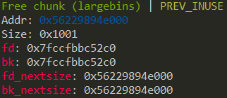

# Off-By-One

# Introduction

严格地来说，OFF-By-One 漏洞相较于其他漏洞而言，更为特殊。 off-by-one指的是程序向缓冲区写入信息时，写入的字节数超过了缓冲区所申请的字节数，并且越界只发生了一个字节。其漏洞的实质是单字节的缓冲区溢出。

# Vulnerability Principle

Off-By-One漏洞的产生往往与边界验证抑或是字符串操作的不当处理有关。 ( 另外的，也有可能写入的size正好大于其一个字节 )

> 边界验证不当通常包括两种
>
> - 循环语句使用不当 --  使用循环语句写入数据时，循环次数设置错误，导致多输入一个字节。(  C 初学者常犯 )
> - 字符串操作不当 -- 比如strlen()函数以及strcpy()的组合技

‍

需要说明的一点是，Off-By-One漏洞并不仅仅出现在堆中，在其他例如栈、bss段等缓冲区中都可能出现。但该漏洞在CTF比赛中基本出现在堆上。

原因:

	原本单字节溢出漏洞通常被认为是难以利用的。但Linux的Ptmalloc堆管理机制验证的松散性让漏洞利用者拥有了巨大的可操作性。基于Linux堆上的Off-By-One漏洞利用起来通常并不复杂，且威力强大。

‍

# Exploitation Ideas

1. 溢出的字节为可控制的任意字节: 我们可以通过修改块的大小，使得块与块之间出现重叠，从而泄露其他块的数据 ( 抑或是控制其他块的数据 )。也可以使用NULL字节溢出的方法.
2. 溢出的字节仅能是 NULL 字节: 此时，我们在 Size为0x100的时候，溢出的NULL字节会使得Prev_in_use位被清空，这样会让前块被认作为Free块。

   1. 此时我们可以选择使用 Unlink方法进行处理
   2. 这时候 Prev_size 域将会启用，即此时可以对Prev_size进行伪造，从而也能造成块与块之间产生重叠。此方法的关键在于Unlink时没有检查以Prev_size查找到的块的大小是否与 Prev_size 一致。 ( 在2.28后的版本已加入对其的Check )

```c
/* consolidate backward */
if (!prev_inuse(p)) {
	prevsize = prev_size (p);
	size += prevsize;
	p = chunk_at_offset(p, -((long) prevsize));
	/* 后两行代码在最新版本中加入，则 2 的第二种方法无法使用，但是 2.28 及之前都没有问题 */
	if (__glibc_unlikely (chunksize(p) != prevsize))
		malloc_printerr ("corrupted size vs. prev_size while consolidating");
	unlink_chunk (av, p);
}
```

# Example 1

```c
int my_gets(char *ptr,int size)
{
    int i;
    for(i=0;i<=size;i++)
    {
        ptr[i]=getchar();
    }
    return i;
}
int main()
{
    void *chunk1,*chunk2;
    chunk1=malloc(16);
    chunk2=malloc(16);
    puts("Get Input:");
    my_gets(chunk1,16);
    return 0;
}
```

这是一个编写的带有Off-By-One漏洞的函数，其漏洞点在 for循环的边界并未控制好，使得输入多进行了一次，这常常被我们称为 [栅栏错误](Off-By-One/栅栏错误.md)

```c
0x602000:   0x0000000000000000  0x0000000000000021 <=== chunk1
0x602010:   0x0000000000000000  0x0000000000000000
0x602020:   0x0000000000000000  0x0000000000000021 <=== chunk2
0x602030:   0x0000000000000000  0x0000000000000000
```

我们在gdb后可以发现，在输入为17个'A'时，下一个堆块的prev_size域被改写为了 0x41

```c
0x602000:   0x0000000000000000  0x0000000000000021 <=== chunk1
0x602010:   0x4141414141414141  0x4141414141414141
0x602020:   0x0000000000000041  0x0000000000000021 <=== chunk2
0x602030:   0x0000000000000000  0x0000000000000000
```

‍

# Example 2

这个示例是常见的字符串操作，其常见原因为字符串的结束符计算有误。

```c
int main(void)
{
    char buffer[40]="";
    void *chunk1;
    chunk1=malloc(24);
    puts("Get Input");
    gets(buffer);
    if(strlen(buffer)==24)
    {
        strcpy(chunk1,buffer);
    }
    return 0;

}
```

乍一看这个程序并无什么错误，实际上这是strlen与strcpy函数打的一个组合技 -- strlen()函数进行计数时并不会记上'\0\'结束符的长度，导致实际满足其判断的长度是25个字节。( 我们输入24个字节进去，实际是输入了24个自己输入的字节加上一个结束符，也就是25个字节 ) 我们通过 gdb进行调试也可以看到这一点。

‍

输入前

```c
0x602000:   0x0000000000000000  0x0000000000000021 <=== chunk1
0x602010:   0x0000000000000000  0x0000000000000000
0x602020:   0x0000000000000000  0x0000000000000411 <=== next chunk
```

在我们输入 'A'*24后

```c
0x602000:   0x0000000000000000  0x0000000000000021
0x602010:   0x4141414141414141  0x4141414141414141
0x602020:   0x4141414141414141  0x0000000000000400
```

可以看到，Next Chunk的size低字节都被 '\x00\' 所覆盖，这也就导致了[Size后的N、M、P Flag](Off-By-One/Size后的N、M、P%20Flag.md) 皆被清除为 0。

这是Off-By-One的一个分支，被成为 NULL byte off-by-one，我们在后面会看到 off-by-one 与 NULL byte off-by-one在利用上面的区别。

> Question:  为什么是低字节被覆盖呢？
>
> ‍
>
> Answer:  我我们平常使用的 CPU 的字节序都是小端序的。
>
> 例： 0xdeadbeef   在内存中的存储实际是   0xef 0xbe 0xad 0xde

## 在 Libc版本 2.28 后

更新了两行代码，检查变得严格，我们伪造prev_size的方法由此时失效

```c
if (__glibc_unlikely (chunksize(p) != prevsize))
	malloc_printerr ("corrupted size vs. prev_size while consolidating");
```

但我们满足 被unlink的chunk与下一个chunk相连 的条件后，我们仍然可以利用其漏洞伪造 Fake_chunk

伪造的方式利用了 Large_bin 遗留下的 fd_nextsize 以及 bk_nextsize 这两个指针。

我们以 fd_nextsize 作为 fakechunk 的fd，bk_nextsize 作为 fakechunk 的bk，这样就可以完全控制 fakechunk的size字段 (此过程会破坏原来的 largebin chunk的fd指针，但无伤大雅)，同时也能控制其fd指针(通过部分的覆写fd_nextsize)。这样，我们在后面使用其他的chunk辅助伪造，即可通过该检测

```c
if (__glibc_unlikely (chunksize(p) != prevsize))
	malloc_printerr ("corrupted size vs. prev_size while consolidating");
```

随后需要通过的检测就只有 unlink的检测了，也就是 `fd->bk == p && bk->fd == p`

如果 LargeBin 中仅有一个chunk，那么该chunk的两个nextsize指针都会指向自己。如下图所示



我们可以控制其 fd_nextsize 指向堆上的任意地址，从而轻易地使其指向一个 fastbin +0x10-0x18。

而fastbin中的fd也会指向堆上的一个地址，通过覆写这个指针，我们能使其指向之前的LargeBin+0x10，这样我们 `fd->bk == p`的检测即可通过了。

‍

由于 bk_nextsize 我们是无法修改到的，所以 bk->fd 必然在原先的 LargeBin Chunk 的 fd 指针处 ( 该处的 fd 已经被我们破坏了 )。

我们通过 Fastbin 的链表特性，可以做到修改这个指针，而不影响其他的数据。 我们对其进行部分覆写即可通过 `bk->fd == p`的检测了。

‍

随后，我们通过 off-by-one 向低地址处合并，即可实现 chunk overlapping 了。

即可 Leak Libc_base 以及 堆地址, tcache 攻击 __free_hook 即可。
