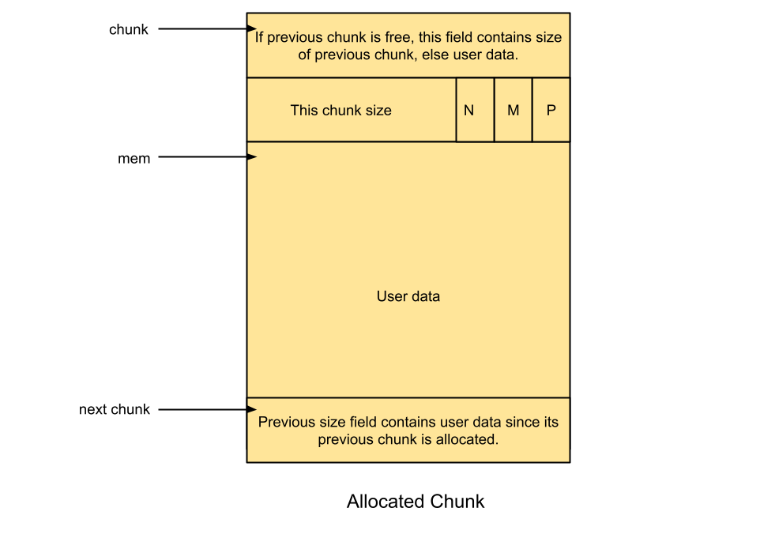

# Size后的N、M、P Flag

高位存储chunk的大小，低三位因为不会被存储的大小用到，所以分别会表示

- P -- `PREV_INUSE` 之前的 chunk 已经被分配时记为 1，未被分配为 0
- M -- `IS_MMAPED`​ 当前 chunk 时`mmap()`得到的则记为 1， 反之则为 0
- N -- `NON_MAIN_ARENA`​ 当前 chunk 在`non_main_arena`里则为 1， 反之则为0
