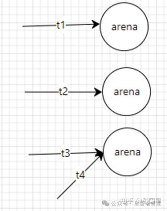

# 堆相关的数据结构

首先介绍的是堆的一些主要的内部结构 **堆的漏洞利用与结构密切相关**

# 微观结构

## [Malloc_chunk](堆相关的数据结构/Malloc_chunk.md)

> # [概述](堆相关的数据结构/Malloc_chunk/概述.md)
>
>> 在程序的执行过程中，我们称由 malloc 申请的内存为 `chunk` ，这块内存在 ptmalloc 内部用 malloc_chunk 结构体来表示。
>>
>> 当程序申请的 `chunk` 被 free 后，会被加入到相应的空闲管理列表中。
>>
>> 非常有意思的是，无论一个 `chunk` 的大小如何，处于分配状态还是释放状态，他们都使用一个统一的结构——虽然他们使用了同一个数据结构，但是根据是否被释放，它们的表现形式会有所不同。
>>
>> malloc_chunk是每个 chunk 的头部
>>
>> 其malloc_chunk的结构如下
>>
>> ```c
>> /*
>>   This struct declaration is misleading (but accurate and necessary).
>>   It declares a "view" into memory allowing access to necessary
>>   fields at known offsets from a given base. See explanation below.
>> */
>> struct malloc_chunk {
>>
>>   INTERNAL_SIZE_T      prev_size;  /* Size of previous chunk (if free).  */
>>   INTERNAL_SIZE_T      size;       /* Size in bytes, including overhead. */
>>
>>   struct malloc_chunk* fd;         /* double links -- used only if free. */
>>   struct malloc_chunk* bk;
>>
>>   /* Only used for large blocks: pointer to next larger size.  */
>>   struct malloc_chunk* fd_nextsize; /* double links -- used only if free. */
>>   struct malloc_chunk* bk_nextsize;
>> };
>> ```
>>
>>> 我们在此给出一些必要的宏的定义
>>>
>>> ```c
>>> /* INTERNAL_SIZE_T is the word-size used for internal bookkeeping of
>>>    chunk sizes.
>>>    The default version is the same as size_t.
>>>    While not strictly necessary, it is best to define this as an
>>>    unsigned type, even if size_t is a signed type. This may avoid some
>>>    artificial size limitations on some systems.
>>>    On a 64-bit machine, you may be able to reduce malloc overhead by
>>>    defining INTERNAL_SIZE_T to be a 32 bit `unsigned int' at the
>>>    expense of not being able to handle more than 2^32 of malloced
>>>    space. If this limitation is acceptable, you are encouraged to set
>>>    this unless you are on a platform requiring 16byte alignments. In
>>>    this case the alignment requirements turn out to negate any
>>>    potential advantages of decreasing size_t word size.
>>>    Implementors: Beware of the possible combinations of:
>>>      - INTERNAL_SIZE_T might be signed or unsigned, might be 32 or 64 bits,
>>>        and might be the same width as int or as long
>>>      - size_t might have different width and signedness as INTERNAL_SIZE_T
>>>      - int and long might be 32 or 64 bits, and might be the same width
>>>    To deal with this, most comparisons and difference computations
>>>    among INTERNAL_SIZE_Ts should cast them to unsigned long, being
>>>    aware of the fact that casting an unsigned int to a wider long does
>>>    not sign-extend. (This also makes checking for negative numbers
>>>    awkward.) Some of these casts result in harmless compiler warnings
>>>    on some systems.  */
>>> #ifndef INTERNAL_SIZE_T
>>> # define INTERNAL_SIZE_T size_t
>>> #endif
>>>
>>> /* The corresponding word size.  */
>>> #define SIZE_SZ (sizeof (INTERNAL_SIZE_T))
>>>
>>> /* The corresponding bit mask value.  */
>>> #define MALLOC_ALIGN_MASK (MALLOC_ALIGNMENT - 1)
>>>
>>> /* MALLOC_ALIGNMENT is the minimum alignment for malloc'ed chunks.  It
>>>    must be a power of two at least 2 * SIZE_SZ, even on machines for
>>>    which smaller alignments would suffice. It may be defined as larger
>>>    than this though. Note however that code and data structures are
>>>    optimized for the case of 8-byte alignment.  */
>>> #define MALLOC_ALIGNMENT (2 * SIZE_SZ < __alignof__ (long double) \
>>>               ? __alignof__ (long double) : 2 * SIZE_SZ)
>>> ```
>>>
>>
>>> 一般来说，`size_t`​会被定义为 `unsigned long`，在 64 位中是 64位无符号整数，在 32位中是 32位无符号整数。
>>>
>>
>> 下面我们来看 `chunk` 结构体，各个字段的具体的解释如下：
>>
>> - **prev_size**，如果该`chunk`​的物理相邻的前一地址 chunk ( 两个指针的地址差值为前一chunk的大小 ) 是空闲的话，那么该字段记录的是前一个 `chunk`​ 的大小 ( 包括 `chunk`​ 头 )。    否则，该字段可以用来存储物理相邻的前一个 chunk 的数据。这里的前一个 `chunk`​ 指的是较低地址的 `chunk`。
>> - **size**，该 `chunk`​ 的大小，大小必须是 `MALLOC_ALIGNMENT`​ 的整数倍。如果申请的内存大小不是 `MALLOC_ALIGNMENT`​ 的整数倍，会被转换为满足大小的最小的 `MALLOC_ALIGNMENT`​ 的倍数，这会通过 `request2size()` 宏来完成。
>>
>>   在32位系统中， `MALLOC_ALIGNMENT`​ 可能是 `4`​ 或者 `8`​ ；而在64位系统中， `MALLOC_ALIGNMENT`​ 只可能是 `8`​ 。该字段的低三个比特位对 `chunk` 的大小没有影响，他们从高到低分别表示
>>
>>   - NON_MAIN_ARENA    这一位记录当前 `chunk`​ 是否属于主线程，属于主线程标记为 `0`​ ，不属于主线程标记为 `1`.
>>   - IS_MAPPED    这一位记录前一个 `chunk` 是否是有mmap分配的.
>>   - PREV_INUSE    这一位记录前一个 `chunk`​ 块是否被分配。一般来说，堆中的第一个被分配的内存块的 size 字段的 P位 都会被设置为1，以便于防止访问前面的非法内存。当一个`chunk`​的 size 的 P位 为0时，我们能通过 `prev_size`​ 字段来获取上一个 `chunk`​ 的大小以及地址。这会方便程序进行 空闲的`chunk` 之间的合并。
>> - **fd、bk**，当 `chunk`​ 处于分配状态时，从 fd 字段开始就是用户的数据；当 `chunk` 处于空闲状态时，其字段会被添加到对应的空闲管理链表中，其字段含义如下
>>
>>   - **fd** 指向下一个 (非物理相邻) 空闲的 `chunk`
>>   - **bk** 指向上一个 (非物理相邻) 空闲的 `chunk`
>> - **fd_nextsize、bk_nextsize** 也是只有在 `chunk`​ 空闲时才会使用，不过其用于较大的 `chunk` 上 (Large Chunk)
>>
>>   - fd\_nextsize 指向前一个与当前 `chunk` 大小不同的第一个空闲块，不包含 bin 的头指针。
>>   - bk\_nextsize 指向后一个与当前 `chunk` 大小不同的第一个空闲块，不包含 bin 的头指针。
>>   - 一般空闲的  `large chunk`​ 在 fd 的遍历顺序中，按照由大到小的顺序排列。**这样做可以避免在寻找合适 chunk 时挨个遍历。**
>>
>>> 自 glibc-2.26 版本起，在32位glibc中，`MALLOC_ALIGNMENT`​ 宏的定义在编译时优先选择 `sysdeps/i386/malloc-alignment.h` 中的定义，该值定义为了一个常量：
>>>
>>> ```c
>>> #define MALLOC_ALIGNMENT 16
>>> ```
>>>
>>> 因此，对于自 glibc-2.26 起的32位 glibc 中，`MALLOC_ALIGNMENT`​ 并非基于 `SIZE_SZ`​ 计算的 `8`​ ，而是和64位glibc所用相同的 `16`
>>>
>>
>> 一个已经分配的 `chunk` 的样子如下
>>
>> ```c
>> chunk-> +-+-+-+-+-+-+-+-+-+-+-+-+-+-+-+-+-+-+-+-+-+-+-+-+-+-+-+-+-+-+-+-+
>>         |             Size of previous chunk, if unallocated (P clear)  |
>>         +-+-+-+-+-+-+-+-+-+-+-+-+-+-+-+-+-+-+-+-+-+-+-+-+-+-+-+-+-+-+-+-+
>>         |             Size of chunk, in bytes                     |A|M|P|
>>   mem-> +-+-+-+-+-+-+-+-+-+-+-+-+-+-+-+-+-+-+-+-+-+-+-+-+-+-+-+-+-+-+-+-+
>>         |             User data starts here...                          .
>>         .                                                               .
>>         .             (malloc_usable_size() bytes)                      .
>> next    .                                                               |
>> chunk-> +-+-+-+-+-+-+-+-+-+-+-+-+-+-+-+-+-+-+-+-+-+-+-+-+-+-+-+-+-+-+-+-+
>>         |             (size of chunk, but used for application data)    |
>>         +-+-+-+-+-+-+-+-+-+-+-+-+-+-+-+-+-+-+-+-+-+-+-+-+-+-+-+-+-+-+-+-+
>>         |             Size of next chunk, in bytes                |A|0|1|
>>         +-+-+-+-+-+-+-+-+-+-+-+-+-+-+-+-+-+-+-+-+-+-+-+-+-+-+-+-+-+-+-+-+
>> ```
>>
>> **我们将前两个字段称为** **​`chunk header`​**​  **，后面的部分称为** **​`user data`​** 。
>>
>> **每次 malloc 申请得到的内存指针，其实指向** **​`user data`​**​ **的起始处。**
>>
>> 当一个 `chunk`​ 处于使用状态时，它的下一个 `chunk`​ 的 `prev_size`​ 域无效，所以下一个 `chunk`​ 的该部分也可以被当前的 `chunk`​ 使用。**这就是** **​`chunk`​**​ **中的空间复用**
>>
>> 一个被释放的`chunk`被记录在链表中 (可能是循环双向链表，也可能是单向链表)，具体结构如下
>>
>> ```c
>> chunk-> +-+-+-+-+-+-+-+-+-+-+-+-+-+-+-+-+-+-+-+-+-+-+-+-+-+-+-+-+-+-+-+-+
>>         |             Size of previous chunk, if unallocated (P clear)  |
>>         +-+-+-+-+-+-+-+-+-+-+-+-+-+-+-+-+-+-+-+-+-+-+-+-+-+-+-+-+-+-+-+-+
>> `head:' |             Size of chunk, in bytes                     |A|0|P|
>>   mem-> +-+-+-+-+-+-+-+-+-+-+-+-+-+-+-+-+-+-+-+-+-+-+-+-+-+-+-+-+-+-+-+-+
>>         |             Forward pointer to next `chunk` in list           |
>>         +-+-+-+-+-+-+-+-+-+-+-+-+-+-+-+-+-+-+-+-+-+-+-+-+-+-+-+-+-+-+-+-+
>>         |             Back pointer to previous `chunk` in list          |
>>         +-+-+-+-+-+-+-+-+-+-+-+-+-+-+-+-+-+-+-+-+-+-+-+-+-+-+-+-+-+-+-+-+
>>         |             Unused space (may be 0 bytes long)                .
>>         .                                                               .
>>  next   .                                                               |
>> chunk-> +-+-+-+-+-+-+-+-+-+-+-+-+-+-+-+-+-+-+-+-+-+-+-+-+-+-+-+-+-+-+-+-+
>> `foot:' |             Size of chunk, in bytes                           |
>>         +-+-+-+-+-+-+-+-+-+-+-+-+-+-+-+-+-+-+-+-+-+-+-+-+-+-+-+-+-+-+-+-+
>>         |             Size of next chunk, in bytes                |A|0|0|
>>         +-+-+-+-+-+-+-+-+-+-+-+-+-+-+-+-+-+-+-+-+-+-+-+-+-+-+-+-+-+-+-+-+
>> ```
>>
>> 可以发现，如果一个 `chunk` 处于 free 状态，那么会有两个位置记录相应的大小
>>
>> 1. 本身的size字段会记录
>> 2. 它后面的 `chunk` 会记录
>>
>> **在一般情况下，** 物理相邻的两个空闲的 `chunk`​ 会被合并为一个 `chunk`。
>>
>> 堆管理器会通过 prev_size 字段以及 size 字段来对两个物理相邻的空闲 `chunk` 块进行合并。
>>
>>> 特别的，我们对于堆有一些约束条件，我们在后面将会详细讲解并考虑
>>>
>>> ```c
>>> /*
>>>     The three exceptions to all this are:
>>>      1. The special chunk `top' doesn't bother using the
>>>     trailing size field since there is no next contiguous chunk
>>>     that would have to index off it. After initialization, `top'
>>>     is forced to always exist.  If it would become less than
>>>     MINSIZE bytes long, it is replenished.
>>>      2. Chunks allocated via mmap, which have the second-lowest-order
>>>     bit M (IS_MMAPPED) set in their size fields.  Because they are
>>>     allocated one-by-one, each must contain its own trailing size
>>>     field.  If the M bit is set, the other bits are ignored
>>>     (because mmapped chunks are neither in an arena, nor adjacent
>>>     to a freed chunk).  The M bit is also used for chunks which
>>>     originally came from a dumped heap via malloc_set_state in
>>>     hooks.c.
>>>      3. Chunks in fastbins are treated as allocated chunks from the
>>>     point of view of the chunk allocator.  They are consolidated
>>>     with their neighbors only in bulk, in malloc_consolidate.
>>> */
>>>
>>> Translate to Chinese：
>>> /* 
>>> 	所有这些规则有三个例外情况： 
>>> 	1. 特殊的内存块 top 无需使用尾部大小字段，因为不存在需要根据该字段进行索引的下一个连续内存块。
>>> 	初始化后，top 始终会存在。如果其长度小于 MINSIZE 字节，就会对其进行补充。 
>>> 	2. 通过 mmap 分配的内存块，其大小字段中设置了次低位的 M 位（IS_MMAPPED）。
>>> 	由于它们是逐个分配的，每个内存块都必须包含自己的尾部大小字段。
>>> 	如果 M 位被设置，则忽略其他位（因为通过 mmap 分配的内存块既不在某个内存区域中，也不与已释放的内存块相邻）。
>>> 	M 位还用于通过 hooks.c 中的 malloc_set_state 从转储堆中获取的内存块。 ``
>>> 	3. 从内存块分配器的角度来看，快速链表（fastbins）中的内存块被视为已分配的内存块。
>>> 	只有在 malloc_consolidate 函数中进行批量操作时，它们才会与其相邻的内存块进行合并。 
>>>
>>> */                        
>>> ```
>>>
>>
>
> # [Chunk 相关宏](堆相关的数据结构/Malloc_chunk/Chunk%20相关宏.md)
>
>> # `chunk`chunk 与 mem 指针头部的转换
>>
>> mem 指向用户得到的内存的起始位置
>>
>> ```c
>> /* conversion from malloc headers to user pointers, and back */
>> #define chunk2mem(p) ((void *) ((char *) (p) + 2 * SIZE_SZ))
>> #define mem2chunk(mem) ((mchunkptr)((char *) (mem) -2 * SIZE_SZ))
>> ```
>>
>> # 最小的chunk大小
>>
>> ```c
>> /* The smallest possible chunk */
>> #define MIN_CHUNK_SIZE (offsetof(struct malloc_chunk, fd_nextsize))
>> ```
>>
>> 在这里， offsetof() 函数会计算出 fd_nextsize 在 malloc_chunk 中的便宜，说明最小的 chunk 至少要包含 bk 指针。
>>
>> # 最小申请的堆内存大小
>>
>> 用户最小申请的内存大小必须是 2*SIZE_SZ 的最小整数倍
>>
>>> Tip
>>>
>>> 就目前而看 MIN_CHUNK_SIZE 和 MINISIZE 大小是一致的，这样设置两个宏的目的推测是方便之后对malloc_chunk的修改
>>>
>>> ```c
>>> /* The smallest size we can malloc is an aligned minimal chunk */
>>> //MALLOC_ALIGN_MASK = 2 * SIZE_SZ -1
>>> #define MINSIZE                                                                \
>>>     (unsigned long) (((MIN_CHUNK_SIZE + MALLOC_ALIGN_MASK) &                   \
>>>                       ~MALLOC_ALIGN_MASK))
>>> ```
>>>
>>
>> # 检查分配给用户的内存是否对齐
>>
>> 2 * SIZE_SZ 大小对齐
>>
>> ```c
>> /* Check if m has acceptable alignment */
>> // MALLOC_ALIGN_MASK = 2 * SIZE_SZ -1
>> #define aligned_OK(m) (((unsigned long) (m) & MALLOC_ALIGN_MASK) == 0)
>>
>> #define misaligned_chunk(p)                                                    \
>>     ((uintptr_t)(MALLOC_ALIGNMENT == 2 * SIZE_SZ ? (p) : chunk2mem(p)) &       \
>>      MALLOC_ALIGN_MASK)
>> ```
>>
>> # 请求字节数判断
>>
>> ```c
>> /*
>>    Check if a request is so large that it would wrap around zero when
>>    padded and aligned. To simplify some other code, the bound is made
>>    low enough so that adding MINSIZE will also not wrap around zero.
>>  */
>>
>> #define REQUEST_OUT_OF_RANGE(req)                                              \
>>     ((unsigned long) (req) >= (unsigned long) (INTERNAL_SIZE_T)(-2 * MINSIZE))
>> ```
>>
>> # 将用户请求内存大小转为实际分配内存大小
>>
>> ```c
>> /* pad request bytes into a usable size -- internal version */
>> //MALLOC_ALIGN_MASK = 2 * SIZE_SZ -1
>> #define request2size(req)                                                      \
>>     (((req) + SIZE_SZ + MALLOC_ALIGN_MASK < MINSIZE)                           \
>>          ? MINSIZE                                                             \
>>          : ((req) + SIZE_SZ + MALLOC_ALIGN_MASK) & ~MALLOC_ALIGN_MASK)
>>
>> /*  Same, except also perform argument check */
>>
>> #define checked_request2size(req, sz)                                          \
>>     if (REQUEST_OUT_OF_RANGE(req)) {                                           \
>>         __set_errno(ENOMEM);                                                   \
>>         return 0;                                                              \
>>     }                                                                          \
>>     (sz) = request2size(req);
>> ```
>>
>> 当一个 `chunk`​ 处于以分配状态时，它的物理相邻的下一个 `chunk`​ 的 prev_size 字段必然是无效的，故而这个字段就可以被当前这个 `chunk`​ 使用。 这就是 ptmalloc 中 `chunk` 间的复用。
>>
>> 具体流程如下
>>
>> 1. 首先利用 `REQUEST_OUT_OF_RANGE`​ 判断是否可以分配用户请求的字节大小的 `chunk`
>> 2. 之后，需要注意的是用户请求的字节是用来存储数据的，即 `chunk header` 后面的部分。
>>
>>    与此同时，由于 `chunk`​ 间复用，所以可以使用下一个 `chunk` 的 prev_size 字段。因此，这里只需要再添加 SIZE_SZ 大小即可完全存储内容。
>> 3. 由于系统中所允许的申请的 `chunk` 最小的大小是 MINISIZE，所以对其进行比较，如果不满足最低要求，即直接分配 MINISIZE 字节。
>> 4. 如果前一条的比较结果是大于 MINISIZE， 由于系统中申请的 `chunk`​ 需要进行对齐操作，所以这里需要加上 MALLOC_ALIGN_MASK 以便进行 `chunk` 的对齐
>>
>> # 标记位相关宏
>>
>> ```c
>> /* size field is or'ed with PREV_INUSE when previous adjacent chunk in use */
>> #define PREV_INUSE 0x1
>>
>> /* extract inuse bit of previous chunk */
>> #define prev_inuse(p) ((p)->mchunk_size & PREV_INUSE)
>>
>> /* size field is or'ed with IS_MMAPPED if the chunk was obtained with mmap() */
>> #define IS_MMAPPED 0x2
>>
>> /* check for mmap()'ed chunk */
>> #define chunk_is_mmapped(p) ((p)->mchunk_size & IS_MMAPPED)
>>
>> /* size field is or'ed with NON_MAIN_ARENA if the chunk was obtained
>>    from a non-main arena.  This is only set immediately before handing
>>    the chunk to the user, if necessary.  */
>> #define NON_MAIN_ARENA 0x4
>>
>> /* Check for chunk from main arena.  */
>> #define chunk_main_arena(p) (((p)->mchunk_size & NON_MAIN_ARENA) == 0)
>>
>> /* Mark a chunk as not being on the main arena.  */
>> #define set_non_main_arena(p) ((p)->mchunk_size |= NON_MAIN_ARENA)
>>
>> /*
>>    Bits to mask off when extracting size
>>    Note: IS_MMAPPED is intentionally not masked off from size field in
>>    macros for which mmapped chunks should never be seen. This should
>>    cause helpful core dumps to occur if it is tried by accident by
>>    people extending or adapting this malloc.
>>  */
>> #define SIZE_BITS (PREV_INUSE | IS_MMAPPED | NON_MAIN_ARENA)
>> ```
>>
>> # 获取 chunk size
>>
>> ```c
>> /* Get size, ignoring use bits */
>> #define chunksize(p) (chunksize_nomask(p) & ~(SIZE_BITS))
>>
>> /* Like chunksize, but do not mask SIZE_BITS.  */
>> #define chunksize_nomask(p) ((p)->mchunk_size)
>> ```
>>
>> # 获取下一个物理相邻的 chunk
>>
>> ```c
>> /* Ptr to next physical malloc_chunk. */
>> #define next_chunk(p) ((mchunkptr)(((char *) (p)) + chunksize(p)))
>> ```
>>
>> # 获取前一个 chunk 的信息
>>
>> ```c
>> /* Size of the chunk below P.  Only valid if !prev_inuse (P).  */
>> #define prev_size(p) ((p)->mchunk_prev_size)
>>
>> /* Set the size of the chunk below P.  Only valid if !prev_inuse (P).  */
>> #define set_prev_size(p, sz) ((p)->mchunk_prev_size = (sz))
>>
>> /* Ptr to previous physical malloc_chunk.  Only valid if !prev_inuse (P).  */
>> #define prev_chunk(p) ((mchunkptr)(((char *) (p)) - prev_size(p)))
>> ```
>>
>> # 当前 chunk 使用状态的相关操作
>>
>> ```c
>> /* extract p's inuse bit */
>> #define inuse(p)                                                               \
>>     ((((mchunkptr)(((char *) (p)) + chunksize(p)))->mchunk_size) & PREV_INUSE)
>>
>> /* set/clear chunk as being inuse without otherwise disturbing */
>> #define set_inuse(p)                                                           \
>>     ((mchunkptr)(((char *) (p)) + chunksize(p)))->mchunk_size |= PREV_INUSE
>>
>> #define clear_inuse(p)                                                         \
>>     ((mchunkptr)(((char *) (p)) + chunksize(p)))->mchunk_size &= ~(PREV_INUSE)
>> ```
>>
>> # 设置 chunk 的 size 字段
>>
>> ```c
>> /* Set size at head, without disturbing its use bit */
>> // SIZE_BITS = 7
>> #define set_head_size(p, s)                                                    \
>>     ((p)->mchunk_size = (((p)->mchunk_size & SIZE_BITS) | (s)))
>>
>> /* Set size/use field */
>> #define set_head(p, s) ((p)->mchunk_size = (s))
>>
>> /* Set size at footer (only when chunk is not in use) */
>> #define set_foot(p, s)                                                         \
>>     (((mchunkptr)((char *) (p) + (s)))->mchunk_prev_size = (s))
>> ```
>>
>> # 获取指定偏移的 chunk
>>
>> ```c
>> /* Treat space at ptr + offset as a chunk */
>> #define chunk_at_offset(p, s) ((mchunkptr)(((char *) (p)) + (s)))
>> ```
>>
>> # 制定偏移处 chunk 使用状态的相关操作
>>
>> ```c
>> /* check/set/clear inuse bits in known places */
>> #define inuse_bit_at_offset(p, s)                                              \
>>     (((mchunkptr)(((char *) (p)) + (s)))->mchunk_size & PREV_INUSE)
>>
>> #define set_inuse_bit_at_offset(p, s)                                          \
>>     (((mchunkptr)(((char *) (p)) + (s)))->mchunk_size |= PREV_INUSE)
>>
>> #define clear_inuse_bit_at_offset(p, s)                                        \
>>     (((mchunkptr)(((char *) (p)) + (s)))->mchunk_size &= ~(PREV_INUSE))
>> ```
>>

## [Bin](堆相关的数据结构/Bin.md)

> # [概述](堆相关的数据结构/Bin/概述.md)
>
>> 我们曾说过，用户释放掉的 `chunk` 并不会马上归还给系统， ptmalloc 会统一管理 heap 以及 mmap 映射区域中的空闲的 chunk。
>>
>> 当用户再一次请求分配内存时，ptmalloc 分配器会试图在空闲的 `chunk` 中挑选一块合适的分配给用户。 这样的操作能够避免平凡的系统调用，以降低内存分配的开销。
>>
>> 我们在具体的实现中，ptmalloc 采用分箱式方法堆空闲的 `chunk` 进行管理。
>>
>> 首先，它会根据空闲的 `chunk`​ 的大小以及使用状态，将`chunk`初步分为4类：
>>
>> - Fast Bin
>> - Small Bin
>> - Large Bin
>> - Unsorted Bin
>>
>> 对于每一类又有更细的划分，相似大小的 `chunk` 会用双向链表连接起来。
>>
>> 也就是说，在每类 Bin 的内部仍然会有多个互不相关的链表来保存不同大小的 chunk。
>>
>> 对于 Small Bin、Large Bin、Unsorted Bin 来说，ptmalloc 会将它们维护在同一个数组之中。
>>
>> 这些 Bin 对应的数据结构在 Malloc_state 中，如下
>>
>> ```c
>> #define NBINS 128
>> /* Normal bins packed as described above */
>> mchunkptr bins[ NBINS * 2 - 2 ];
>> ```
>>
>> ​`Bins` 主要是用于索引不同的 Bin 的 fd 以及 bk。
>>
>> 为了简化双向链表的使用，每个 Bin 的header都被设置为 malloc_chunk 类型。 这样可以避免 header 类型以及其特殊处理。
>>
>> 但为了节省空间以及提高局限性，我们只会分配 Bin 的 fd/bk 指针，然后再使用 respositioning tricks 将这些指针视为一个 `malloc_chunk*` 的字段。
>>
>> 这里我们以 32位系统为例子， Bin 的前四项含义如下
>>
>> |含义|bin1 的 fd/bin2 的 prev\_size|bin1 的 bk/bin2 的 size|bin2 的 fd/bin3 的 prev\_size|bin2 的 bk/bin3 的 size|
>> | --------| ----------------------------| -----------------------| ----------------------------| -----------------------|
>> |bin 下标|0|1|2|3|
>>
>> 我们可以看到，bin2 的 prev_size、size 以及 bin1 的 fd、bk 是重合的。
>>
>> 由于我们只会使用 fd 和 bk 来索引链表，所以该重合部分的数据其实记录的是 bin1 的 fd、bk 。也就是说，虽然 bin2 和 bin1 共用部分数据，但是记录的仍然是前一个 bin 的链表数据。
>>
>> 通过这样的数据复用，程序可以节省部分内存空间。
>>
>> 在 数组中的 Bin 以此如下
>>
>> 1. 第一个为 『Unsorted Bin』。正如其名，存在此处的 `chunk`​ 没有进行排序，存储的 `chunk` 比较杂乱。
>> 2. 索引从 2 至 63 的 Bin 被称为 『Small Bin』。同一个 Small Bin 链表中的 `chunk` 的大小相同。
>>
>>    两个相邻索引的 Small Bin 链表中的 `chunk`​ 大小相差的字节数为 **2机器字长** ，即32位相差 8字节，64位相差 16字节。
>> 3. Small Bin 之后的 Bin 被称作 『Large Bin』。Large Bin 中的每一个 Bin 都包含一定范围内的 `chunk`​ ，其中的 `chunk` 按 fd指针 的顺序从大到小排列。
>>
>>    相同大小的 `chunk` 同样按照最近使用的顺序排列。
>>
>> 此外，上述这些 Bin 的排布都会遵循一个原则：   **任意两个物理相邻的** **空闲**​**​`chunk`​**​ **的使用标记总是被置位的，因而上述原则在 两个物理相邻的空闲**​**​`chunk`​**​ **上无效**
>>
>> # Bin 的通用宏
>>
>> ```c
>> typedef struct malloc_chunk *mbinptr;
>>
>> /* addressing -- note that bin_at(0) does not exist */
>> #define bin_at(m, i)                                                           \
>>     (mbinptr)(((char *) &((m)->bins[ ((i) -1) * 2 ])) -                        \
>>               offsetof(struct malloc_chunk, fd))
>>
>> /* analog of ++bin */
>> //获取下一个bin的地址
>> #define next_bin(b) ((mbinptr)((char *) (b) + (sizeof(mchunkptr) << 1)))
>>
>> /* Reminders about list directionality within bins */
>> // 这两个宏可以用来遍历bin
>> // 获取 bin 的位于链表头的 chunk
>> #define first(b) ((b)->fd)
>> // 获取 bin 的位于链表尾的 chunk
>> #define last(b) ((b)->bk)
>> ```
>>
>
> # [Fast Bin](堆相关的数据结构/Bin/Fast%20Bin.md)
>
>> # 概述
>>
>> 大多数程序，会经常申请以及释放一些比较小的内存块。
>>
>> 如果我们将一些较小的 `chunk`​ 释放，随后发现存在与之相邻的 空闲的 `chunk`​ ，对其进行合并，那么在下一次申请相应大小的 `chunk`​ 时，我们就需要对 `chunk` 进行分割，着就大大降低了堆的利用效率。
>>
>> **因为我们将大部分时间花在了合并、分割及检查的过程中。**
>>
>> 因此，ptmalloc设计了 FastBin应对当前场景。 其对应的变量是 Malloc_State 中的 fastbinY
>>
>> ```c
>> /*
>>    Fastbins
>>
>>     An array of lists holding recently freed small chunks.  Fastbins
>>     are not doubly linked.  It is faster to single-link them, and
>>     since chunks are never removed from the middles of these lists,
>>     double linking is not necessary. Also, unlike regular bins, they
>>     are not even processed in FIFO order (they use faster LIFO) since
>>     ordering doesn't much matter in the transient contexts in which
>>     fastbins are normally used.
>>
>>     Chunks in fastbins keep their inuse bit set, so they cannot
>>     be consolidated with other free chunks. malloc_consolidate
>>     releases all chunks in fastbins and consolidates them with
>>     other free chunks.
>>  */
>> typedef struct malloc_chunk *mfastbinptr;
>>
>> /*
>>     This is in malloc_state.
>>     /* Fastbins */
>>     mfastbinptr fastbinsY[ NFASTBINS ];
>> */
>> ```
>>
>> 为了更好的、更高效的使用 FastBin，glibc 采用了单向链表，对其涵盖的每个 Bin 进行组织，并**每个Bin都采用LIFO规则<sup>（最近释放的 chunk 会被更早的分配， 这样会更加适合于局部性）</sup>**。
>>
>> 也就是说，当用户需要的 `chunk`​ 大小小于 FastBin 的最大大小时， ptmalloc 将会优先判断 FastBin 中相应的 Bin 中是否有对应大小的空闲块，如果有，则直接从这个bin中获取其 `chunk`。
>>
>> 如果没有，ptmalloc 才会进行接下来的一系列的操作。
>>
>> 在默认情况下 (这里以32位系统为例) ， FastBin 中 默认支持最大的 `chunk`​ 的数据空间大小为 64字节，但其可以支持的 `chunk` 的数据空间最大为 80字节。
>>
>> 除此之外， FastBin 最多可以支持的 Bin 的个数为 10个，从数据空间为 8字节 开始，一直到 80字节 (注意，这里说的是数据空间大小，即除去了 prev_size 及 size 字段部分的大小)
>>
>> 定义如下
>>
>> ```c
>> #define NFASTBINS (fastbin_index(request2size(MAX_FAST_SIZE)) + 1)
>>
>> #ifndef DEFAULT_MXFAST
>> #define DEFAULT_MXFAST (64 * SIZE_SZ / 4)
>> #endif
>>
>> /* The maximum fastbin request size we support */
>> #define MAX_FAST_SIZE (80 * SIZE_SZ / 4)
>>
>> /*
>>    Since the lowest 2 bits in max_fast don't matter in size comparisons,
>>    they are used as flags.
>>  */
>>
>> /*
>>    FASTCHUNKS_BIT held in max_fast indicates that there are probably
>>    some fastbin chunks. It is set true on entering a chunk into any
>>    fastbin, and cleared only in malloc_consolidate.
>>
>>    The truth value is inverted so that have_fastchunks will be true
>>    upon startup (since statics are zero-filled), simplifying
>>    initialization checks.
>>  */
>> //判断分配区是否有 fast bin chunk，1表示没有
>> #define FASTCHUNKS_BIT (1U)
>>
>> #define have_fastchunks(M) (((M)->flags & FASTCHUNKS_BIT) == 0)
>> #define clear_fastchunks(M) catomic_or(&(M)->flags, FASTCHUNKS_BIT)
>> #define set_fastchunks(M) catomic_and(&(M)->flags, ~FASTCHUNKS_BIT)
>>
>> /*
>>    NONCONTIGUOUS_BIT indicates that MORECORE does not return contiguous
>>    regions.  Otherwise, contiguity is exploited in merging together,
>>    when possible, results from consecutive MORECORE calls.
>>
>>    The initial value comes from MORECORE_CONTIGUOUS, but is
>>    changed dynamically if mmap is ever used as an sbrk substitute.
>>  */
>> // MORECORE是否返回连续的内存区域。
>> // 主分配区中的MORECORE其实为sbr()，默认返回连续虚拟地址空间
>> // 非主分配区使用mmap()分配大块虚拟内存，然后进行切分来模拟主分配区的行为
>> // 而默认情况下mmap映射区域是不保证虚拟地址空间连续的，所以非主分配区默认分配非连续虚拟地址空间。
>> #define NONCONTIGUOUS_BIT (2U)
>>
>> #define contiguous(M) (((M)->flags & NONCONTIGUOUS_BIT) == 0)
>> #define noncontiguous(M) (((M)->flags & NONCONTIGUOUS_BIT) != 0)
>> #define set_noncontiguous(M) ((M)->flags |= NONCONTIGUOUS_BIT)
>> #define set_contiguous(M) ((M)->flags &= ~NONCONTIGUOUS_BIT)
>>
>> /* ARENA_CORRUPTION_BIT is set if a memory corruption was detected on the
>>    arena.  Such an arena is no longer used to allocate chunks.  Chunks
>>    allocated in that arena before detecting corruption are not freed.  */
>>
>> #define ARENA_CORRUPTION_BIT (4U)
>>
>> #define arena_is_corrupt(A) (((A)->flags & ARENA_CORRUPTION_BIT))
>> #define set_arena_corrupt(A) ((A)->flags |= ARENA_CORRUPTION_BIT)
>>
>> /*
>>    Set value of max_fast.
>>    Use impossibly small value if 0.
>>    Precondition: there are no existing fastbin chunks.
>>    Setting the value clears fastchunk bit but preserves noncontiguous bit.
>>  */
>>
>> #define set_max_fast(s)                                                        \
>>     global_max_fast =                                                          \
>>         (((s) == 0) ? SMALLBIN_WIDTH : ((s + SIZE_SZ) & ~MALLOC_ALIGN_MASK))
>> #define get_max_fast() global_max_fast
>> ```
>>
>> ptmalloc 默认情况下会调用 set_max_fast(s)，将全局变量 global_max_fast 设置为 DEFAULT_MXFAST ，也就是设置 FastBin 中 `chunk` 的最大值。
>>
>> 当 MAX_FAST_SIZE 被设置为0时，系统不会支持 FastBin。
>>
>> # FastBin 的索引
>>
>> ```c
>> #define fastbin(ar_ptr, idx) ((ar_ptr)->fastbinsY[ idx ])
>>
>> /* offset 2 to use otherwise unindexable first 2 bins */
>> // chunk size=2*size_sz*(2+idx)
>> // 这里要减2，否则的话，前两个bin没有办法索引到。
>> #define fastbin_index(sz)                                                      \
>>     ((((unsigned int) (sz)) >> (SIZE_SZ == 8 ? 4 : 3)) - 2)
>> ```
>>
>> ​**需要特别注意的是，fastbin 范围的** **​`chunk`​**​ **的 inuse 始终会被设置为 1。**
>>
>> **因此它们不会和其他被释放的** **​`chunk`​**​ **合并。**
>>
>> 当释放的 `chunk`​ 与该 `chunk`​ 相邻的空闲 `chunk`​ 合并后的大小大于 FASTBIN_CONSOLIDATION_THRESHOLD 时，这时内存碎片可能比较多了，我们需要将 FastBin 中的 `chunk` 全部进行合并，以减少内存碎片对于系统的影响。
>>
>> ```c
>> /*
>>    FASTBIN_CONSOLIDATION_THRESHOLD is the size of a chunk in free()
>>    that triggers automatic consolidation of possibly-surrounding
>>    fastbin chunks. This is a heuristic, so the exact value should not
>>    matter too much. It is defined at half the default trim threshold as a
>>    compromise heuristic to only attempt consolidation if it is likely
>>    to lead to trimming. However, it is not dynamically tunable, since
>>    consolidation reduces fragmentation surrounding large chunks even
>>    if trimming is not used.
>>  */
>>
>> #define FASTBIN_CONSOLIDATION_THRESHOLD (65536UL)
>> ```
>>
>> **malloc_consolidate 函数可以将 FastBin 中的所有能与其他**  ****  **​`chunk`​**​ **合并的** **​`chunk`​**​ **合并在一起。**
>>
>> **具体的实现方法参见后续的详细 函数分析。**
>>
>> ```c
>> /*
>>     Chunks in fastbins keep their inuse bit set, so they cannot
>>     be consolidated with other free chunks. malloc_consolidate
>>     releases all chunks in fastbins and consolidates them with
>>     other free chunks.
>>  */
>> ```
>>
>
> # [Small Bin](堆相关的数据结构/Bin/Small%20Bin.md)
>
>> Small Bin 中每个 `chunk` 的大小与其所在的 Bin 的 Index 的关系为:
>>
>> Chunk_Size = 2 * SIZE_SZ * Index
>>
>> 具体如下
>>
>> |下标|SIZE\_SZ\=4（32 位）|SIZE\_SZ\=8（64 位）|
>> | ----| ------------------| ------------------|
>> |2|16|32|
>> |3|24|48|
>> |4|32|64|
>> |5|40|80|
>> |x|2\*4\*x|2\*8\*x|
>> |63|504|1008|
>>
>> Small Bin 中一共有 62个循环双向链表，每个链表中存储的`chunk` 大小都一致。
>>
>> 比如对于 32位的系统而言，下表2所对应的双向链表中存储的 `chunk` 大小均为 16字节 。
>>
>> 每个链表都拥有链表头节点，这样方便于对链表内部节点的管理。
>>
>> 特别的，**Small Bin 中每个 Bin 对应的链表都采用** **FIFO规则**，所以同一个链表中先被释放的 `chunk` 会先被分配出去。
>>
>> Small Bin 相关的宏如下
>>
>> ```c
>> #define NSMALLBINS 64
>> #define SMALLBIN_WIDTH MALLOC_ALIGNMENT
>> // 是否需要对small bin的下标进行纠正
>> #define SMALLBIN_CORRECTION (MALLOC_ALIGNMENT > 2 * SIZE_SZ)
>>
>> #define MIN_LARGE_SIZE ((NSMALLBINS - SMALLBIN_CORRECTION) * SMALLBIN_WIDTH)
>> //判断chunk的大小是否在small bin范围内
>> #define in_smallbin_range(sz)                                                  \
>>     ((unsigned long) (sz) < (unsigned long) MIN_LARGE_SIZE)
>> // 根据chunk的大小得到small bin对应的索引。
>> #define smallbin_index(sz)                                                     \
>>     ((SMALLBIN_WIDTH == 16 ? (((unsigned) (sz)) >> 4)                          \
>>                            : (((unsigned) (sz)) >> 3)) +                       \
>>      SMALLBIN_CORRECTION)
>> ```
>>
>> **或许大家会疑惑，那 Small Bin 是否与 FastBin 中的** **​`chunk`​**​ **的大小会有大部分的重合？ 那么 Small Bin 中对应大小的 Bin 是否是没有太大的作用？**
>>
>> 其实不然， FastBin 中的 `chunk` 是有可能被放到 Small Bin 中去的，在我们后面分析具体的源码时，会有更深刻的理解。
>>
>
> # [Large Bin](堆相关的数据结构/Bin/Large%20Bin.md)
>
>> Large Bin 中一共包括 63个 Bin，每个 Bin 中的 `chunk` 的大小不是一致，而是处于一定区间范围内。
>>
>> 此外，这 63个 Bin 被分为了 6组，每组 Bin 中的 `chunk` 大小之间的公差一致
>>
>> 具体如下:
>>
>> |组|数量|公差|
>> | --| ----| -------|
>> |1|32|64B|
>> |2|16|512B|
>> |3|8|4096B|
>> |4|4|32768B|
>> |5|2|262144B|
>> |6|1|不限制|
>>
>> 这里我们以 32位平台的 Large Bin 为例，第一个 Large Bin 的起始 `chunk`​ 大小为 512字节，位于第一组，所以该 Bin 可以存储的 `chunk` 的大小范围为 [512,512+64) 。
>>
>> 关于 Large Bin 的宏如下
>>
>> ```c
>> #define largebin_index_32(sz)                                                  \
>>     (((((unsigned long) (sz)) >> 6) <= 38)                                     \
>>          ? 56 + (((unsigned long) (sz)) >> 6)                                  \
>>          : ((((unsigned long) (sz)) >> 9) <= 20)                               \
>>                ? 91 + (((unsigned long) (sz)) >> 9)                            \
>>                : ((((unsigned long) (sz)) >> 12) <= 10)                        \
>>                      ? 110 + (((unsigned long) (sz)) >> 12)                    \
>>                      : ((((unsigned long) (sz)) >> 15) <= 4)                   \
>>                            ? 119 + (((unsigned long) (sz)) >> 15)              \
>>                            : ((((unsigned long) (sz)) >> 18) <= 2)             \
>>                                  ? 124 + (((unsigned long) (sz)) >> 18)        \
>>                                  : 126)
>>
>> #define largebin_index_32_big(sz)                                              \
>>     (((((unsigned long) (sz)) >> 6) <= 45)                                     \
>>          ? 49 + (((unsigned long) (sz)) >> 6)                                  \
>>          : ((((unsigned long) (sz)) >> 9) <= 20)                               \
>>                ? 91 + (((unsigned long) (sz)) >> 9)                            \
>>                : ((((unsigned long) (sz)) >> 12) <= 10)                        \
>>                      ? 110 + (((unsigned long) (sz)) >> 12)                    \
>>                      : ((((unsigned long) (sz)) >> 15) <= 4)                   \
>>                            ? 119 + (((unsigned long) (sz)) >> 15)              \
>>                            : ((((unsigned long) (sz)) >> 18) <= 2)             \
>>                                  ? 124 + (((unsigned long) (sz)) >> 18)        \
>>                                  : 126)
>>
>> // XXX It remains to be seen whether it is good to keep the widths of
>> // XXX the buckets the same or whether it should be scaled by a factor
>> // XXX of two as well.
>> #define largebin_index_64(sz)                                                  \
>>     (((((unsigned long) (sz)) >> 6) <= 48)                                     \
>>          ? 48 + (((unsigned long) (sz)) >> 6)                                  \
>>          : ((((unsigned long) (sz)) >> 9) <= 20)                               \
>>                ? 91 + (((unsigned long) (sz)) >> 9)                            \
>>                : ((((unsigned long) (sz)) >> 12) <= 10)                        \
>>                      ? 110 + (((unsigned long) (sz)) >> 12)                    \
>>                      : ((((unsigned long) (sz)) >> 15) <= 4)                   \
>>                            ? 119 + (((unsigned long) (sz)) >> 15)              \
>>                            : ((((unsigned long) (sz)) >> 18) <= 2)             \
>>                                  ? 124 + (((unsigned long) (sz)) >> 18)        \
>>                                  : 126)
>>
>> #define largebin_index(sz)                                                     \
>>     (SIZE_SZ == 8 ? largebin_index_64(sz) : MALLOC_ALIGNMENT == 16             \
>>                                                 ? largebin_index_32_big(sz)    \
>>                                                 : largebin_index_32(sz))
>> ```
>>
>> 这里我们以 32位平台下，第一个 Large Bin 的起始 `chunk` 大小为例，其大小为 512字节，那么进行计算:  512>>6 == 8 ，所以其下标为 56 + ( 512 >> 6 ) == 64 。
>>
>
> # [Unsorted Bin](堆相关的数据结构/Bin/Unsorted%20Bin.md)
>
>> Unsorted Bin 可以视为空闲 `chunk` 回归其所属 Bin 之前的缓冲区。
>>
>> 其在 Glibc 中具体的说明如下:
>>
>> ```c
>> /*
>>    Unsorted chunks
>>
>>     All remainders from chunk splits, as well as all returned chunks,
>>     are first placed in the "unsorted" bin. They are then placed
>>     in regular bins after malloc gives them ONE chance to be used before
>>     binning. So, basically, the unsorted_chunks list acts as a queue,
>>     with chunks being placed on it in free (and malloc_consolidate),
>>     and taken off (to be either used or placed in bins) in malloc.
>>
>>     The NON_MAIN_ARENA flag is never set for unsorted chunks, so it
>>     does not have to be taken into account in size comparisons.
>>  */
>> ```
>>
>> ```c
>> /* The otherwise unindexable 1-bin is used to hold unsorted chunks. */
>> #define unsorted_chunks(M) (bin_at(M, 1))
>> ```
>>
>> 从该宏我们可以看出， Unsorted Bin 处于我们之前所说的 Bin 数组 Index = 1 处，故而 Unsorted Bin 只有一个链表。
>>
>> Unsorted Bin 中的空闲 `chunk` 处于乱序状态，主要是有两个来源:
>>
>> 1. 当一个较大的 `chunk` 被分割为两半后，如果剩下的部分大于 MINISIZE，就会被 " 流放 " 到 Unsorted Bin 中。
>> 2. 当释放一个不属于 FastBin 的 `chunk`​ ， 且该 `chunk`​ 不与 `Top chunk`​ 紧邻，该 `chunk` 会首先被放入 Unsorted Bin 中。
>>
>>    关于`Top chunk` 的解释，请参考后面的介绍。
>>
>> 此外，Unsorted Bin 在使用的过程中，采用的遍历顺序是 **FIFO规则** 。
>>
>
> # 常用宏
>
> 根据 chunk 大小统一地获取 chunk 所在的索引
>
> ```c
> #define bin_index(sz)                                                          \
>     ((in_smallbin_range(sz)) ? smallbin_index(sz) : largebin_index(sz))
> ```

‍

## [Top Chunk](堆相关的数据结构/Top%20Chunk.md)

> Glibc 中对于 Top Chunk 的描述如下
>
> ```sh
> /*
>    Top
>
>     The top-most available chunk (i.e., the one bordering the end of
>     available memory) is treated specially. It is never included in
>     any bin, is used only if no other chunk is available, and is
>     released back to the system if it is very large (see
>     M_TRIM_THRESHOLD).  Because top initially
>     points to its own bin with initial zero size, thus forcing
>     extension on the first malloc request, we avoid having any special
>     code in malloc to check whether it even exists yet. But we still
>     need to do so when getting memory from system, so we make
>     initial_top treat the bin as a legal but unusable chunk during the
>     interval between initialization and the first call to
>     sysmalloc. (This is somewhat delicate, since it relies on
>     the 2 preceding words to be zero during this interval as well.)
>  */
>
> /* Conveniently, the unsorted bin can be used as dummy top on first call */
> #define initial_top(M) (unsorted_chunks(M))
> ```
>
> 程序在第一次进行 malloc 时， Heap 会被分成两块，一块给用户 ，另一块分配给 Top Chunk。
>
> 其实，所谓的 Top Chunk 就是处于当前堆的物理地址最高的 `chunk`。
>
> 这个 `chunk` 不属于任何一个 Bin，它的作用在于当所有的 Bin 都无法满足用户请求的大小时，如果其大小不小于指定的大小，则进行分配操作，并将剩下的部分作为新的 Top Chunk。
>
> 但如果其大小大于指定的大小，程序会对 Heap 进行扩展后，再进行分配。
>
> 在 Main Arena 中通过 sbrk 扩展 Heap 段，在 Thread Arena 中通过 mmap 分配新的 Heap。
>
> 需要注意的是， Top Chunk 的 prev_inuse 位始终为 1，否则其前方的 `chunk` 会被合并到 Top Chunk 中。
>
> **在初始情况下，我们可以将 Unsorted Chunk 作为 Top Chunk。**

‍

## [Last Remainder Chunk](堆相关的数据结构/Last%20Remainder%20Chunk.md)

> 在用户使用 Malloc 请求分配内存时， Ptmalloc2 找到的 `chunk` 可能并不和申请的内存大小一致，这时候就将分割之后的剩余部分称为 Last Remainder Chunk。
>
> Unsorted Bin 中也会有这一个切割后的剩余部分。
>
> 解释：
>
> 分配给其他Chunk时对后剩下的

# 宏观结构

## [Arena](堆相关的数据结构/Arena.md)

> # 引入
>
> 在我们之前的例子中，无论是主线程，还是新创建的线程，在第一次申请内存时，都会有独立的Arena。
>
> 那么，会不会对于每一个线程(thread)而言，都有一个独立的 Arena呢？
>
> 接下来我们便对其进行具体介绍
>
> # 多线程时代
>
> 在现今的多线程时代，如果所有的线程都是存同一个地方分配内存，那么资源的竞争会极其的激烈，性能也会极差
>
> 
>
> 为了解决这个问题，Ptmalloc引入了 Arena的概念，将线程分至多个Arena进行内存分配，以此减少资源的竞争，提升运行性能
>
> 
>
> # Arena
>
> Arena在进程中的虚拟地址空间的布局如下
>
> 
>
> 在 Heap段有且只有一个main_arena，空间不足时会通过 sbrk() 向操作系统申请内存。
>
> Main_Arena对于全局也是只有一个的，但在mmap映射区域可以存在多个non_main_arena，其空间不足时通过 mmap() 向操作系统申请内存。
>
> # Arena的管理与查找
>
> 程序中存在一个 GLOBAL 变量指向Main_Arena的地址，而Main_Arena又与其他的 non_main_arena 通过链表链接，具体如下图
>
> 
>
> # Arena的生成
>
> 我们这里以 Linux 64位系统为例
>
> # Arena数量
>
> 不同的系统，对于Arena数量的约束不同，具体如下
>
> ```sh
> For 32 bit systems:
>      Number of arena = 2 * number of cores.
> For 64 bit systems:
>      Number of arena = 8 * number of cores.
> ```
>
> 显然，并不是每一个线程都会有对应的 Arena。
>
> 由于每一个系统的核心数是有限的，所以当线程数大于核心数的两倍 (超线程技术) 时，便必然会有线程正处于等待状态。
>
> 因此没有必要为每一个线程都分配一个 Arena。
>
> # 与Thread的区别
>
> 与 thread 不同的是，main\_arena 并不在申请的 heap 中，而是作为一个全局变量，存放在 libc.so 的数据段中。

## [heap_info](堆相关的数据结构/heap_info.md)

> # 简述
>
> 在程序刚开始执行的时候，每个线程都是不存在 Heap区域的。 当当前线程申请内存时，就需要一个结构来记录对应的信息，此时，Heap_info结构应运而生。
>
> 当该Heap的资源被耗尽后，就需要再次申请内存。
>
> 此外，一般申请的 Heap 在物理内存上 是不连续的， 因此我们需要记录不同Heap之间的链接结构。
>
> **该数据结构是特意为了 从<Memory Mapping Segment>处申请的内存而准备的，即 为非主线程所准备的。**
>
> 主线程可以通过 sbrk()函数 扩展 Program Break Location 获得 (直到申请至使用完全，触及 **<Memory Mapping Segment>** )，主线程仅拥有一个Heap，不存在 Heap_info 结构。
>
> # 完整定义
>
> ```c
> #define HEAP_MIN_SIZE (32 * 1024)
> #ifndef HEAP_MAX_SIZE
> # ifdef DEFAULT_MMAP_THRESHOLD_MAX
> #  define HEAP_MAX_SIZE (2 * DEFAULT_MMAP_THRESHOLD_MAX)
> # else
> #  define HEAP_MAX_SIZE (1024 * 1024) /* must be a power of two */
> # endif
> #endif
>
> /* HEAP_MIN_SIZE and HEAP_MAX_SIZE limit the size of mmap()ed heaps
>    that are dynamically created for multi-threaded programs.  The
>    maximum size must be a power of two, for fast determination of
>    which heap belongs to a chunk.  It should be much larger than the
>    mmap threshold, so that requests with a size just below that
>    threshold can be fulfilled without creating too many heaps.  */
>
> /***************************************************************************/
>
> /* A heap is a single contiguous memory region holding (coalesceable)
>    malloc_chunks.  It is allocated with mmap() and always starts at an
>    address aligned to HEAP_MAX_SIZE.  */
>
> typedef struct _heap_info
> {
>   mstate ar_ptr; /* Arena for this heap. */
>   struct _heap_info *prev; /* Previous heap. */
>   size_t size;   /* Current size in bytes. */
>   size_t mprotect_size; /* Size in bytes that has been mprotected
>                            PROT_READ|PROT_WRITE.  */
>   /* Make sure the following data is properly aligned, particularly
>      that sizeof (heap_info) + 2 * SIZE_SZ is a multiple of
>      MALLOC_ALIGNMENT. */
>   char pad[-6 * SIZE_SZ & MALLOC_ALIGN_MASK];
> } heap_info;
> ```
>
> 这个结构主要描述了堆的基本信息，包括了:
>
> - 堆所对应的 Arena 地址
> - 如果一个线程使用的堆占满，则必须再次申请。 因而一个线程可能具有多个堆结构。
>
>   prev 记录着上一个 Heap_info 的地址。 这里可以发现，堆的Heap_info 是通过一个单向链表所链接的。
> - Size 表示当前堆的大小
> - 最后一个部分是保证内存空间对齐。 (即 pad[...] )
>
>> Q:  为何 `pad` 的空间大小存在 "-6" ?
>>
>> A:  `pad`​是为了确保分配的空间是按照 `MALLOC_ALIGN_MASK +1`​(又被记为 `MALLOC_ALIGN_MASK_1`​ )对齐的。  在`pad`​之前，该结构体一共存在6个 `SIZE_SZ`​ 大小的成员，为了确保 `MALLOC_ALIGN_MASK_1`​ 字节的对其，我们可能会需要进行 `pad`​ ，因而我们不妨假设 该结构体的最终大小为`MALLOC_ALIGN_MASK_1 + X`​，其中`X`​为自然数。那么，需要`pad`​的空间即为`MALLOC_ALIGN_MASK_1 * X  -  6 * SIZE_SZ`​ -> `(MALLOC_ALIGN_MASK_1 * x  -  6 * SIZE_SZ) % MALLOC_ALIGN_MASK_1`​ -> `0  -  6 * SIZE_SZ % MALLOC_ALIGN_MASK_1`​ -> `-6 * SIZE_SZ % MALLOC_ALIGN_MASK_1`​ -> `-6 * SIZE_SZ & MALLOC_ALIGN_MASK`  因此, pad的空间如此表示
>>
>
> 到现在为止，这个结构看起来是相当重要的，但若是我们看完 Malloc 的实现后，会发现其出现的频率实际并不高。

‍

## [malloc_state](堆相关的数据结构/malloc_state.md)

> # 简述
>
> 这个结构用于管理堆块，用来记录每一个 Arena 当前申请的内存的具体状态，例如当前Arena是否存在空闲Chunk，存在什么大小的空闲Chunk等。
>
> 无论是 Main_arena 还是 Thread_arena，它们都只会有一个 Malloc_State 结构。
>
> 由于 Thread 的 Arena 可能拥有多个，因而 Malloc_State 会存在在最新申请的 Arena中。
>
> **注意： Main_Arena 中的 Malloc_State 并不是 Heap Segment 的一部分，而是一个全局变量，它存储在 Libc.so的数据段中**
>
> # 完整定义
>
> ```c
> struct malloc_state {
>     /* Serialize access.  */
>     __libc_lock_define(, mutex);
>
>     /* Flags (formerly in max_fast).  */
>     int flags;
>
>     /* Fastbins */
>     mfastbinptr fastbinsY[ NFASTBINS ];
>
>     /* Base of the topmost chunk -- not otherwise kept in a bin */
>     mchunkptr top;
>
>     /* The remainder from the most recent split of a small request */
>     mchunkptr last_remainder;
>
>     /* Normal bins packed as described above */
>     mchunkptr bins[ NBINS * 2 - 2 ];
>
>     /* Bitmap of bins, help to speed up the process of determinating if a given bin is definitely empty.*/
>     unsigned int binmap[ BINMAPSIZE ];
>
>     /* Linked list, points to the next arena */
>     struct malloc_state *next;
>
>     /* Linked list for free arenas.  Access to this field is serialized
>        by free_list_lock in arena.c.  */
>     struct malloc_state *next_free;
>
>     /* Number of threads attached to this arena.  0 if the arena is on
>        the free list.  Access to this field is serialized by
>        free_list_lock in arena.c.  */
>     INTERNAL_SIZE_T attached_threads;
>
>     /* Memory allocated from the system in this arena.  */
>     INTERNAL_SIZE_T system_mem;
>     INTERNAL_SIZE_T max_system_mem;
> };
> ```
>
> - __libc_lock_define(, mutex);
>
>   - 这个变量是用于控制程序串行访问同一个分配区的。当一个线程获取分配区后，其他线程想要访问该分配区，便必须等待该线程分配完成后方才可以使用。 (上🔒)
> - flags
>
>   - 它记录了分配区的一些标志，如 bit0 记录分配区是否存在 `fast_bin_chunk`，bit1标识着分配区是否能够返回一个连续的虚拟地址空间。
>
>     具体如下
>   - ```sh
>     /*
>        FASTCHUNKS_BIT held in max_fast indicates that there are probably
>        some fastbin chunks. It is set true on entering a chunk into any
>        fastbin, and cleared only in malloc_consolidate.
>        The truth value is inverted so that have_fastchunks will be true
>        upon startup (since statics are zero-filled), simplifying
>        initialization checks.
>      */
>
>     #define FASTCHUNKS_BIT (1U)
>
>     #define have_fastchunks(M) (((M)->flags & FASTCHUNKS_BIT) == 0)
>     #define clear_fastchunks(M) catomic_or(&(M)->flags, FASTCHUNKS_BIT)
>     #define set_fastchunks(M) catomic_and(&(M)->flags, ~FASTCHUNKS_BIT)
>
>     /*
>        NONCONTIGUOUS_BIT indicates that MORECORE does not return contiguous
>        regions.  Otherwise, contiguity is exploited in merging together,
>        when possible, results from consecutive MORECORE calls.
>        The initial value comes from MORECORE_CONTIGUOUS, but is
>        changed dynamically if mmap is ever used as an sbrk substitute.
>      */
>
>     #define NONCONTIGUOUS_BIT (2U)
>
>     #define contiguous(M) (((M)->flags & NONCONTIGUOUS_BIT) == 0)
>     #define noncontiguous(M) (((M)->flags & NONCONTIGUOUS_BIT) != 0)
>     #define set_noncontiguous(M) ((M)->flags |= NONCONTIGUOUS_BIT)
>     #define set_contiguous(M) ((M)->flags &= ~NONCONTIGUOUS_BIT)
>
>     /* ARENA_CORRUPTION_BIT is set if a memory corruption was detected on the
>        arena.  Such an arena is no longer used to allocate chunks.  Chunks
>        allocated in that arena before detecting corruption are not freed.  */
>
>     #define ARENA_CORRUPTION_BIT (4U)
>
>     #define arena_is_corrupt(A) (((A)->flags & ARENA_CORRUPTION_BIT))
>     #define set_arena_corrupt(A) ((A)->flags |= ARENA_CORRUPTION_BIT)
>     ```
> - fastbinsY[ NFASTBINS ]
>
>   - 用于存放每个 `fast bin`链表头部的指针
> - top
>
>   - 其指向分配区的 Top_Chunk
> - last_remainder
>
>   - 指向最新`Chunk`分割后剩下的部分
> - bins[ NBINS * 2 - 2 ]
>
>   - 用于存储 `Unsorted Bin`​、`Small Bins`​以及`Large Bins`的链表
> - binmap
>
>   - ptmalloc 使用 Bitmap 来标识哪些 bin 中是非空的
> - *next
>
>   - 指向Arena链表中的下一个节点
> - \*next\_free
>
>   - 用于管理 (未被线程占用的) Arena
>   - 其被 `free_list_lock` 保护，仅在 Arena 未被使用时方才出现在链表中
> - attached\_threads
>
>   - 记录当前有多少个线程正使用该 Arena (若为0，则说明该Arena未被任何线程使用，可以进入Free List链表中)
> - system\_mem
>
>   - 记录该Arena从系统申请的内存总量 (包括了未分配出去的部分)
> - max\_system\_mem
>
>   - 记录历史上从系统申请的最大内存值
>
>> ChatGPT Said:
>>
>> ## 总结一句话版本：
>>
>> 这个结构体代表了一个 **内存分配“arena”**  的内部状态。多个线程可以拥有各自的 arena，从而减小锁竞争。内部包含快速分配机制（fastbins）、正常分配机制（bins/top）、多线程支持（锁、线程计数）、以及从系统请求的内存记录等。
>>

## [malloc_par](堆相关的数据结构/malloc_par.md)

> # 概述
>
> ​`malloc_par`​ 是 `glibc`​ 中与内存分配器相关的另一个结构体，全称通常是 `malloc_par`​（即 *malloc parameters*），用于**配置内存分配器的一些全局参数**，控制行为如 fastbin 的最大值、是否启用 mmap 等。
>
> 我们又在利用时将其叫做 mp_ 结构，具体实例的定义存在于malloc.c中
>
> ```c
> static struct malloc_par mp_ =
> {
>   .top_pad = DEFAULT_TOP_PAD,
>   .n_mmaps_max = DEFAULT_MMAP_MAX,
>   .mmap_threshold = DEFAULT_MMAP_THRESHOLD,
>   .trim_threshold = DEFAULT_TRIM_THRESHOLD,
> #define NARENAS_FROM_NCORES(n) ((n) * (sizeof (long) == 4 ? 2 : 8))
>   .arena_test = NARENAS_FROM_NCORES (1)
> };
> ```
> # 🧩 `struct malloc_par` 是什么？
>
> 这是一个结构体，定义了一组与整个堆分配器相关的参数，这些参数影响 **所有 arena** 的行为。
>
> ```c
> struct malloc_par {
>     INTERNAL_SIZE_T trim_threshold;      // 触发 trim（释放回系统）的阈值
>     INTERNAL_SIZE_T top_pad;             // 分配额外内存的 padding
>     INTERNAL_SIZE_T mmap_threshold;      // 超过这个大小就用 mmap 分配
>     INTERNAL_SIZE_T arena_test;          // 创建新 arena 的条件参数
>     INTERNAL_SIZE_T arena_max;           // 最大 arena 数量
>     int n_mmaps;                         // 当前 mmap 分配的数量
>     int n_mmaps_max;                     // mmap 分配的最大数量
>     int max_n_mmaps;                     // mmap 分配总数限制
>     int no_dyn_threshold;               // 是否禁用动态调整 mmap_threshold
>     int pagesize;                        // 系统页大小（Page Size）
>     int malloc_debug;                   // debug 开关
>     // 还有其他字段...
> };
> ```
> ---
>
> ## 📌 主要字段解释
>
> |字段名|含义|示例解释|
> | ------| ----------------------------------------------------| --------------------------|
> |​`trim_threshold`|控制当空闲内存超过这个阈值时是否释放回系统（调用`sbrk(-x)`）|控制堆收缩|
> |​`top_pad`|每次向系统申请内存时额外保留的字节数|提高性能，减少系统调用频率|
> |​`mmap_threshold`|当请求内存大于此值时，使用`mmap`​而不是`sbrk`|避免大块内存碎片|
> |​`arena_max`|允许的最大 arena 数量（多线程时用）|限制多线程下内存池的数量|
> |​`pagesize`|系统页面大小|通常是 4KB 或 2MB|
>
> ---
>
> ## 🔍 它在哪被使用？
>
> - 在 `glibc`​ 的 `malloc`​ 实现中，例如 `malloc.c`​，这个结构体叫 `mp_`（即：malloc parameters）。
> - **全局唯一实例**：`static struct malloc_par mp_;`
> - 所有线程共享这个配置，它影响所有的分配策略。
>
> ---
>
> ## 🛠️ 举个应用场景
>
> 如果你调用：
>
> ```c
> mallopt(M_TRIM_THRESHOLD, 128 * 1024);
> ```
> 就会影响 `mp_.trim_threshold`，让 malloc 在释放空闲 chunk 时更积极地归还内存给系统。
>
> ---
>
> ## 🚨 和 `malloc_state` 的区别
>
> |对比项|​`malloc_state`|​`malloc_par`|
> | ----------| -------------------------------| ----------------------|
> |粒度|每个 arena 一份|全局一份|
> |作用|保存每个 arena 的状态和结构|控制整个分配器的行为|
> |包含内容|fastbins、bins、top、系统内存等|阈值、开关、调试参数等|
> |与线程关系|每个线程可能使用不同的`malloc_state`|所有线程共用一个`malloc_par`|
