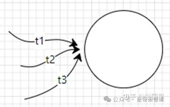
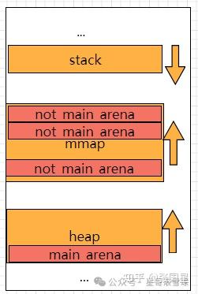
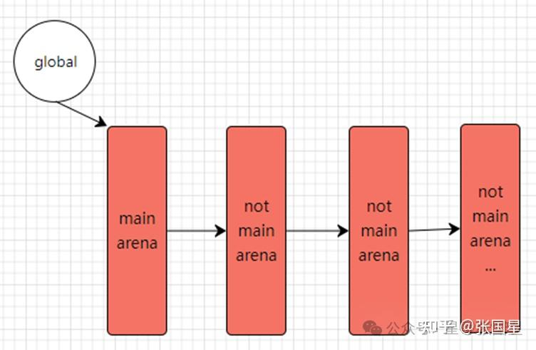

# Arena

‍

# 引入

在我们之前的例子中，无论是主线程，还是新创建的线程，在第一次申请内存时，都会有独立的Arena。

那么，会不会对于每一个线程(thread)而言，都有一个独立的 Arena呢？

接下来我们便对其进行具体介绍

‍

# 多线程时代

在现今的多线程时代，如果所有的线程都是存同一个地方分配内存，那么资源的竞争会极其的激烈，性能也会极差



为了解决这个问题，Ptmalloc引入了 Arena的概念，将线程分至多个Arena进行内存分配，以此减少资源的竞争，提升运行性能

‍


‍

# Arena

Arena在进程中的虚拟地址空间的布局如下



在 Heap段有且只有一个main_arena，空间不足时会通过 sbrk() 向操作系统申请内存。

Main_Arena对于全局也是只有一个的，但在mmap映射区域可以存在多个non_main_arena，其空间不足时通过 mmap() 向操作系统申请内存。

‍

‍

# Arena的管理与查找

程序中存在一个 GLOBAL 变量指向Main_Arena的地址，而Main_Arena又与其他的 non_main_arena 通过链表链接，具体如下图



‍

# Arena的生成

我们这里以 Linux 64位系统为例

# Arena数量

不同的系统，对于Arena数量的约束不同，具体如下

```sh
For 32 bit systems:
     Number of arena = 2 * number of cores.
For 64 bit systems:
     Number of arena = 8 * number of cores.
```

显然，并不是每一个线程都会有对应的 Arena。

由于每一个系统的核心数是有限的，所以当线程数大于核心数的两倍 (超线程技术) 时，便必然会有线程正处于等待状态。

因此没有必要为每一个线程都分配一个 Arena。

# 与Thread的区别

与 thread 不同的是，main\_arena 并不在申请的 heap 中，而是作为一个全局变量，存放在 libc.so 的数据段中。

‍
