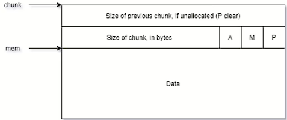

# 收集的部分资料

### 简介

Chunk 是用户申请内存的单位，也是堆管理器管理内存的基本单位。

当我们使用malloc()指令时，malloc()指令返回的指针实际指向了一个chunk的数据区域。



## Chunk的代码实现

‍

‍

```c
/* 
This struct declaration is misleading (but accurate and necessary). It declares a "view" into memory allowing access to necessary fields at known offsets from a given base. See explanation below. 

这个 struct 声明具有误导性（但准确且必要）。
它声明了一个内存的 “视图”，允许访问必要的
场。请参阅下面的说明。

*/
struct malloc_chunk{
	INTERNAL_SIZE_T prev_size; /* Size of previous chunk (if free). */
    INTERNAL_SIZE_T size; /* Size in bytes, including overhead. */
  
    struct malloc_chunk* fd; /* double links -- used only if free. */
    struct malloc_chunk* bk;

    /* Only used for large blocks:
    	pointer to next larger size.
    */
    struct malloc_chunk* fd_nextsize; /* double links -- used only if free. */
    struct malloc_chunk* bk_next_size;
};
```

```c
/* 
INTERNAL_SIZE_T is the word-size used for internal bookkeeping of
chunk sizes.
The default version is the same as size_t.
While not strictly necessary, it is best to define this as an
unsigned type, even if size_t is a signed type. This may avoid some
artificial size limitations on some systems.
On a 64-bit machine, you may be able to reduce malloc overhead by
defining INTERNAL_SIZE_T to be a 32 bit `unsigned int' at the
expense of not being able to handle more than 2^32 of malloced
space. If this limitation is acceptable, you are encouraged to set
this unless you are on a platform requiring 16byte alignments. In
this case the alignment requirements turn out to negate any
potential advantages of decreasing size_t word size.
Implementors: Beware of the possible combinations of:
     - INTERNAL_SIZE_T might be signed or unsigned, might be 32 or 64 bits,
       and might be the same width as int or as long
     - size_t might have different width and signedness as INTERNAL_SIZE_T
     - int and long might be 32 or 64 bits, and might be the same width
To deal with this, most comparisons and difference computations
among INTERNAL_SIZE_Ts should cast them to unsigned long, being
aware of the fact that casting an unsigned int to a wider long does
not sign-extend. (This also makes checking for negative numbers
awkward.) Some of these casts result in harmless compiler warnings
on some systems.  

INTERNAL_SIZE_T 是用于内部簿记的字大小
块大小。
默认版本与size_t相同。
虽然不是绝对必要的，但最好将其定义为
无符号类型，即使 size_t 是有符号类型。这可能会避免一些
某些系统上的人为尺寸限制。
在 64 位机器上，您可以通过以下方式减少 malloc 开销
将 INTERNAL_SIZE_T 定义为 32 位“unsigned int”
无法处理超过 2^32 的 malloc 的代价
空间。如果此限制可以接受，建议您设置
除非您所在的平台需要 16 字节对齐。在
在这种情况下，对齐要求结果否定了任何
减小 size_t 字大小的潜在优势。
实施者：注意以下可能的组合：
    - INTERNAL_SIZE_T 可能有符号或无符号，可能是 32 或 64 位，
    并且可能与 int 相同宽度或相同长度
    - size_t 可能具有与 INTERNAL_SIZE_T 不同的宽度和符号
    - int 和 long 可能是 32 位或 64 位，并且可能具有相同的宽度
为了解决这个问题，大多数比较和差异计算
其中 INTERNAL_SIZE_Ts 应该将它们转换为 unsigned long，即
意识到将 unsigned int 转换为更宽的 long 的事实
不进行符号扩展。 （这也使得检查负数
尴尬。）其中一些转换会导致无害的编译器警告
在某些系统上。
*/

#ifndef INTERNAL_SIZE_T
# define INTERNAL_SIZE_T size_t
#endif

/* The corresponding word size.   对应的字长。 */
#define SIZE_SZ (sizeof (INTERNAL_SIZE_T))

/* The corresponding bit mask value.  对应的位掩码值。 */
#define MALLOC_ALIGN_MASK (MALLOC_ALIGNMENT - 1)

/* MALLOC_ALIGNMENT is the minimum alignment for malloc'ed chunks.  It
   must be a power of two at least 2 * SIZE_SZ, even on machines for
   which smaller alignments would suffice. It may be defined as larger
   than this though. Note however that code and data structures are
   optimized for the case of 8-byte alignment.  
   MALLOC_ALIGNMENT 是 malloc 块的最小对齐方式。 它
   必须是至少 2 * SIZE_SZ 的 2 的幂，即使在机器上
   哪个较小的对齐就足够了。它可以被定义为更大
   不过比这个。但请注意，代码和数据结构是
   针对 8 字节对齐的情况进行了优化。 */
#define MALLOC_ALIGNMENT (2 * SIZE_SZ < __alignof__ (long double) \
              ? __alignof__ (long double) : 2 * SIZE_SZ)
          
```

一般来说， `size_t`​ 被定义为 `unsigned long` ，其在 64 位中是 64 位无符号整数，32 位中是 32 位无符号整数。

# Chunk的实际组成

因而，我们 **FD** 在 Heap Chunk 中的偏移为 addr + 12 , **BK**在 Heap Chunk 中的偏移为 addr + 16

## 堆的大小 ( Size )

堆的大小必须是 `2*SIZE_SZ`​ 的整数倍，如果申请的内存大小不是 `2*SIZE_SZ`​的整数倍，会被转成满足大小的最小的`2*SIZE_SZ`的倍数。

32位系统中,  `SIZE_SZ=4`​;	64位系统中,  `SIZE_SZ=8`

也就是说，**32位系统**堆大小为8的倍数，**64位系统**堆大小为16的倍数

**8 对应的 2进制 为 1000**,  因而不管size如何变换,  其对应的低3位固定为0;

为了不浪费这三个比特位，它们从高到低用来表示

	**NON_MAIN_ARENA** 用来记录当前 `chunk` 是否不属于主线程,  1为不属于主线程,  0为属于主线程 ;

	**IS_MAPPED** 用来记录当前 `chunk`​ 是否是由 `mmap` 分配的 ;

	**PREV_INUSE** 用来记录前一个 `chunk` 块是否被分配,是否正在使用 .
