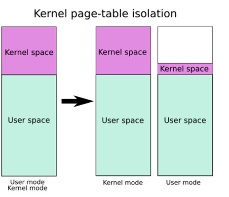

# Kernel Protecter

# 通用保护机制

对于内核程序，我们同样的有通用保护机制

1. KASLR(FGKASLR)
2. Stack Cookie
3. SMAP/SMEP
4. KPTI

接下来，我们来简单的介绍一下这几个基本保护机制

## KASLR

KASLR ，顾名思义，是 Kernel ASLR技术，是在内核态上的 空间地址随机化 技术。其与用户态下的 ASLR技术相类似。

在未开启 KASLR时， 内核 data段的基址为 0xffffffff81000000 DMA(Direct Mapping Area)基址为 0xffff888000000000

> ## FGKASLR
>
> FGKASLR是一种研究员基于 KASLR 上实现的，以函数粒度重新排布内核代码的技术
>
> 其能够在 KASLR 的基础上进一步的环节泄露内核中某个地址后的攻击
>
> 但现今仍旧运用较少

## Stack Protector

也就是Stack Cookie，可以认为是内核态下的 Canary，同样是用于检测内核栈是否发生溢出。若发生内核堆栈溢出，则 throw Kernel panic

其通常取自 gs段寄存器的某个固定偏移处的值。

## SMAP/SMEP

SMAP(Supervisor Mode Access Prevention)，即 管理模式访问保护，是用于阻止内核空间直接访问用户空间的数据。

SMEP(Supervisor Mode Execution Prevention)同理，是用于阻止内核空间直接执行用户空间的数据。

这两种保护机制成功的将内核空间与用户空间分隔开来，成功的防范了类似 ret2user 的攻击。

> #### SMEP保护绕过
>
> 我们一般有两种方式
>
> 1. 我们能够利用 内核线性映射区与物理地址空间的完整映射，来找到用户空间对应的页框的内核空间地址，我们能利用对应内核地址来完成对用户空间的访问
>
>    实际上就是利用内核地址和用户空间地址映射到了同一个页框上，来规避SMEP的检查。 这种攻击手法又被叫做 ret2dir
> 2. 在Intel下，系统是根据 CR4 控制寄存器的 第20位 来确定是否开启 SMEP 保护的。这也就意味着，我们只要能够通过kernel ROP改变到 CR4寄存器的值，我们就能够关闭 SMEP保护，从而进行 ret2user 攻击。

**在ARM架构下，有类似的保护，其被称为 PXN**

## KPTI

KPTI(Kernel page-table isolation)，即 内核页表隔离。

该技术会让内核空间与用户空间使用两组不同的页表集，这让系统对于内核的内存管理产生了根本性的变化。

对于用户空间，两个页表都会有其完整的映射。但在用户页表中，只会映射少量的内核代码 (即系统调用的入口点、中断处理等)

其修复了 Meltdown漏洞，使得之前利用 CPU流水线设计中的漏洞获取用户态无法访问的内核空间的数据的技术失效

同时，也使得内核页表中，属于用户地址空间的部分不再拥有执行权限，使得 ret2user 彻底成为过去式

‍

# 内核堆保护机制

系统对于内核上的堆也有一定的保护机制

1. Hardened Usercopy
2. Hardened Freelist
3. Random Freelist
4. Config_Init_On_Alloc_Default_On

我们这里也简单的介绍一下这几个保护机制

## Hardened Usercopy

这是一种对用户空间与内核空间之间拷贝数据的过程进行越界检查的技术，其主要检查拷贝过程中对**内核空间中的数据**读写是否越界

也就是检查读取的数据长度是否会超出规定范围，检查写入长度是否超出规定范围

> ### 绕过方法
>
> 这种技术被用于 copy_to_user()、copy_from_user()等数据交换的API中。
>
> 但其并不适用于内核空间内的数据拷贝，也就是我们只要越界不设计两空间的切换，即可随意使用，不会因该技术存在而失效。

## Hardened Freelist

这个技术类似于 glibc2.32新增的
