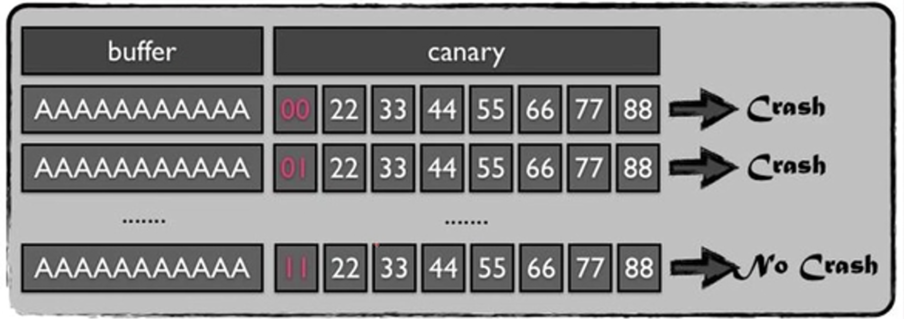

# BROP

## **施工中......**

# 简介

BROP是一种逐字节爆破canary值的技术，在CTF比赛中，BROP技术常常**在出题方未提供二进制文件的情况下**使用。使用BROP技术有一下几点使用条件

# 使用条件

1. 源程序必须存在**栈溢出漏洞**，从而让攻击者控制执行流
2. 服务器端上挂载的进程会在**程序崩溃**后重新启动，且**重启后进程的地址不变，Canary的值不变**(也就是说，如果程序开启了ASLR保护，也只能在刚开始生效)
3. 目前，满足条件的几个服务器应用有 **nginx、MySQL、Apache、OpenSSH** 等

# 攻击思路

1. **判断栈溢出长度**
2. 逐字节爆破 **Canary的值** ( 若未开Canary保护，则跳过此步 )
3. 获取`Stop gadget`
4. 获取useful gadget ( 尤其是[BROP gadget](BROP/BROP%20gadget.md))
5. 寻找可用的**PLT表项 **
6. 利用 **PLT表中的puts/write** 函数, 配合 useful gadget, 从而达到**远程dump信**息的效果

# 流程解析

## 判断栈溢出长度

	直接暴力枚举，如果Canary的值被覆盖，或是返回地址被覆盖，会导致程序崩溃

	我们只需要检测程序是否崩溃，如果发生崩溃，则返回 `padding-1` 的值即可

## 逐字节爆破canary

	对每一个字节 进行枚举，直到还原Canary在该字节的值，使得其字节中的值与Canary在该字节存储的值相同后

	再进行下一个字节的枚举

	

	如上图，在我们爆破到canary第一个字节为`\x11`时，程序没有出现错误，即说明该字节爆破成功，应进行下一个字节的爆破

## 寻找Stop gadget

‍

‍
