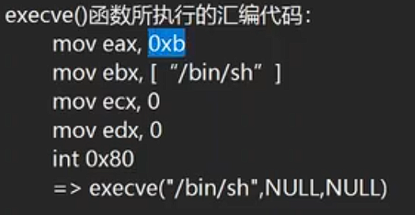

# Ret2syscall

> Tip
>
> syscall是一种可利用性很广的构建方式，可以实现多种函数构建，最后达到 **获取shell等控制其目标机器** 的效果

Ret2syscall其基本原理是通过使用程序中存在的[gadget](../ROP编程.md#20241214125147-hy5svh0)，

‍

‍




x86下的 int0x80:

```assembly
mov eax,0xb
mov ebx,["/bin/sh"] # or "sh"
mov ecx,0
mov edx,0
int 0x80 # 对应机器码 CD 80
# =>execve("/bin/sh",NULL,NULL)
```

> Note
>
> mov eax,0xb -> **0xb为[[系统调用]]号**,该值指向的是execve函数
>
> int 0x80 -> interrupt(中断) 0x80(中断号)   (对应机器码 CD 80)

x64下的syscall：

‍

```assembly
mov eax,0x3b # or rax
mov rdi,["/bin/sh"] # or "sh"
mov rsi,0
mov rdx,0
syscall #对应机器码 0F 05 
# =>execve("/bin/sh",NULL,NULL)
```

> Note
>
> mov eax,0x3b -> **0x3b为[[系统调用]]号**，指向execve函数
>
> syscall -> 进行中断  (对应机器码 0F 05)

### 大致的栈帧构建

|x64  /  x86|pop_rax_rdi_rsi_rdx_ret_addr|
| :-----------: | :------------------------------------: |
|rax  /  eax|0x3b  (x64)               0xb  (x86)|
|rdi  /  ebx|"/bin/sh"  or "sh"|
|rsi  /  ecx|0|
|rdx  /  edx|/edx0|
||syscall_addr|

同理，我们也可以通过该原理构建write、read等函数

‍
