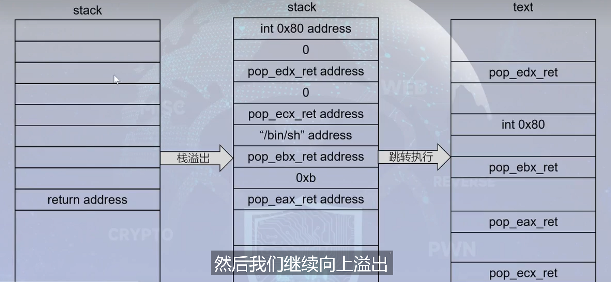

# ROP编程

> Tips
>
> <u>分离的代码小片段叫做gadget</u>

‍

# ROP的一般工作原理

# 返回导向编程

通过栈溢出的方式，将构建的ROP链(pop_ret链,指向其地址)放入栈中

当`esp`指向`pop_eax_ret address`时，进行以下操作：

1. 将数据"0xb"通过 `pop eax`存入`eax`寄存器中
2. `return`指令生效,将`pop_ebx_ret address`放入`eip`中
3. ...

‍
