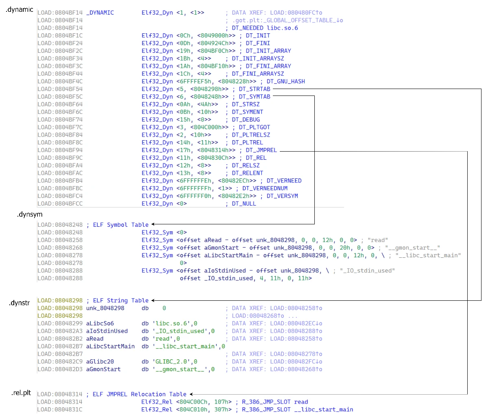

# ret2dlresolve

   这实际是ROP的一种高级玩法。

我们在学习之前，需要先了解一下攻击相关的结构体

# 相关结构

主要有 `.dynamic`​ 、`.dynstr`​ 、`.dynsym`​ 和 `.rel.plt` 四个重要的 section 。

结构及关系如下如图（以 32 位为例）：  
 

## Dyn

```c
/* Dynamic section entry.  */
 
typedef struct
{
  Elf32_Sword   d_tag;         /* Dynamic entry type */
/* 
d_tag: ,决定了你后面所存储的数据类型是什么 
d_val: 存储一个int值
d_ptr: 存储一个地址
*/
  union
    {
      Elf32_Word d_val;         /* Integer value, 整型 */
      Elf32_Addr d_ptr;         /* Address value, 存储地址 */
    } d_un;
} Elf32_Dyn;
 
typedef struct
{
  Elf64_Sxword  d_tag;          /* Dynamic entry type */
  union
    {
      Elf64_Xword d_val;        /* Integer value */
      Elf64_Addr d_ptr;         /* Address value */
    } d_un;
} Elf64_Dyn;
```

Dyn 结构体用于描述动态链接时需要使用到的信息，其成员含义如下：

- ​`d_tag`​ 表示标记值，指明了该结构体的具体类型。比如，`DT_NEEDED`​ 表示需要链接的库名，`DT_PLTRELSZ` 表示 PLT 重定位表的大小等。
- ​`d_un`​ 是一个联合体，用于存储不同类型的信息。具体含义取决于 `d_tag` 的值。

  - 如果 `d_tag`​ 的值是一个整数类型，则用 `d_val` 存储它的值。
  - 如果 `d_tag`​ 的值是一个指针类型，则用 `d_ptr` 存储它的值。

## Sym

```c
/* Symbol table entry.  */
 
/*

st_name: 存储符号名称在字符串表中的偏移(字符串相对于字符串表base的偏移)
st_info: 存储相关符号的类型和绑定属性
st_other: 决定了函数参数的 link_map 参数是否有效。若该值!=0,则直接通过link_map的信息计算目标函数地址。若==0,则调用 _dl_lookup_symbol_x 来查询新的 link_map&sym 来计算目标函数地址 ***这个是32位利用和64位利用的分水岭
st_value: 存储符号地址相对于模块基址的偏移值

*/
typedef struct
{
  Elf32_Word    st_name;        /* Symbol name (string tbl index) */
  Elf32_Addr    st_value;       /* Symbol value */
  Elf32_Word    st_size;        /* Symbol size */
  unsigned char st_info;        /* Symbol type and binding */
  unsigned char st_other;       /* Symbol visibility */
  Elf32_Section st_shndx;       /* Section index */
} Elf32_Sym;
 
typedef struct
{
  Elf64_Word    st_name;        /* Symbol name (string tbl index) */
  unsigned char st_info;        /* Symbol type and binding */
  unsigned char st_other;       /* Symbol visibility */
  Elf64_Section st_shndx;       /* Section index */
  Elf64_Addr    st_value;       /* Symbol value */
  Elf64_Xword   st_size;        /* Symbol size */
} Elf64_Sym;
```

Sym 结构体用于描述 ELF 文件中的符号（Symbol）信息，其成员含义如下：

- ​`st_name`​：指向一个存储符号名称的字符串表的索引，即​**字符串相对于字符串表起始地址的偏移**。
- ​`st_info`​：如果 **​`st_other`​**​ **为 0** 则设置成 0x12 即可。
- ​`st_other`​：决定**函数参数** `link_map`​ 参数是否有效。如果该值不为 0 则直接通过 `link_map`​ 中的信息计算出目标函数地址。否则需要调用 `_dl_lookup_symbol_x`​ 函数查询出新的 `link_map`​ 和 `sym` 来计算目标函数地址。
- ​`st_value`：符号地址相对于模块基址的偏移值。

## Rel

```c
/* Relocation table entry without addend (in section of type SHT_REL).  */
 
typedef struct
{
  Elf32_Addr    r_offset;       /* Address */
  Elf32_Word    r_info;         /* Relocation type and symbol index */
} Elf32_Rel;
 
/* I have seen two different definitions of the Elf64_Rel and
   Elf64_Rela structures, so we'll leave them out until Novell (or
   whoever) gets their act together.  */
/* The following, at least, is used on Sparc v9, MIPS, and Alpha.  */
 
typedef struct
{
  Elf64_Addr    r_offset;       /* Address */
  Elf64_Xword   r_info;         /* Relocation type and symbol index */
} Elf64_Rel;
```

Rel 结构体用于描述重定位（Relocation）信息，其成员含义如下：

- ​`r_offset`​：加上**传入的参数** `link_map->l_addr` 等于该函数对应 got 表地址。
- ​`r_info`​ ：符号索引的低 8 位（32 位 ELF）或低 32 位（64 位 ELF）指示符号的类型这里设为 7 即可，高 24 位（32 位 ELF）或高 32 位（64 位 ELF）指示符号的索引即 `Sym` 构造的数组中的索引。

## link\_map

```c
struct link_map
  {
    ElfW(Addr) l_addr;      /* Difference between the address in the ELF
                   file and the addresses in memory.  */
    ...
    ElfW(Dyn) *l_info[DT_NUM + DT_THISPROCNUM + DT_VERSIONTAGNUM
              + DT_EXTRANUM + DT_VALNUM + DT_ADDRNUM];
```

​`link_map`​ 是存储目标函数查询结果的一个结构体，我们主要关心 `l_addr`​ 和 `l_info` 两个成员即可。

- ​`l_addr`：目标函数所在 lib 的基址。
- ​`l_info`​：`Dyn`​ 结构体指针，指向各种结构对应的 `Dyn` 。

  - ​`l_info[DT_STRTAB]`​：即 `l_info`​ 数组第 5 项，指向 `.dynstr`​ 对应的 `Dyn` 。
  - ​`l_info[DT_SYMTAB]`​：即 `l_info`​ 数组第 6 项，指向 `Sym`​ 对应的 `Dyn` 。
  - ​`l_info[DT_JMPREL]`​：即 `l_info`​ 数组第 23 项，指向 `Rel`​ 对应的 `Dyn` 。

‍

# 利用方法

## 32位

我们在32位系统下，可以利用 `ELFW(ST_VISIBILITY)`。

在 `sym->st_other=0`时，其执行流程会自动计算其目标函数的地址，我们只要通过操纵其运行流程，就能达到劫持执行流的目的。

在 `sym->st_other=0`​时， `dl_runtime_resolve`函数具体的执行流程如下

1. 使用 `link_map`​ 访问 `.dynamic`​ 段，取出里面的 `.dynstr`​、`.dynsym`​、`.rel.plt` 几个指针
2. 使用 `.rel.plt + sec_var(第二个参数)`​ 求出当前函数的重定向表`ELF32_rel`的指针，将其记为 rel
3. 通过 `rel->r_info >> 8`​求出当前函数在`.dynsym`​中的下标，并将其符号表`ELF32_sym`的指针取出,记为sym
4. 通过 `.dynstr + sym->st_name` 得到符号名的字符串指针
5. 最后在动态链接库中查找函数地址，并将其赋值给 `*rel->r_offset`，即got表
6. 最后调用该函数

‍

我们的利用一般有两种玩法

### 1. 改写 .dynamic 中的 DT_STRTAB

该利用方法比较少见，只在 `NO RELRO` 下可行。

由于 `dl_runtime_resolve` 刚开始会从 .dynamic 段上取出 .dynstr 字符串的指针，再与偏移结合得到相应函数的字符串，我们就能够通过劫持这个指针，来将某个函数重定向到我们指定的任意lib函数上

### 2. 操纵第二个参数，使其指向我们所构造的 ELF32_rel

因 `_dl_runtime_resolve`​ 函数中的各个按下标取值的操作都没有越界检查，我们可以操控函数的第二个参数，使得在执行时访问到我们可控的内存上。我们只要在自己可控的内存上伪造一个 `.rel.plt`​ ，进一步地伪造 `.dynsym`​ 和 `.dynstr` 即可控制执行流

‍

# Demo

## 32位

```c
#include <stdio.h>
#include <string.h>
#include <unistd.h>
 
void vuln() {
    char buf[0x100];
    puts("please input:");
    read(0, buf, 0x300);
}
 
int main() {
    setbuf(stdin, NULL);
    setbuf(stdout, NULL);
 
    vuln();
 
    return 0;
}
```

一个简单的栈溢出。

‍

我们可以首先利用栈迁移获得
